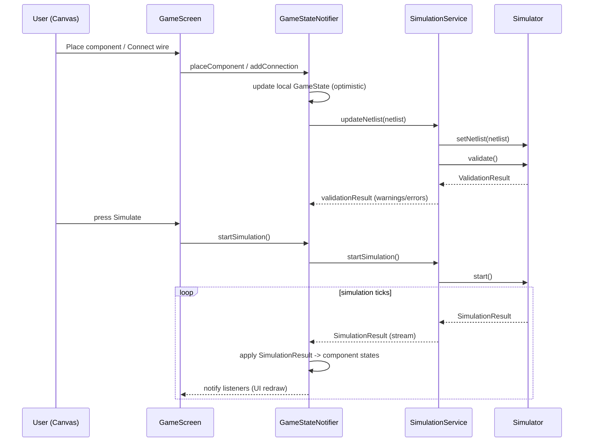

# SparkCircuit — Core Backend Integration Design & Justification

This document provides a detailed design, rationale, and step-by-step implementation checklist to connect the existing Flutter UI and Riverpod state to a production-quality core backend (simulator, persistence, command history, validation). It is written to guide engineers through the work with clear integration contracts and best practices.

---

## Contents

- Executive summary
- Why a dedicated core backend (justification)
- Key responsibilities and separation of concerns
- Concrete architecture and file map
- Data contracts and types (JSON/Dart shapes)
- API surface and method signatures
- Sequence diagrams (Mermaid)
- Validation, error handling, and diagnostics
- Performance & isolation strategy
- Tests and acceptance criteria
- Step-by-step implementation checklist (prioritized)
- Notes & references to code locations

---

## Executive summary

The UI repository already contains rich presentation logic and state containers, delivered with Riverpod providers such as [`lib/presentation/state/game_state.dart:1`] and UI screens such as [`lib/presentation/features/game/screens/game_screen.dart:1`]. However, the electrical simulation and deterministic circuit logic are currently placeholders. To produce a reliable learning app we must:

- Implement a deterministic Simulator core to compute node voltages and branch currents for a netlist.
- Provide a clean SimulationService bridge that accepts netlist updates and emits SimulationResult updates consumed by `GameStateNotifier` (in [`lib/presentation/state/game_state.dart:1`]).
- Implement a robust port/connection model, placement validation, command/undo stack, persistence, scoring, and tests.

This document defines the exact contracts and steps to accomplish this.

---

## Why a dedicated core backend (justification)

1. Determinism: Circuit solving requires numerical methods and stable sequencing. Keeping it isolated ensures reproducible results and testability.
2. Performance: The solver may be CPU-bound; isolating it (separate isolate or background worker) prevents UI jank.
3. Single Responsibility: UI handles presentation; the Simulator handles physics. Clear boundaries reduce bugs and simplify maintenance.
4. Testability & Reuse: A Dart-based core can be unit tested (solver math) separately and potentially reused for web/native builds.

---

## Responsibilities & separation of concerns

- Simulator Core (`lib/core/simulation/*`):
  - Netlist parsing, nodal/MNA solver, element models
  - Validation and diagnostics
  - Streaming simulation results

- SimulationService (provider; `lib/core/services/simulation_service.dart`):
  - Long-lived service that manages Simulator lifecycle
  - Exposes Stream<SimulationResult> and control APIs to UI

- Presentation & State (`lib/presentation/state/*`):
  - `GameStateNotifier` (in [`lib/presentation/state/game_state.dart:210`]) becomes the consumer of SimulationResult
  - NetlistBuilder utility in presentation layer converts placed components/connections into simulator models

- Command/Undo (`lib/core/commands/*`):
  - Encapsulates operations (place, move, connect, delete)
  - Provides history stack and transactional grouping

- Persistence (`lib/core/services/storage_service.dart`):
  - Save/load level progress, best scores, palettes
  - Use `SharedPreferences`, `Hive`, or `sqflite`

- Scoring & Validation (`lib/core/services/scoring_service.dart`):
  - Deterministic score calculation based on SimulationResult, time, hints

---

## Concrete architecture & file map

Create the following new files and folders as initial scaffolding:

- `lib/core/simulation/models.dart:1` — types: SimComponent, SimConnection, Netlist, SimulationResult
- `lib/core/simulation/simulator.dart:1` — Simulator core implementing initialize/start/pause/step
- `lib/core/services/simulation_service.dart:1` — Riverpod provider wrapper for Simulator
- `lib/core/services/storage_service.dart:1` — abstraction for persistence
- `lib/core/services/scoring_service.dart:1` — scoring and objective validation
- `lib/core/commands/command.dart:1` — Command interface and a `CommandStack` manager
- `lib/presentation/state/netlist_builder.dart:1` — conversion utilities: GameState → Netlist
- `test/core/` — unit tests for solver & netlist builder

References to existing files:
- `GameState` and notifier: [`lib/presentation/state/game_state.dart:1`]
- UI integration points (simulate toggle): [`lib/presentation/features/game/screens/game_screen.dart:277`]
- HUD: [`lib/presentation/features/hud/widgets/progress_hud.dart:1`]
- Canvas painters: [`lib/presentation/features/game/painters/wire_painter.dart:1`], [`lib/presentation/features/game/painters/component_painter.dart:1`]

---

## Data contracts (Dart/JSON shapes)

All shapes must be JSON-serializable to support persistence, network sync, and deterministic tests.

Netlist:
- Netlist {
    components: SimComponent[],
    connections: SimConnection[]
  }

SimComponent:
- SimComponent {
    id: String,
    type: String,              // 'battery', 'resistor', 'led', 'switch', ...
    ports: String[],           // ['pos','neg'] or ['a','b']
    properties: Map<String, dynamic>, // {voltage:1.5,resistance:1000,...}
    position: {x:int,y:int}    // grid coordinates
  }

SimConnection:
- SimConnection {
    id: String,
    from: {componentId:String, port:String},
    to: {componentId:String, port:String},
    path: [ {x,y} ] // optional visual path for UI (list of points)
  }

SimulationResult:
- SimulationResult {
    timestamp: int,
    components: Map<String, ComponentState>,
    connections: Map<String, ConnectionState>,
    diagnostics: Diagnostic[]
  }

ComponentState:
- ComponentState { voltageAcross: double, current: double, isActive: bool, extra: {} }

ConnectionState:
- ConnectionState { current: double, isActive: bool }

Diagnostic:
- Diagnostic { level: 'info'|'warning'|'error', code: String, message: String }

---

## API surface / method signatures (precise)

SimulationService (provider)
- Future<void> initialize(Netlist netlist)
- Future<void> updateNetlist(Netlist netlist)
- void startSimulation()
- void pauseSimulation()
- Future<void> stepSimulation(Duration dt)
- Stream<SimulationResult> onUpdate
- Future<ValidationResult> validateNetlist(Netlist netlist)

Simulator (core)
- class Simulator {
    Simulator();
    Future<void> setNetlist(Netlist netlist);
    Future<ValidationResult> validate();
    void start();    // begins simulation loop (time-step or steady-state refresh)
    void pause();
    Future<void> step(Duration dt);
    SimulationResult getCurrentState();
    Stream<SimulationResult> get updates;
  }

GameStateNotifier integration points
- void applyNetlist(Netlist netlist) // trigger when presentation changes placements/connections
- void startSimulation()
- void pauseSimulation()
- void _onSimulationResult(SimulationResult result) // internal handler that updates UI state

Command interface
- abstract class Command {
    String id;
    Future<void> execute(GameStateNotifier state);
    Future<void> undo(GameStateNotifier state);
  }

Persistence StorageService
- Future<void> saveLevelProgress(String levelId, LevelProgress data)
- Future<LevelProgress?> loadLevelProgress(String levelId)
- Future<void> savePreferences(Map<String, dynamic> prefs)

ScoringService
- int calculateScore(SimulationResult result, GameplayMetrics metrics)

---

## Sequence diagrams (Mermaid)

Netlist update & simulation run:



Undo / redo:

```mermaid
sequenceDiagram
  participant UI as Canvas
  participant GS as GameStateNotifier
  participant CMD as CommandStack

  UI->>GS: moveComponent(cmd)
  GS->>CMD: push(cmd) ; cmd.execute()
  UI->>GS: press Undo
  GS->>CMD: undo()
  CMD->>GS: cmd.undo() ; state restored
  GS-->>UI: UI re-render
```

---

## Validation & error handling

- Validation occurs at two levels:
  1. Placement-time: `PlacementService.validatePlacement()` returns errors like `Occupied`, `OutOfBounds`, `InventoryExhausted`.
  2. Netlist-time: `SimulationService.validateNetlist()` returns diagnostics (e.g., conflicting voltage sources on the same net, floating nodes).
- UI policy:
  - Non-blocking warnings show in HUD and a small toast.
  - Blocking errors (shorts, multiple different voltage sources on same net) prevent simulation start and show a modal with error explanation and suggested fixes.

Diagnostic object shape:
- {level: 'error'|'warning'|'info', code: 'SHORT_CIRCUIT', message: 'Short between net A and B', details: {...}}

---

## Performance & isolation

- Run heavy solver work in a Dart isolate to avoid UI thread blocking.
- Use incremental solves for small edits (rebuild matrix only for affected nodes if feasible).
- Throttle UI update application (e.g., apply at 30 fps max even if solver emits faster).

---

## Tests and acceptance criteria

Tests to implement:
- Unit:
  - Netlist builder correctness (graph -> nets)
  - DC solver results for canonical circuits (series, parallel) with known answers
  - Validation returns expected diagnostics
  - Command undo/redo semantics
- Integration:
  - Simulate placement + connect + simulate and assert HUD values and `GameState` flags
  - Persistence save/load roundtrip

Acceptance:
- For a basic series circuit (battery + resistor + LED), solver result must be within 1% of expected current/voltage.
- Simulation start should run without UI jank on typical mobile device (frame times stable).
- Undo/Redo restores positions and inventory counts consistently.

---

## Implementation checklist (detailed & prioritized)

Phase 0 — Scaffolding & prototype
- [ ] Add `lib/core/simulation/models.dart:1` (Netlist/SimComponent/SimConnection/SimulationResult)
- [ ] Add `lib/core/simulation/simulator.dart:1` stub implementing MNA entry points
- [ ] Add `lib/core/services/simulation_service.dart:1` provider wrapper
- [ ] Add `lib/presentation/state/netlist_builder.dart:1` to convert GameState → Netlist
- [ ] Add unit tests under `test/core/solver_test.dart:1` for a simple series circuit

Phase 1 — DC solver + UI hookup
- [ ] Implement MNA DC solver in `simulator.dart`
- [ ] Implement `SimulationService.updateNetlist()` and `onUpdate` stream
- [ ] Wire `SimulationService.onUpdate` into `GameStateNotifier` `GameStateNotifier._onSimulationResult()`
- [ ] Replace placeholder `_updateSimulation()` logic in [`lib/presentation/state/game_state.dart:293`] with real integration
- [ ] Add validation blocking in `SimulationService.validateNetlist()` and show errors via HUD

Phase 2 — Ports, routing, placement, undo
- [ ] Define port models and update `ComponentDefinition` in [`lib/presentation/state/palette_state.dart:1`]
- [ ] Implement `PlacementService.validatePlacement()` and integrate into UI placement flows
- [ ] Implement `Command` classes and `CommandStack` in `lib/core/commands/command.dart:1`
- [ ] Add Undo/Redo UI affordances and tie to `GameStateNotifier`

Phase 3 — Persistence, scoring, polish
- [ ] Implement `StorageService` and move bestScore storage out of hard-coded values
- [ ] Implement `ScoringService` and detach `_calculateScore()` from `GameStateNotifier`
- [ ] Implement capture/share platform code for `lib/presentation/features/sharing/services/capture_service.dart:1`
- [ ] Add test coverage and CI pipeline

Phase 4 — Advanced simulation, telemetry, sync
- [ ] Add time-domain elements (capacitor/inductor) and step-based integration
- [ ] Implement telemetry hooks and optional cloud sync
- [ ] Document API for potential multiplayer

---

## Best practices & developer notes

- Keep the Simulator pure and side-effect free (no direct UI calls). All I/O should occur in `SimulationService`.
- Stream updates as immutable `SimulationResult` objects; the presenter (`GameStateNotifier`) can diff and update minimal fields.
- Version netlists with incrementing sequence numbers to prevent stale updates applying out-of-order.
- Use deterministic random seeds for any stochastic processes to make tests repeatable.
- Start with resistors and ideal voltage sources. Add diodes/LEDs as piecewise linear models before full diode equations.
- Always write a unit test for a new circuit model or solver change.

---

## Appendices

- Quick integration points (files to edit first):
  - `lib/presentation/state/game_state.dart:1` — add applyNetlist() and subscribe to SimulationService
  - `lib/presentation/state/netlist_builder.dart:1` — create builder util
  - `lib/core/simulation/simulator.dart:1` — implement MNA solver
  - `lib/core/services/simulation_service.dart:1` — provider wrapper
  - `test/core/solver_test.dart:1` — simple tests

- Example mermaid sequence diagrams are embedded above. They can be rendered in Markdown viewers that support Mermaid.

---

If you confirm, I will:
- create the `.md` file in the repo (this document),
- then switch to code mode and scaffold `lib/core/simulation/*` files and a simple DC solver prototype with unit tests.

