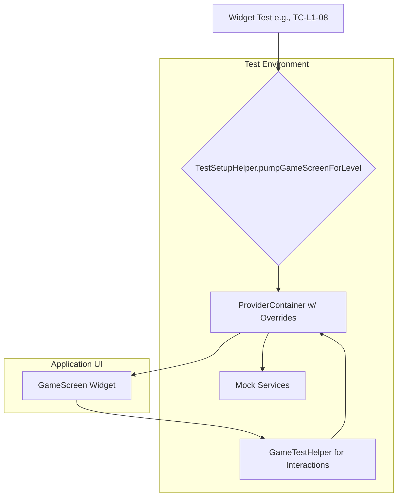

# Revised Testing Architecture for Circuit STEM Level 01

**Project:** Circuit STEM
**Last Updated:** 2025-08-22

## Executive Summary

This document outlines the current revised testing architecture for Level 01, addressing critical issues identified in previous implementations. It reflects the shift towards a more modular game engine and updated testing practices.

## Current Testing Architecture

### Key Components & Helpers:

*   **`GameScreen`**: Main UI container with `GameCanvas` and `ComponentPalette`.
*   **`GameCanvas`**: Handles gesture detection and delegates to `GameEngineNotifierV2`'s `InputManager`.
*   **`CanvasPainter`**: CustomPainter that renders components using pixel coordinates.
*   **`GameEngineNotifierV2`**: The orchestrator for game state management, delegating to `GameEngineCore`, `SimulationManager`, `InputManager`, and `AudioManager`.
*   **`GameEngineState`**: Immutable state with `Grid`, drag state, win conditions.
*   **`Grid`**: Component positioning and validation logic.
*   **`ComponentModel`**: Individual component state and behavior.
*   **`GameTestHelper` (`test/helpers/game_test_helper.dart`):** A universal helper class for state querying, grid interaction, UI button interactions, and audio verification.
*   **`MockAudioService` (`test/helpers/mock_services.dart`):** A mock for audio playback, recording played sounds for verification.
*   **`TestSetupHelper` (`test/helpers/test_setup_helper.dart`):** A standardized, reusable setup function (`pumpGameScreenForLevel`) that creates a fully mocked and stable environment for any level test.

### Core Principles:

*   **Stability & Isolation**: Tests are hermetic (self-contained). External services (file system, audio, preferences) are mocked, and game state is pre-initialized.
*   **Readability & Maintainability**: Complex interactions and state-checking are abstracted into `GameTestHelper`.
*   **Reliability**: Known Flutter bugs (like file I/O hangs) are avoided by performing all necessary setup in a `setUpAll` block.

### Test Flow:

A typical widget test follows this controlled flow:



### Key Implementation Details:

*   **Corrected Provider Setup:** Tests use `ProviderScope` with overrides for mock services (`sharedPreferencesProvider`, `assetManagerProvider`, `levelManagerProvider`, `gameEngineProvider`). `GameEngineNotifierV2` is instantiated with the `initialLevel` directly.
*   **Deterministic Coordinate Calculation:** `GameTestHelper` provides `gridToPixel` and `pixelToGrid` methods to ensure accurate and deterministic pixel-to-grid conversions, independent of widget layout.
*   **Corrected Component State Handling:** Helper methods like `isSwitchClosed` and `isTimerActive` correctly access component state using updated keys (e.g., `isClosed`, `isActive`) and string-based component types.
*   **Robust Asset Mocking:** `MockAssetManager` is used to prime file contents (e.g., level JSONs) for reliable asset loading in tests.

## Revised Test Cases Implementation

Examples of corrected test cases reflecting the new architecture:

### TC-L1-01: Toggle Switch Interaction (Corrected)

```dart
testWidgets('TC-L1-01: Toggle switch interaction', (WidgetTester tester) async {
  final container = await TestSetupHelper.pumpGameScreenForLevel(tester, 0); // Using TestSetupHelper
  
  // Wait for level to load
  await tester.pumpAndSettle();
  
  final switchComponent = GameTestHelper.findComponentById(container, 'switch1');
  expect(switchComponent, isNotNull);
  expect(switchComponent!.type, 'switch'); // Using string literal for type

  final initialSwitchClosed = GameTestHelper.isSwitchClosed(container, 'switch1'); // Using helper
  
  await GameTestHelper.tapGridCell(tester, switchComponent.r, switchComponent.c); // Using helper
  await tester.pumpAndSettle(); // Wait for state update

  final newSwitchComponent = GameTestHelper.findComponentById(container, 'switch1');
  final finalSwitchClosed = GameTestHelper.isSwitchClosed(container, 'switch1'); // Using helper
  
  expect(finalSwitchClosed, !initialSwitchClosed);
});
```

### TC-L1-02: Component Movement (Corrected)

```dart
testWidgets('TC-L1-02: Move timer component', (WidgetTester tester) async {
  final container = await TestSetupHelper.pumpGameScreenForLevel(tester, 0); // Using TestSetupHelper
  await tester.pumpAndSettle();
  
  final timerComponent = GameTestHelper.findComponentById(container, 'timer1');
  expect(timerComponent, isNotNull);
  expect(timerComponent!.isDraggable, isTrue);

  final fromPos = Position(r: timerComponent.r, c: timerComponent.c);
  final toPos = Position(r: fromPos.r + 1, c: fromPos.c);
  
  await GameTestHelper.dragComponentToGrid(tester, container, 'timer1', toPos.r, toPos.c); // Using helper
  await tester.pumpAndSettle(); // Wait for state update

  final movedComponent = GameTestHelper.findComponentById(container, 'timer1');
  expect(movedComponent!.r, toPos.r); // Asserting position directly
  expect(movedComponent.c, toPos.c);
});
```

## Implementation Priority

### Phase 1: Foundation (High Priority)
1.  Resolve current compilation errors (see "Current Blockers & Known Issues").
2.  Ensure provider setup and level loading are stable.
3.  Verify coordinate system calculations.
4.  Confirm proper asset mocking.
5.  Validate component state key mappings.

### Phase 2: Core Tests (Medium Priority)
1.  Implement corrected TC-L1-01 through TC-L1-05.
2.  Add drag validation and boundary testing.
3.  Implement circuit completion detection.

### Phase 3: Advanced Features (Low Priority)
1.  Animation state testing.
2.  Audio feedback verification.
3.  Performance and stress testing.

## Expected Outcomes

With this revised architecture:
*   Tests will properly load Level 01 and initialize game state.
*   Coordinate calculations will be deterministic and accurate.
*   Component interactions will work with correct state keys.
*   Asset dependencies will be properly mocked.
*   Test reliability will improve significantly.

## Current Status and Unresolved Issues (as of 2025-08-22)

Despite the comprehensive revised testing architecture, critical compilation issues persist, preventing the successful execution of tests. These are primarily due to the recent game engine refactoring.

*   **Compilation Errors due to Game Engine Refactoring:** The recent refactoring of `GameEngineNotifier` to `GameEngineNotifierV2` and the introduction of new modular components (`GameEngineCore`, `SimulationManager`, `InputManager`, `AudioManager`) have introduced a new set of compilation errors in the test suite. These include:
    *   Missing `lib/models/port.dart` file.
    *   `GridWidgetState` type not found.
    *   `GameEngineNotifierV2` constructor and API mismatches (e.g., `animationScheduler` parameter not found, `audioManager` parameter not defined, too many positional arguments).
    *   Undefined methods/getters across refactored components (e.g., `playToggle` on `AudioManager`, `getComponentAt` on `Grid`, `shape` on `ComponentModel`).
    *   Invalid `this` reference in `GameEngineNotifierV2` initializer.
    *   (Refer to `BUGS_TRACKING.md` for detailed bug reports: `BUG-004` to `BUG-008`).
*   **Unused Code and Improper State Access Warnings:** Warnings about unused imports, unused local variables, and invalid use of the `state` member outside of `StateNotifier` or test context. (Refer to `BUGS_TRACKING.md` for `BUG-009`).
*   **macOS Build Environment:** Test execution on macOS requires the Xcode command-line tools. This can be resolved by running `xcode-select --install`.
*   **Outdated Package Dependencies:** The project has several packages with newer versions available. While not currently blocking, these should be updated to ensure long-term stability by running `flutter pub outdated` and updating `pubspec.yaml`.

---

## Legacy Architecture Analysis (Historical Reference)

This section contains the previous analysis of critical architectural issues with the Level 01 testing implementation. This information is retained for historical context but is no longer relevant to the current implementation.

### Old Critical Issues Identified:

*   **Navigation Flow Problem:** Test helper navigated from `LevelSelectScreen` → `Level 1`, but the actual game flow was `LevelSelectScreen` → `GameScreen` (with level loaded via `GameEngineNotifier.loadLevel`). The test assumed `GameScreen` was automatically created, but it was not.
*   **Provider Override Mismatch:** Tests overrode `sharedPreferencesProvider` but didn't properly initialize the game engine with a level. `gameEngineProvider` was created with `forNoLevel()` constructor, and the level had to be loaded via `LevelManagerNotifier.loadLevelByIndex()` then `GameEngineNotifier.loadLevel()`.
*   **Coordinate System Issues:** Tests used `cellSize` constant (64.0) for pixel calculations, but `GameCanvas` gesture detection used `(tapPos.dx / cellSize).floor()` for grid conversion. Canvas size was not deterministic in tests.
*   **State Synchronization Problems:** Switch state used `'closed'` key, but test looked for `'switchOpen'`. Component draggability logic (excluding battery and bulb) was inconsistent with tests trying to drag bulb. Grid validation happened in `endDrag()` but tests didn't account for validation failures.
*   **Asset Dependencies:** `CanvasPainter` required `AssetManager` for SVG rendering, but tests didn't properly mock `AssetManager`, leading to null image rendering.

This legacy analysis has been superseded by the current testing architecture and the new set of compilation issues.
