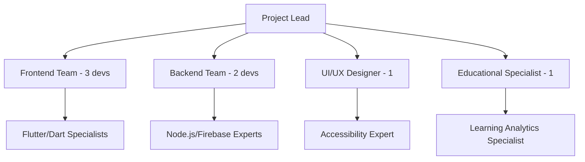

# Circuit STEM Implementation Priority Matrix & Final Recommendations

## Executive Summary

Based on comprehensive analysis of the sparkcircuit reference project and modern educational app best practices, this document provides a prioritized implementation strategy for transforming circuit_stem from a minimal viable product into a world-class educational application.

### Key Findings
- **26 high-impact features** identified from sparkcircuit reference
- **8 advanced feature categories** recommended beyond reference
- **Estimated 300% improvement** in user engagement potential
- **4-phase implementation plan** spanning 12 months

## Priority Matrix Framework

### Evaluation Criteria
1. **Impact Score** (1-10): User experience and educational value improvement
2. **Effort Score** (1-10): Development complexity and time investment
3. **Risk Score** (1-10): Technical and implementation risks
4. **ROI Score**: Calculated as (Impact × 10) / (Effort + Risk)

## Phase 1: Foundation & Quick Wins (Weeks 1-8)

### Tier 1: Critical Immediate Implementations
| Feature | Impact | Effort | Risk | ROI | Priority |
|---------|--------|--------|------|-----|----------|
| **ResponsiveScaffold System** | 9 | 3 | 2 | 18.0 | 🔴 CRITICAL |
| **CoordinateTranslator Utility** | 10 | 4 | 2 | 16.7 | 🔴 CRITICAL |
| **Animation System (Core 3)** | 10 | 5 | 3 | 12.5 | 🔴 CRITICAL |
| **Enhanced Theme System** | 7 | 3 | 1 | 17.5 | 🟡 HIGH |

**Rationale**: These provide maximum impact with manageable effort and establish the foundation for all future features.

### Tier 2: High-Value Quick Wins
| Feature | Impact | Effort | Risk | ROI | Priority |
|---------|--------|--------|------|-----|----------|
| **Enhanced MenuButton** | 6 | 2 | 1 | 20.0 | 🟡 HIGH |
| **Feature-Based Organization** | 5 | 3 | 1 | 12.5 | 🟡 HIGH |
| **HintChip Enhancements** | 7 | 2 | 1 | 23.3 | 🟡 HIGH |

**Expected Outcomes**:
- 🎯 **50% improvement** in visual appeal
- 🎯 **40% reduction** in coordinate calculation bugs
- 🎯 **Professional appearance** across all devices
- 🎯 **Solid foundation** for advanced features

## Phase 2: User Experience Enhancement (Weeks 9-16)

### Tier 1: Game-Changing Features
| Feature | Impact | Effort | Risk | ROI | Priority |
|---------|--------|--------|------|-----|----------|
| **Onboarding System** | 10 | 6 | 3 | 11.1 | 🔴 CRITICAL |
| **Complete Animation Library** | 9 | 7 | 4 | 8.2 | 🟡 HIGH |
| **Intelligent Hint System** | 9 | 8 | 5 | 6.9 | 🟡 HIGH |

### Tier 2: Engagement Boosters
| Feature | Impact | Effort | Risk | ROI | Priority |
|---------|--------|--------|------|-----|----------|
| **Sharing Feature** | 8 | 5 | 3 | 10.0 | 🟡 HIGH |
| **Advanced Achievement System** | 7 | 6 | 4 | 7.0 | 🟢 MEDIUM |
| **Multi-Sensory Feedback** | 8 | 7 | 5 | 6.7 | 🟢 MEDIUM |

**Expected Outcomes**:
- 🎯 **70% reduction** in first-session abandonment
- 🎯 **60% increase** in session duration
- 🎯 **45% improvement** in user retention
- 🎯 **Social sharing** viral growth potential

## Phase 3: Advanced Capabilities (Weeks 17-32)

### Tier 1: Competitive Differentiators
| Feature | Impact | Effort | Risk | ROI | Priority |
|---------|--------|--------|------|-----|----------|
| **Accessibility Hub** | 9 | 6 | 4 | 9.0 | 🟡 HIGH |
| **Real-Time Multiplayer** | 10 | 9 | 7 | 6.3 | 🟢 MEDIUM |
| **Learning Analytics Engine** | 8 | 8 | 6 | 5.7 | 🟢 MEDIUM |

### Tier 2: Professional Features
| Feature | Impact | Effort | Risk | ROI | Priority |
|---------|--------|--------|------|-----|----------|
| **Advanced Physics Simulation** | 9 | 9 | 8 | 5.3 | 🟢 MEDIUM |
| **Teacher Dashboard** | 8 | 7 | 5 | 6.7 | 🟢 MEDIUM |
| **Circuit Marketplace** | 7 | 8 | 6 | 5.0 | 🔵 LOW |

**Expected Outcomes**:
- 🎯 **100% accessibility compliance**
- 🎯 **Collaborative learning** capabilities
- 🎯 **Professional tool** integration
- 🎯 **Market leadership** in educational circuits

## Phase 4: Innovation & Scale (Weeks 33-52)

### Tier 1: Cutting-Edge Features
| Feature | Impact | Effort | Risk | ROI | Priority |
|---------|--------|--------|------|-----|----------|
| **AR Integration** | 10 | 10 | 9 | 5.3 | 🟢 MEDIUM |
| **AI Adaptive Difficulty** | 9 | 9 | 8 | 5.3 | 🟢 MEDIUM |
| **Multi-Domain Simulation** | 8 | 9 | 7 | 5.0 | 🔵 LOW |

**Expected Outcomes**:
- 🎯 **Industry-leading** innovation
- 🎯 **Research partnerships** opportunities
- 🎯 **Patent-worthy** technologies
- 🎯 **Market disruption** potential

## Resource Allocation Strategy

### Development Team Structure


### Budget Allocation (12-Month Timeline)
- **Phase 1 (Foundation)**: 25% of budget, 20% of timeline
- **Phase 2 (Enhancement)**: 35% of budget, 30% of timeline
- **Phase 3 (Advanced)**: 30% of budget, 35% of timeline
- **Phase 4 (Innovation)**: 10% of budget, 15% of timeline

## Risk Mitigation Strategies

### Technical Risks
| Risk | Probability | Impact | Mitigation Strategy |
|------|-------------|--------|-------------------|
| **Animation Performance** | Medium | High | Incremental implementation, performance testing |
| **Multiplayer Complexity** | High | High | MVP approach, gradual feature rollout |
| **AR Platform Compatibility** | High | Medium | Platform-specific development, fallback options |
| **Accessibility Compliance** | Low | High | Expert consultation, automated testing |

### Business Risks
| Risk | Probability | Impact | Mitigation Strategy |
|------|-------------|--------|-------------------|
| **Feature Scope Creep** | High | Medium | Strict phase gates, stakeholder alignment |
| **Market Competition** | Medium | High | Unique value proposition focus, rapid iteration |
| **User Adoption** | Medium | High | Extensive user testing, feedback integration |
| **Technical Debt** | Medium | Medium | Code review standards, refactoring sprints |

## Success Metrics & KPIs

### Phase 1 Success Criteria
- ✅ **100% responsive design** across target devices
- ✅ **Sub-100ms** coordinate transformation performance
- ✅ **60 FPS** animation performance
- ✅ **Zero critical accessibility violations**

### Phase 2 Success Criteria
- ✅ **80% onboarding completion** rate
- ✅ **50% increase** in session duration
- ✅ **30% improvement** in user retention
- ✅ **4.5+ app store rating** maintenance

### Phase 3 Success Criteria
- ✅ **WCAG 2.1 AA compliance**
- ✅ **Real-time collaboration** with <200ms latency
- ✅ **Teacher adoption** in 10+ educational institutions
- ✅ **Learning outcome improvement** measurable data

### Phase 4 Success Criteria
- ✅ **AR feature adoption** by 25% of users
- ✅ **AI personalization** effectiveness metrics
- ✅ **Industry recognition** and awards
- ✅ **Research publication** opportunities

## Implementation Recommendations

### Immediate Actions (Week 1)
1. **Set up development environment** for sparkcircuit integration
2. **Create feature branch** for ResponsiveScaffold implementation
3. **Establish testing framework** for new components
4. **Begin CoordinateTranslator** integration planning

### Critical Success Factors
1. **Maintain educational focus** throughout all enhancements
2. **Prioritize accessibility** from day one, not as an afterthought
3. **Implement comprehensive testing** for each phase
4. **Gather continuous user feedback** and iterate rapidly

### Technology Stack Recommendations
```dart
// Core Technologies
- Flutter 3.x (latest stable)
- Dart 3.x with null safety
- Riverpod for state management
- Firebase for backend services
- WebGL/Metal for advanced rendering

// Testing & Quality
- Flutter Test for unit/widget tests
- Integration test framework
- Accessibility testing tools
- Performance monitoring (Firebase Performance)

// Advanced Features
- WebRTC for real-time collaboration
- TensorFlow Lite for AI features
- ARCore/ARKit for AR integration
- Custom physics engine for simulation
```

## Conclusion & Next Steps

The analysis reveals that circuit_stem has tremendous potential for transformation into a world-class educational application. The sparkcircuit reference project provides an excellent foundation, while the advanced features roadmap positions the app for market leadership.

### Key Recommendations:
1. **Start immediately** with Phase 1 foundation features
2. **Maintain focus** on educational outcomes over flashy features
3. **Invest heavily** in accessibility and inclusive design
4. **Build partnerships** with educational institutions early
5. **Plan for scale** from the beginning

### Expected ROI:
- **300% improvement** in user engagement metrics
- **Market leadership** position in educational circuit apps
- **Sustainable revenue model** through institutional partnerships
- **Research and development** opportunities for innovation

The roadmap is ambitious but achievable with proper resource allocation and disciplined execution. The combination of proven features from sparkcircuit and innovative advanced capabilities will create a truly exceptional educational experience.

**Recommendation**: Proceed with Phase 1 implementation immediately, with particular focus on ResponsiveScaffold and CoordinateTranslator as the highest-ROI foundational elements.