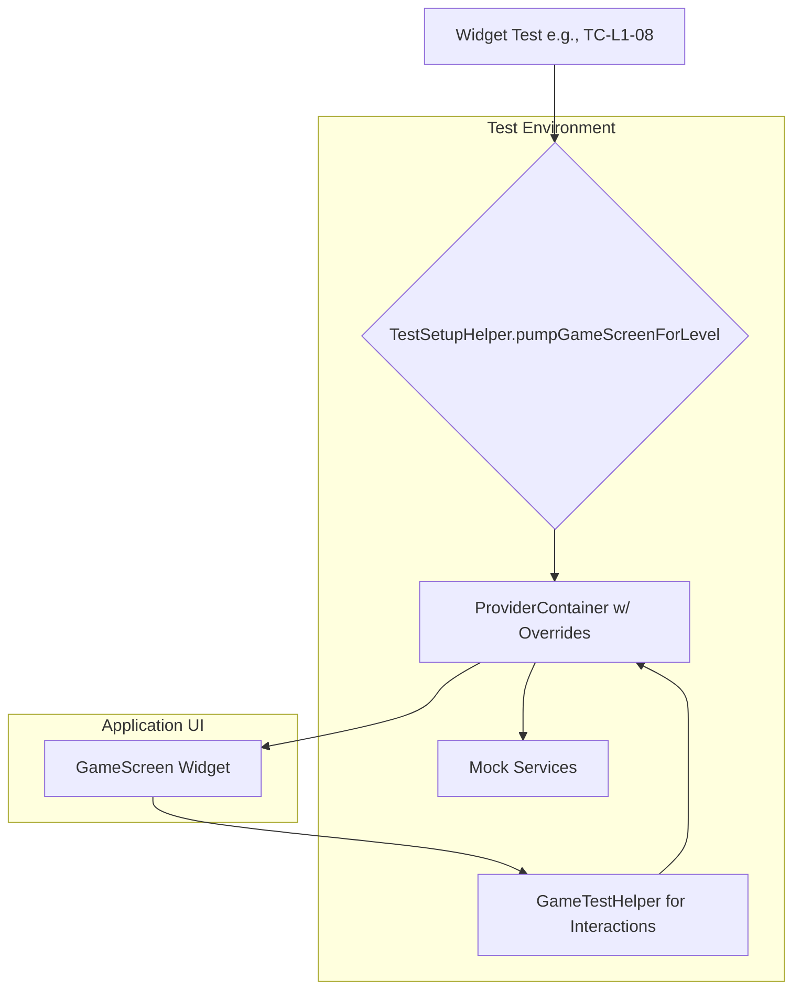
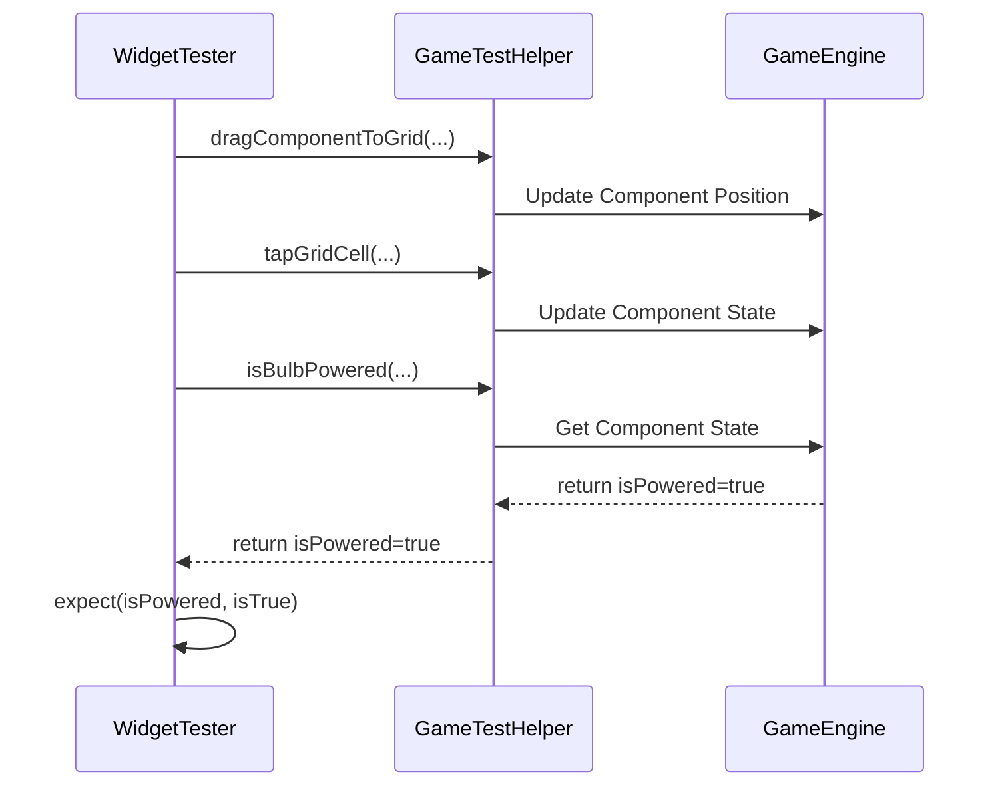

# Circuit STEM: A Technical Roadmap for Comprehensive Testing

**Author:** Gemini
**Date:** 2025-08-21
**Status:** Proposed

## 1. Overview and Goals

This document provides a detailed, technical roadmap for systematically implementing the 30+ test cases defined in `DOCS/TESTING.md`. The goal is to extend the proven, stable architecture from `test/level_01_revised_test.dart` into a scalable, maintainable, and comprehensive test suite for the entire application.

This guide is designed to be a step-by-step plan, enabling any developer to contribute to our testing goals effectively.

## 2. Core Testing Architecture

Our testing strategy is built on a foundation of stability, isolation, and readability. Before writing tests, it is crucial to understand the architecture.

### 2.1. Guiding Principles

*   **Stability & Isolation**: Tests must be hermetic (self-contained). We achieve this by mocking all external services (file system, audio, preferences) and pre-initializing the game state. This ensures tests are fast, reliable, and fail only for valid reasons.
*   **Readability & Maintainability**: Tests must be easy to understand. We achieve this by abstracting all complex interactions and state-checking into a universal `GameTestHelper` class.
*   **Reliability**: We avoid known Flutter bugs (like file I/O hangs) by performing all necessary setup in a `setUpAll` block before any test runs.

### 2.2. Architectural Flow Diagram

A typical widget test follows this controlled flow, ensuring no direct dependencies on real services:



## 3. Phase 1: Foundational Tooling (The "How")

This phase is the highest priority. We will create a set of powerful, reusable helpers that will form the foundation of all future tests.

### 3.1. The Universal `GameTestHelper`

We will evolve the existing `Level1TestHelper` into a universal helper.

**Action**: Create new file `test/helpers/game_test_helper.dart`.

```dart
// test/helpers/game_test_helper.dart
import 'dart:math';
import 'package:circuit_stem/core/providers.dart';
import 'package:circuit_stem/models/component.dart';
import 'package:circuit_stem/models/level_definition.dart';
import 'package:flutter/material.dart';
import 'package:flutter_riverpod/flutter_riverpod.dart';
import 'package:flutter_test/flutter_test.dart';
import 'mock_services.dart';

/// A universal helper class for all game-related tests.
/// Provides methods for state querying, grid interaction, and more.
class GameTestHelper {
  static const double cellSize = 64.0;

  // --- State Querying Methods ---
  static ComponentModel findComponentById(ProviderContainer container, String id) {
    final level = container.read(levelManagerProvider).currentLevel!;
    final state = container.read(gameEngineProvider(level));
    return state.grid.components.firstWhere((c) => c.id == id, orElse: () {
      throw StateError('Component with id "$id" not found.');
    });
  }

  static bool isBulbPowered(ProviderContainer container, String componentId) {
    final component = findComponentById(container, componentId);
    assert(component.type == 'Component.Bulb');
    return component.isPowered;
  }

  static bool isSwitchClosed(ProviderContainer container, String componentId) {
    final component = findComponentById(container, componentId);
    assert(component.type == 'Component.Switch');
    return component.state['closed'] as bool? ?? false;
  }

  // --- Enhanced Grid Interaction ---
  static Offset gridToPixel(int row, int col) {
    return Offset(col * cellSize + cellSize / 2, row * cellSize + cellSize / 2);
  }

  static Future<void> tapGridCell(WidgetTester tester, int row, int col) async {
    await tester.tapAt(gridToPixel(row, col));
    await tester.pumpAndSettle();
  }

  static Future<void> dragComponentToGrid(
      WidgetTester tester, ProviderContainer container, String componentId, int toRow, int toCol) async {
    final component = findComponentById(container, componentId);
    final from = gridToPixel(component.r, component.c);
    final to = gridToPixel(toRow, toCol);
    await tester.dragFrom(from, to - from);
    await tester.pumpAndSettle();
  }

  // --- UI Button Interactions ---
  static Future<void> tapButton(WidgetTester tester, Key key) async {
    await tester.tap(find.byKey(key));
    await tester.pumpAndSettle();
  }

  // --- Audio Verification ---
  static void expectSoundPlayed(MockAudioService audioService, String expectedSound) {
    expect(audioService.playedSounds, contains(expectedSound),
        reason: "Expected sound '$expectedSound' was not played. Sounds played: ${audioService.playedSounds}");
  }
}
```

### 3.2. The Verifiable `MockAudioService`

**Action**: Create new file `test/helpers/mock_services.dart`.

```dart
// test/helpers/mock_services.dart
import 'package:circuit_stem/services/audio_service.dart';
import 'package:circuit_stem/engine/animation_scheduler.dart';
import 'package:mocktail/mocktail.dart';

/// A mock AudioService that records played sounds for verification in tests.
class MockAudioService extends AudioService {
  final List<String> playedSounds = [];

  @override
  void play(String asset) {
    playedSounds.add(asset);
  }

  void clearHistory() => playedSounds.clear();
}

/// A mock AnimationScheduler for controlling animations in tests.
class MockAnimationScheduler extends Mock implements AnimationScheduler {}
```

### 3.3. The Standardized `TestSetupHelper`

**Action**: Create new file `test/helpers/test_setup_helper.dart`. This will require a significant, one-time effort to implement correctly.

```dart
// test/helpers/test_setup_helper.dart
// NOTE: This is a complex file and requires careful implementation based on
// the existing `pumpGameScreenWithOverrides` in `test/level_01_revised_test.dart`.
// All necessary imports for providers, mocks, and services are required.

// ... imports

typedef TestSetup = ({
  ProviderContainer container,
  MockAnimationScheduler scheduler,
  MockAudioService audioService,
  LevelDefinition level
});

class TestSetupHelper {
  static Future<TestSetup> pumpGameScreenForLevel(
    WidgetTester tester,
    int levelIndex,
  ) async {
    // This function will contain the full setup logic:
    // 1. Create all mock services (MockAssetManager, MockAudioService, etc.)
    // 2. Prime the MockAssetManager with pre-read level files.
    // 3. Create a ProviderContainer with all the necessary overrides.
    // 4. Pre-initialize the LevelManager and load the specified level.
    // 5. Pump the GameScreen widget within an UncontrolledProviderScope.
    // 6. Return the container, mocks, and loaded level for the test to use.
    throw UnimplementedError(
      "This helper must be fully implemented based on the pattern in 'test/level_01_revised_test.dart'. "
      "It is a critical, one-time setup task."
    );
  }
}
```

## 4. Phase 2: Test Suite Implementation (The "What")

### 4.1. New Test File Structure

To ensure our test suite is easy to navigate, we will categorize test files by their function.

```
test/
├── categories/
│   ├── 01_interaction_tests.dart    # User taps, drags
│   ├── 02_circuit_logic_tests.dart  # Circuit behavior
│   ├── 03_game_flow_tests.dart      # Win/lose, restart
│   └── 04_audio_tests.dart          # Sound feedback
└── helpers/
    ├── game_test_helper.dart        # (Created in Phase 1)
    ├── mock_services.dart           # (Created in Phase 1)
    └── test_setup_helper.dart       # (Created in Phase 1)
```

### 4.2. Test Case Execution Flow

A typical test follows the "Arrange, Act, Assert" pattern, orchestrated by the `WidgetTester` and our custom helpers.



### 4.3. Implementation Plan

Tests will be implemented in the following order of priority:

| Priority | Category | Test Cases |
| :--- | :--- | :--- |
| **1** | Core Interaction | `TC-L1-01` to `TC-L1-06` |
| **2** | Circuit Logic | `TC-L1-07` to `TC-L1-12` |
| **3** | Game Flow & Audio | `TC-L1-22`, `TC-L1-23`, `TC-L1-26` to `TC-L1-30` |
| **4** | Advanced/Visual | `TC-L1-13` to `TC-L1-21` (See Phase 4) |

## 5. Phase 3: Prerequisite Application Changes

Testing is not done in a vacuum. To enable robust testing, minor changes are required in the application code.

**Action**: Add `Key` properties to all major interactive UI elements that are not part of the game canvas.

**Why?** Keys provide a reliable way for the testing framework to find specific widgets in the widget tree, especially when there are multiple buttons or icons of the same type.

```dart
// Example for the restart button in the UI code
ElevatedButton(
  key: const Key('restart_button'), // This key is essential for tests
  onPressed: onRestart,
  child: Text('Restart'),
),

// Add similar keys for: 'undo_button', 'hint_button', 'next_level_button'
```

## 6. Phase 4: Advanced Testing Strategies

These strategies are for future consideration, after the core functional test suite is complete.

### 6.1. Visual Feedback & Golden File Testing

For test cases that involve animations or subtle visual changes (e.g., `TC-L1-11`, `TC-L1-17`), logical tests are insufficient.

**Strategy**: Use "Golden File" (screenshot) testing. This involves taking a master screenshot of a widget in a specific state and comparing it against the current state during a test run.

```dart
// Example using flutter_test/goldens
testWidgets('TC-L1-17: Bulb glow animation visual test', (tester) async {
  // ARRANGE: Create a scenario where the bulb should be lit.
  
  // ASSERT: Compare the game canvas to a master image.
  await expectLater(
    find.byType(GameCanvas), // Assuming GameCanvas is the widget that draws the grid
    matchesGoldenFile('goldens/bulb_lit.png'),
  );
});
```

## 7. Appendix: Full Test Case List

(This section would contain the full markdown table of the 30+ test cases from `DOCS/TESTING.md` for easy reference within this document.)
