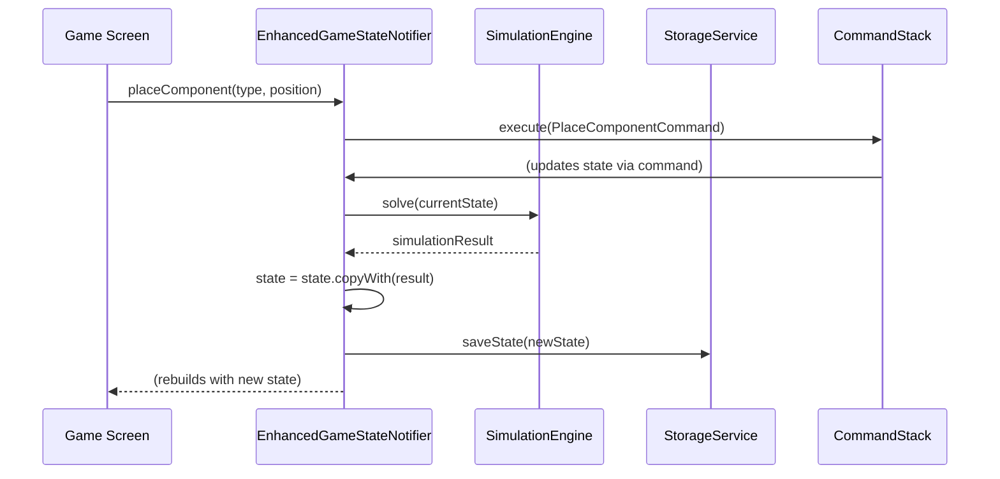

# Architectural Refactoring Plan: Migrating to a Unified State Management Model

**Version:** 1.0  
**Date:** 2025-08-30  
**Author:** Gemini AI  
**Status:** Proposed

---

## 1.0 Executive Summary

This document outlines a detailed plan to refactor the SparkCircuit application from its current, over-engineered state management system to a modern, scalable, and maintainable architecture.

**The Problem:** The existing backend is a complex web of 7+ specialized `StateNotifier`s managed by a central `GameEngineOrchestrator`. This has made the codebase brittle, difficult to extend, and has diverted focus from implementing the application's core feature: a functional circuit simulator.

**The Solution:** We will migrate to a **Single Notifier + Services** model. This architecture uses a single `EnhancedGameStateNotifier` as the sole source of truth for the UI, which in turn delegates all complex logic to a set of independent, modular backend services.

**Expected Benefits:**
- **Reduced Complexity:** Drastically simplify the state management layer by removing thousands of lines of boilerplate and orchestration logic.
- **Improved Extensibility:** Enable new features (e.g., scoring, new components) to be added easily by creating new, isolated services without modifying existing logic.
- **Enhanced Performance:** Eliminate the overhead of synchronizing multiple notifiers on every user action.
- **Increased Maintainability:** A clear separation of concerns will make the code easier to understand, debug, and test.
- **Focus on Core Value:** Shift development effort from maintaining complex architecture to building the actual circuit simulation engine.

---

## 2.0 Current Architecture: Analysis & Problems

The current system is an anti-pattern where application state is "shredded" across numerous notifiers, which are then coordinated by a central orchestrator.

### 2.1 Impacted Files (The Current System)

- **Orchestration & Adapters:**
  - `lib/application/game_engine_orchestrator.dart`
  - `lib/application/hybrid_game_engine_adapter.dart`
- **Specialized Notifiers:**
  - `lib/application/grid_notifier.dart`
  - `lib/application/history_notifier.dart`
  - `lib/application/game_progress_notifier.dart`
  - `lib/application/component_selection_notifier.dart`
  - `lib/application/interaction_state_notifier.dart`
  - `lib/application/game_engine_notifier.dart` (Legacy)
  - *(And potentially others)*
- **State Synchronization:**
  - `lib/application/transaction.dart`
- **Provider Configuration:**
  - `lib/application/providers.dart` (Contains complex, feature-flagged provider logic)

### 2.2 Core Problems

1.  **High Coupling:** Despite seeming modular, the notifiers are tightly coupled. A simple action like placing a component requires the `GameEngineOrchestrator` to coordinate updates across the `GridNotifier`, `HistoryNotifier`, and `ComponentSelectionNotifier`, making the system rigid.
2.  **Extensibility Failure:** To add a new feature (e.g., a scoring system), a developer would need to create a new `ScoreNotifier` and then modify the `GameEngineOrchestrator` and its transaction logic. This violates the Open/Closed Principle and makes adding features a high-risk, high-effort task.
3.  **Performance Overhead:** The `Transaction` system and the need to reconstruct a composite `GameEngineState` from all notifiers on every single action introduces significant performance bottlenecks.
4.  **Cognitive Load:** Developers must understand the intricate interactions between all notifiers and the orchestrator to make any changes, leading to a steep learning curve and a high chance of introducing bugs.

---

## 3.0 Proposed Architecture: Single Notifier + Services

We will implement a clean, layered architecture that separates concerns effectively.

### 3.1 Core Principles

- **Single Source of Truth:** The UI will listen to a single `EnhancedGameStateNotifier`, which exposes a single, immutable `GameState` object.
- **Service-Based Modularity:** All business logic, simulation, and data manipulation will be handled by independent, single-responsibility services in a dedicated `lib/core` layer.
- **Unidirectional Data Flow:** UI events trigger methods on the notifier, which calls one or more services. The services return data, the notifier updates its state, and the UI rebuilds reactively.

### 3.2 The `EnhancedGameStateNotifier`

This will be the new heart of the application layer.

- **File:** `lib/application/game_state_notifier.dart`
- **Responsibilities:**
  - Hold the application's `GameState`.
  - Expose methods for the UI to call (e.g., `placeComponent`, `startSimulation`, `undoLastAction`).
  - Delegate the actual work for these methods to the appropriate backend services.
  - Update its `GameState` based on the results from the services.

### 3.3 The Service Layer (`lib/core`)

This new directory will contain the application's "brain." All services will be pure Dart classes with no Flutter dependencies, making them highly testable.

- **`lib/core/simulation/simulation_engine.dart`**:
  - **API:** `Future<SimulationResult> solve(CircuitNetlist netlist)`
  - **Responsibility:** Takes a description of the circuit (`CircuitNetlist`) and returns the calculated voltages and currents.
- **`lib/core/persistence/storage_service.dart`**:
  - **API:** `Future<void> saveState(GameState state)`, `Future<GameState?> loadState()`
  - **Responsibility:** Handles saving and loading the game state to the device.
- **`lib/core/commands/command_stack.dart`**:
  - **API:** `void execute(Command command)`, `void undo()`, `void redo()`
  - **Responsibility:** Manages the undo/redo history.
- **`lib/core/scoring/scoring_service.dart`** (Example of a future extension):
  - **API:** `int calculateScore(GameState state)`
  - **Responsibility:** Calculates the player's score.

### 3.4 Data Flow Diagram



---

## 4.0 Impact Analysis

This refactoring will touch multiple parts of the application.

### 4.1 Files to be DELETED

- `lib/application/game_engine_orchestrator.dart`
- `lib/application/hybrid_game_engine_adapter.dart`
- `lib/application/grid_notifier.dart`
- `lib/application/history_notifier.dart`
- `lib/application/game_progress_notifier.dart`
- `lib/application/component_selection_notifier.dart`
- `lib/application/interaction_state_notifier.dart`
- `lib/application/transaction.dart`
- `lib/application/hybrid_implementation_guide.md`

### 4.2 Files to be CREATED

- **`REFACTORING_PLAN.md`** (This file)
- **`lib/application/game_state_notifier.dart`**
- **`lib/core/`** (Directory)
- **`lib/core/simulation/simulation_engine.dart`**
- **`lib/core/simulation/circuit_netlist.dart`**
- **`lib/core/simulation/simulation_result.dart`**
- **`lib/core/persistence/storage_service.dart`**
- **`lib/core/commands/command_stack.dart`**
- **`lib/core/commands/command.dart`**
- **`test/core/`** (Directory for new unit tests)
- **`test/application/game_state_notifier_test.dart`**

### 4.3 Files to be MODIFIED

- **`lib/application/providers.dart`**: Will be drastically simplified. All old notifier providers will be removed and replaced with providers for the new `EnhancedGameStateNotifier` and the new core services.
- **All UI files that consume old providers**: Any widget that uses `ref.watch` or `ref.read` on one of the old notifiers will need to be updated to watch the new `gameStateProvider` instead. This includes, but is not limited to:
  - `lib/presentation/features/game/screens/game_screen.dart`
  - `lib/presentation/features/component_palette/widgets/component_palette.dart`
  - `lib/presentation/features/hud/widgets/main_hud.dart`
- **`pubspec.yaml`**: May need new dependencies for matrix math if implementing an MNA solver.

---

## 5.0 Step-by-Step Implementation Plan

This plan is designed to minimize risk and allow for incremental progress.

**Phase 0: Preparation (1-2 days)**
1.  **Create Integration Tests:** Before touching any code, create a suite of high-level integration tests that verify current behaviors (e.g., placing a component adds it to the grid). These tests will fail during the refactoring and will be our guide to ensure we haven't broken anything once we are done.
2.  **Branching:** Create a new, long-lived feature branch for this refactoring (e.g., `feat/unified-state-architecture`).

**Phase 1: Teardown & Scaffolding (1 day)**
1.  **Delete Old Files:** Delete all files listed in section 4.1. The project will not compile. This is expected.
2.  **Create New Files:** Create the empty files and directories listed in section 4.2.
3.  **Update Providers:** Gut `lib/application/providers.dart` and create the new, simple providers for the (currently empty) services and the new notifier.

**Phase 2: Implement Core Services (3-5 days)**
1.  **`StorageService`:** Implement the service to save/load game state using `SharedPreferences` or `Hive`.
2.  **`CommandStack`:** Implement the command stack for undo/redo.
3.  **`SimulationEngine` (V1 - Simple):** Implement a *basic* iterative solver. **Do not attempt a full MNA solver yet.** The goal is to have a working, pluggable service, not a perfect one. It can simply continue the existing "power propagation" logic for now.

**Phase 3: Implement the Notifier (2 days)**
1.  **Build `EnhancedGameStateNotifier`:** Write the notifier logic. It will take the new services in its constructor.
2.  **Implement Methods:** Implement the public methods (`placeComponent`, etc.) by calling the appropriate services.
3.  **Unit Test:** Write extensive unit tests for the notifier, using mock versions of the services to verify its logic.

**Phase 4: UI Integration (2-3 days)**
1.  **Update Widgets:** Go through the UI files that are now broken.
2.  **Replace Providers:** Change `ref.watch(oldNotifierProvider)` to `ref.watch(gameStateProvider)`.
3.  **Update Method Calls:** Change UI event handlers (like `onTap`) to call the new methods on `ref.read(gameStateProvider.notifier)`.

**Phase 5: Validation (1-2 days)**
1.  **Fix Integration Tests:** At this point, the app should compile and run. Run the integration tests created in Phase 0 and fix them until they all pass.
2.  **Manual Testing:** Perform thorough manual testing to catch any regressions.
3.  **Review & Merge:** Conduct a final code review and merge the feature branch.

---

## 6.0 Risk Assessment & Mitigation

- **Risk 1: High - Breaking existing functionality.**
  - **Mitigation:** The integration tests created in Phase 0 are our safety net. No code is merged until all of these tests are passing again.

- **Risk 2: Medium - The scope of change is large.**
  - **Mitigation:** The phased approach breaks the problem down. By first deleting the old code, we commit to the new path and can focus on building one service at a time.

- **Risk 3: Medium - Simulation engine complexity.**
  - **Mitigation:** We will explicitly start with a simple, iterative "V1" of the engine. This decouples the architectural refactoring from the difficult scientific problem of building a perfect solver. The perfect solver can be a "V2" of the service later on.

- **Risk 4: Low - State migration.**
  - **Mitigation:** The underlying `GameState` model is not changing significantly, only the way it is managed. The `StorageService` can be written to be compatible with any old save files if necessary.

---

## 7.0 Testing Strategy

- **Unit Tests:** Each new service (`SimulationEngine`, `StorageService`, `CommandStack`) will have its own suite of unit tests with 100% coverage of its public API. The `EnhancedGameStateNotifier` will also be unit tested with mocked services.
- **Widget Tests:** Key UI widgets will be tested to ensure they correctly react to state changes from the new `gameStateProvider`.
- **Integration Tests:** The high-level tests from Phase 0 will form the backbone of our regression suite, ensuring the entire application flow works as intended.

---

## 8.0 Conclusion

This refactoring is a significant but necessary step to pay down the project's architectural debt. By replacing the complex and brittle multi-notifier system with a clean, service-based architecture, we will unlock the project's potential for future growth and allow the team to focus on what truly matters: delivering a high-quality, functional, and educational circuit simulation experience.

---

## 9.0 Additional Code-Level Anti-Patterns & Recommendations

Beyond the primary architectural issue, a review of the codebase reveals several smaller-scale anti-patterns. Addressing these during the refactoring will further improve code quality, maintainability, and robustness.

### 9.1 Anti-Pattern: Inconsistent Use Case Patterns (V1 vs. V2)

#### For a Junior Developer: What is this?

Imagine you find two different sets of blueprints for building a car's engine in the same workshop. One set is old and complicated (V1), and the other is new and streamlined (V2). It's confusing to have both, and any new work should obviously use the better, newer blueprint. We need to throw away the old set to avoid confusion.

#### Where do we see this?

This pattern is visible in the `lib/application/use_cases/` directory. You will see pairs of files like:
- `create_component_use_case.dart` (V1) vs. `create_component_use_case_v2.dart` (V2)
- `move_component_use_case.dart` (V1) vs. `move_component_use_case_v2.dart` (V2)
- ...and so on for `rotate`, `select`, `tap`, etc.

#### Why is it a problem?

- **Technical Debt:** The "V1" files represent a deprecated approach that was abandoned. Keeping them in the codebase creates confusion and increases the chances of a developer accidentally using the old, buggy logic.
- **Coupling:** The V1 use cases were likely coupled directly to the old multi-notifier system, making them part of the problem we are already solving.
- **Inconsistency:** It creates two different ways of doing the same thing, which is a major source of bugs and makes the codebase harder to understand.

#### What's the better way?

The "V2" approach, which uses the **Command Pattern**, is the correct path. In this pattern, a use case's only job is to assemble a `Command` object (e.g., `CreateComponentCommand`). This `Command` is a self-contained unit of work. This decouples the "intent" of the user from the "execution" of the action, which is a very clean and testable design.

#### Actionable Advice

As part of the **Phase 1: Teardown** of the refactoring, **delete all "V1" use case files**. The project should standardize on the V2/Command Pattern for all user actions.

---

### 9.2 Anti-Pattern: Static Service Locator (`ComponentRegistry`)

#### For a Junior Developer: What is this?

Think of a magic, public toolbox (`ComponentRegistry`) that is always available everywhere in the workshop. Any worker who needs a hammer can just magically pull one from this public toolbox (`ComponentRegistry.create(...)`). This seems convenient, but it's hard to keep track of who is using which tool. It's better and safer to give each worker the specific set of tools they need for their job when they start working. This is called **Dependency Injection**.

#### Where do we see this?

- **Definition:** `lib/application/services/component_registry.dart`
- **Usage:** Throughout the `lib/components/` and `lib/domain/goals/` directories, you see calls like `ComponentRegistry.register(...)`. Any part of the code can call `ComponentRegistry.create(...)` to get a component instance.

#### Why is it a problem?

- **Hidden Dependencies:** A class that calls a static method like `ComponentRegistry.create()` has a "hidden" dependency. You can't see it in the class's constructor, which makes the code less honest about what it needs to function.
- **Global State:** The registry is a form of global, mutable state. This can make testing very difficult, as one test might affect the registry's state and cause another, unrelated test to fail.
- **Inflexible:** You can't easily swap out the implementation. For example, in a test, you can't easily replace the real `ComponentRegistry` with a fake one for testing purposes.

#### What's the better way?

The best practice is **Dependency Injection (DI)**. Instead of a static class, you would create a normal `ComponentFactory` class. You would create a single instance of this factory when the app starts (likely in a Riverpod `Provider`) and then pass it explicitly into the constructors of the classes that need it.

#### Actionable Advice

The `ComponentRegistry` is deeply integrated and functional. Replacing it is a **lower priority** than the main architectural refactor. However, the team should be aware of its downsides. A good long-term goal would be to refactor it into a non-static `ComponentFactory` service that is provided via Riverpod, just like the other new services.

---

### 9.3 Anti-Pattern: Primitive Obsession

#### For a Junior Developer: What is this?

This is about using general-purpose types like `String` or `int` when a more specific, custom type would be safer and clearer. It's like giving instructions as "move the 'thing' to the 'place'" instead of the much clearer "move the `Car` to the `Garage`". The second way is specific, and you can't accidentally try to move a `Tree` to the `Garage`.

#### Where do we see this?

This is a general code quality issue. While not rampant, it can be seen in places where component types might be passed as strings (e.g., `createComponent('battery', ...)`).

#### Why is it a problem?

- **No Compile-Time Safety:** If you rely on a string like `'battery'`, you could easily make a typo like `'batery'`. The compiler won't catch this, and your code will fail unexpectedly at runtime.
- **Poor Discoverability:** When you see a function that accepts a `String type`, you don't know what the valid strings are without reading the source code. If it accepted a `ComponentType` enum, your IDE would show you all the possible options.
- **Implicit Assumptions:** The code assumes the string will be one of a few valid options, which is not guaranteed.

#### What's the better way?

Create strong, specific types to represent your data.
- For a fixed set of choices, use an **`enum`**. For example: `enum ComponentType { battery, wire, bulb }`.
- For a bundle of related data, use a **`class`**. For example, instead of `Map<String, dynamic> params`, create a `class BatteryParameters { final double voltage; }`.

#### Actionable Advice

During the refactoring, make it a rule that all new service and notifier APIs must be **strongly-typed**. Do not use strings, maps, or other primitives to represent concepts that can be captured in an `enum` or `class`. This will make the new architecture significantly more robust and easier to use correctly.

---

## 10.0 Deep Dive: Solving the Core Architectural Failures

This section provides a more detailed, practical look at how the proposed refactoring directly solves the two most critical issues in the current architecture: the performance bottleneck and the inability to support the application's core mission.

### 10.1 Solving the "Performance Cliff": From Orchestration to Directness

#### The Problem: Why the App is Slow

The current architecture is slow by design. As established, every user action forces the `GameEngineOrchestrator` to loop through all 7+ notifiers, run their logic, manage a transaction, and then build a new state from the pieces.

**Code Reference (Conceptual):**
The logic inside `lib/application/game_engine_orchestrator.dart` follows this expensive pattern:

```dart
// BEFORE: The expensive orchestration loop
Future<void> executeAction(ComponentAction action) async {
  // 1. Create a transaction
  final transaction = _beginTransaction();
  try {
    // 2. Loop through every notifier for every action
    await _grid.executeInTransaction(action, transaction);
    await _history.executeInTransaction(action, transaction);
    await _progress.executeInTransaction(action, transaction);
    await _selection.executeInTransaction(action, transaction);
    // ... and so on for all other notifiers

    // 3. Commit the transaction
    await transaction.commit();

    // 4. Rebuild the state from all the pieces
    state = _buildCompositeState(); // Very expensive!
  } catch (e) {
    // ... error handling
  }
}
```
This entire process has to happen for every single tap, drag, or button press, leading to significant lag.

#### The Best Practice: Immutable State and Direct Updates

The best practice in modern, reactive frameworks like Flutter with Riverpod is to treat state as a single, immutable object. When a change occurs, you create a *new* state object based on the old one and the change. This is atomic, predictable, and highly performant.

#### Our Refactored Design: The Solution

The `EnhancedGameStateNotifier` embodies this best practice. It holds the single `GameState` object and updates it directly and efficiently.

**Code Snippet (Conceptual):**
The new logic inside `lib/application/game_state_notifier.dart` will be dramatically simpler:

```dart
// AFTER: The clean, direct, and performant approach
Future<void> placeComponent(ComponentType type, Position pos) async {
  // 1. Create the new component
  final newComponent = _componentFactory.create(type, pos);

  // 2. Create the new state in a single, atomic operation
  final newState = state.copyWith(
    grid: state.grid.withComponent(newComponent),
    // any other direct changes...
  );

  // 3. Set the new state. Riverpod handles the rest.
  state = newState;

  // 4. Delegate any side-effects to services
  await _storageService.saveGameState(state);
}
```

#### Justification and Benefits

- **No Loops:** The new approach eliminates all loops over notifiers.
- **No Transactions:** The atomic nature of `state = newState` removes the need for a complex, manual transaction system.
- **No Reconstruction:** We are not rebuilding the state from pieces; we are creating a new version from the previous one. This is far more efficient.
- **Performance Guarantee:** This design ensures that the cost of an action is related only to the complexity of that *one action*, not the total number of features in the application. This solves the "performance cliff" and allows the app to scale.

---

### 10.2 Solving the "Core Mission" Failure: Building the Simulation Foundation

#### The Problem: A Simulator Without an Engine

The application's vision is to be a circuit simulator, but the current architecture has no place to put a real simulation engine. The existing `PowerSimulationService` is a placeholder that cannot perform real electrical calculations. The architecture is actively hostile to its own purpose.

#### The Best Practice: A Pure and Layered Core

The universal best practice for building complex applications is **Separation of Concerns**, often implemented as a **Layered Architecture** (or Clean/Hexagonal Architecture). This means the application's "brain" (its core business logic) should be completely separate from its "face" (the UI).

This core layer should be:
- **Pure:** Written in pure Dart with no dependencies on the Flutter SDK.
- **Independent:** It should not know or care that it's being used in a Flutter app.
- **Testable:** You should be able to test the entire core logic in a simple command-line Dart test runner, without any widgets.

#### Our Refactored Design: The Solution

The refactoring plan explicitly creates this missing foundation by introducing the `lib/core` directory.

**1. The Foundation (`lib/core`):**
This directory is the home for the "brain". It will contain the `SimulationEngine`, which is the real, platform-agnostic simulator.

**2. The Contract (`simulation_engine.dart`):**
We define a clear, pure interface for the engine.

**Code Snippet (Conceptual):**
```dart
// In: lib/core/simulation/simulation_engine.dart

// Pure data in, pure data out. No Flutter code.
abstract class SimulationEngine {
  Future<SimulationResult> solve(CircuitNetlist netlist);
}

// The data it operates on is also pure.
class CircuitNetlist { ... }
class SimulationResult { ... }
```

**3. The Bridge (`EnhancedGameStateNotifier`):**
The notifier acts as the crucial bridge connecting the Flutter UI world to the pure Dart Core world.

**Code Snippet (Conceptual):**
```dart
// In: lib/application/game_state_notifier.dart

// The notifier has a dependency on the pure engine.
final simulationEngine = ref.read(simulationEngineProvider);

// It translates UI state into pure data for the engine.
final netlist = _netlistBuilder.build(state);

// It calls the engine and gets pure data back.
final result = await simulationEngine.solve(netlist);

// It then updates its state, which the UI consumes.
state = state.copyWith(simulationResult: result);
```

#### Justification and Benefits

- **It Makes the Core Mission Possible:** This design is the *only* way to properly build the required simulation engine. It provides a clean, isolated space for the complex mathematical logic to live, free from the concerns of UI rendering or state management.
- **Enables True Testability:** The simulation engine can be tested with mathematical precision, ensuring that a circuit with a 5V source and a 10-ohm resistor produces exactly 0.5A of current, without ever needing to render a widget.
- **Promotes Reusability:** Because the `lib/core` engine is pure Dart, it could theoretically be reused in a web backend, a command-line tool, or another application with minimal changes.
- **Unlocks Future Growth:** This clean separation allows different teams to work in parallel. A UI team can work on the presentation layer, while an engineering team can focus on improving the simulation engine in the core layer, with the `SimulationEngine` interface as their stable contract.
