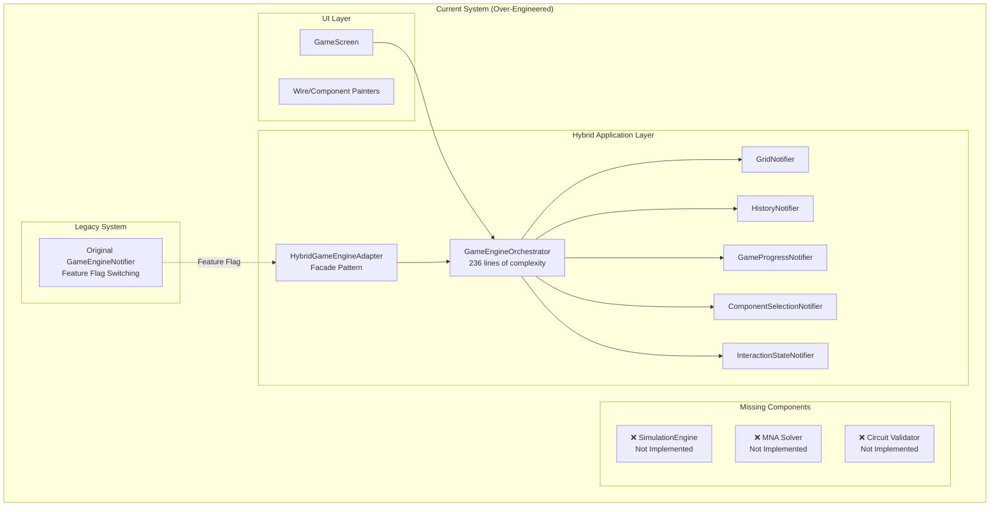
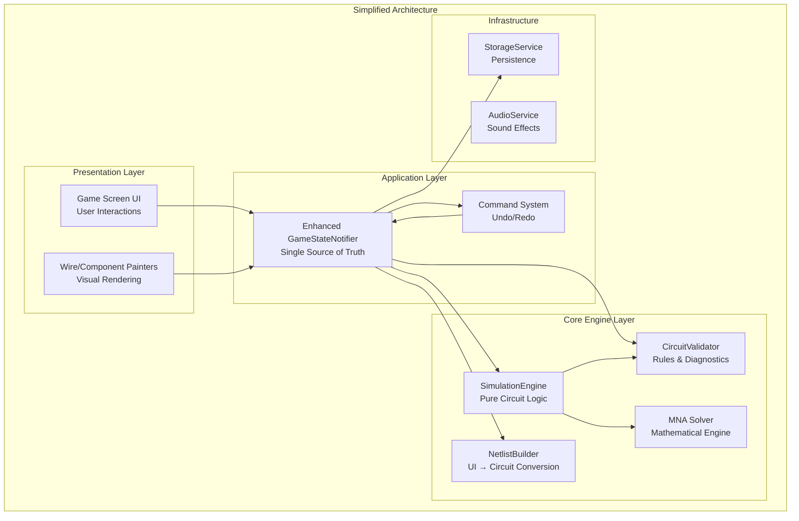
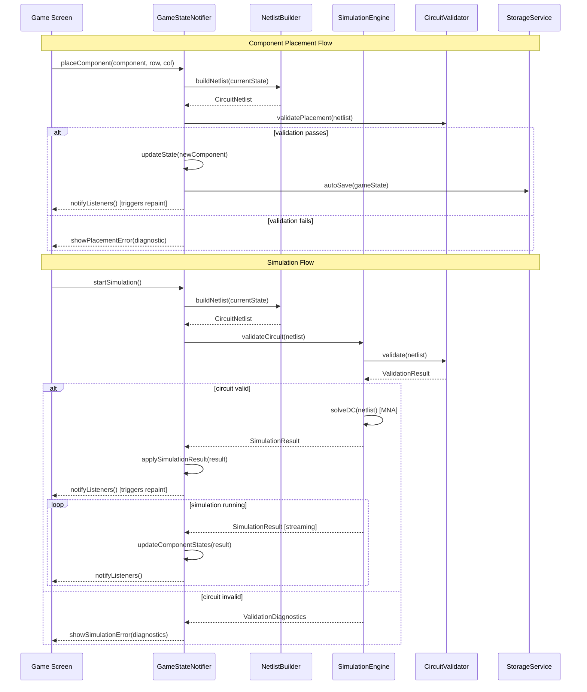
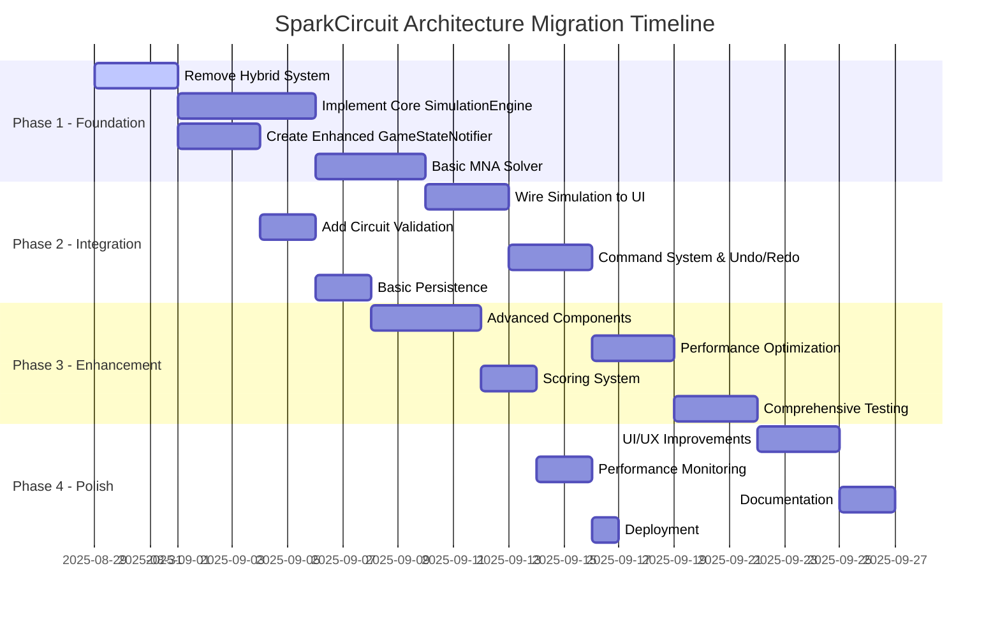
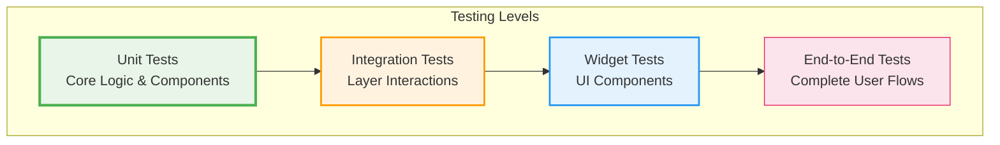

# SparkCircuit — Revised Architecture Design & Implementation Strategy

**Version:** 2.0  
**Date:** 2025-08-29  
**Status:** Architecture Review & Refactoring Proposal

---

## Executive Summary

After comprehensive analysis of the existing codebase and design documents, this document proposes a **simplified, robust architecture** to replace the current over-engineered hybrid system. The focus shifts from complex state orchestration to implementing the missing core circuit simulation functionality while maintaining clean separation of concerns and future extensibility.

**Key Changes:**
- **Eliminate hybrid complexity**: Remove 7+ specialized notifiers and orchestrator pattern
- **Implement missing simulation engine**: Add actual MNA solver and circuit validation
- **Simplify state management**: Single enhanced GameStateNotifier instead of fragmented state
- **Clear API boundaries**: Clean separation between UI, application, and simulation layers

---

## Contents

- [Current Architecture Analysis](#current-architecture-analysis)
- [Critical Issues Identified](#critical-issues-identified)
- [Proposed Simplified Architecture](#proposed-simplified-architecture)
- [Simulation Engine Integration Strategy](#simulation-engine-integration-strategy)
- [Unified State Management](#unified-state-management)
- [Migration Strategy](#migration-strategy)
- [API Contracts & Boundaries](#api-contracts--boundaries)
- [Testing Strategy](#testing-strategy)
- [Implementation Phases](#implementation-phases)
- [Performance & Monitoring](#performance--monitoring)

---

## Current Architecture Analysis

### Existing Codebase Structure



---

## Critical Issues Identified

### 1. **Over-Engineered Hybrid System**
The hybrid approach introduces excessive complexity without delivering core functionality - **7+ specialized notifiers**, **236-line orchestrator**, **runtime feature flag switching**.

### 2. **Missing Core Foundation**
Despite detailed architectural planning, the actual simulation engine is completely missing - no MNA solver, circuit validation, or component behavior models.

### 3. **State Management Fragmentation**
State is spread across too many specialized notifiers, creating debugging complexity and performance overhead.

### 4. **API Boundary Confusion**
Multiple overlapping APIs create development confusion with inconsistent patterns across codebase.

---

## Proposed Simplified Architecture

### Core Principles
1. **Single Source of Truth**: One primary state container instead of 7+ notifiers
2. **Clear API Boundaries**: Distinct separation between UI layer and simulation core
3. **Testable Components**: Isolated, pure simulation engine with deterministic behavior  
4. **Gradual Migration**: Simple migration path without runtime feature flag switching
5. **Focus on Core Value**: Implement actual circuit simulation instead of architectural complexity

### Simplified System Design



---

## Simulation Engine Integration Strategy

### Integration Flow Diagram



---

## Unified State Management

### Enhanced GameStateNotifier

Replace the complex orchestrator with a single, enhanced GameStateNotifier that handles all state management, simulation integration, command execution, and persistence.

---

## Migration Strategy

### Phase-by-Phase Migration Plan



### Step 1: Remove Hybrid Complexity

**Files to Delete:**
```
lib/application/game_engine_orchestrator.dart          [236 lines]
lib/application/hybrid_game_engine_adapter.dart        [Remove facade]
lib/application/grid_notifier.dart                     [Specialized notifier]
lib/application/history_notifier.dart                  [Specialized notifier]
lib/application/game_progress_notifier.dart            [Specialized notifier]
lib/application/component_selection_notifier.dart      [Specialized notifier]
lib/application/interaction_state_notifier.dart        [Specialized notifier]
lib/application/transaction.dart                       [Complex transaction system]
lib/application/hybrid_implementation_guide.md         [220 lines of documentation]
```

**Provider Simplification:**
```dart
// BEFORE: Complex hybrid switching
final gameEngineProvider = Provider<GameEngineState>((ref) {
  final useHybrid = FeatureFlags.useHybridEngine || FeatureFlagService.useHybridEngine;
  if (useHybrid) {
    // Complex composition from multiple notifiers...
  } else {
    return ref.watch(_originalGameEngineProvider);
  }
});

// AFTER: Simple, clean provider
final gameStateProvider = StateNotifierProvider<EnhancedGameStateNotifier, GameState>((ref) {
  return EnhancedGameStateNotifier(
    simulationEngine: ref.watch(simulationEngineProvider),
    netlistBuilder: ref.watch(netlistBuilderProvider),
    storage: ref.watch(storageServiceProvider),
    commandStack: ref.watch(commandStackProvider),
  );
});
```

### Step 2: Implement Core Simulation Engine

**New Files to Create:**
```
lib/core/
├── simulation/
│   ├── simulation_engine.dart          # Main engine interface & implementation
│   ├── mna_solver.dart                # Mathematical circuit solver
│   ├── circuit_netlist.dart          # Circuit representation
│   ├── component_models.dart          # Resistor, LED, Battery equations
│   ├── simulation_result.dart         # Result data structures
│   └── simulation_parameters.dart     # Configuration
├── validation/
│   ├── circuit_validator.dart         # Rules engine
│   ├── placement_validator.dart       # Component placement rules
│   └── diagnostic_result.dart         # Error/warning reporting
├── services/
│   ├── storage_service.dart           # Persistence abstraction
│   └── scoring_service.dart           # Deterministic scoring
└── commands/
    ├── game_command.dart              # Command interface
    ├── place_component_command.dart   # Component placement
    ├── connect_wire_command.dart      # Wire connections
    └── command_stack.dart             # Undo/redo stack management
```

### Step 3: UI Integration

**Files to Modify:**
- [`lib/presentation/features/game/screens/game_screen.dart:277`](lib/presentation/features/game/screens/game_screen.dart:277) - Replace `toggleSimulation()` with new API
- [`lib/presentation/features/game/painters/wire_painter.dart:1`](lib/presentation/features/game/painters/wire_painter.dart:1) - Use simulation results for current flow
- [`lib/presentation/features/game/painters/component_painter.dart:1`](lib/presentation/features/game/painters/component_painter.dart:1) - Use simulation results for component states

### Step 4: Testing & Validation

**Test Files to Create:**
- `test/core/simulation/mna_solver_test.dart` - Verify known circuit solutions
- `test/core/validation/circuit_validator_test.dart` - Rules testing
- `test/application/enhanced_game_state_notifier_test.dart` - State management
- `test/integration/simulation_integration_test.dart` - End-to-end flow

---

## API Contracts & Boundaries

### Core Engine API Contracts

#### SimulationEngine Interface
```dart
abstract class SimulationEngine {
  /// Validate circuit without running simulation
  Future<ValidationResult> validateCircuit(CircuitNetlist netlist);
  
  /// Solve DC steady-state circuit
  Future<SimulationResult> solveDC(CircuitNetlist netlist);
  
  /// Solve transient circuit analysis
  Future<SimulationResult> solveTransient(CircuitNetlist netlist, Duration timeStep);
  
  /// Start continuous simulation with streaming results
  Stream<SimulationResult> startContinuousSimulation(CircuitNetlist netlist);
  
  /// Control simulation state
  void pauseSimulation();
  void resumeSimulation(); 
  void stopSimulation();
  
  /// Configuration
  void setSimulationParameters(SimulationParameters params);
}
```

#### CircuitValidator Interface
```dart
abstract class CircuitValidator {
  /// Validate component placement rules
  ValidationResult validatePlacement(ComponentModel component, int row, int col, Grid grid);
  
  /// Validate complete circuit topology
  ValidationResult validateCircuit(CircuitNetlist netlist);
  
  /// Check for common circuit issues
  List<CircuitDiagnostic> analyzeCircuit(CircuitNetlist netlist);
}
```

#### StorageService Interface
```dart
abstract class StorageService {
  /// Level progress and scores
  Future<void> saveLevelProgress(String levelId, LevelProgress progress);
  Future<LevelProgress?> loadLevelProgress(String levelId);
  
  /// Game state persistence
  Future<void> saveGameState(GameState state);
  Future<GameState?> loadGameState(String levelId);
  
  /// User preferences
  Future<void> savePreferences(Map<String, dynamic> preferences);
  Future<Map<String, dynamic>> loadPreferences();
}
```

#### CommandStack Interface
```dart
abstract class CommandStack {
  /// Command execution
  void push(GameCommand command);
  GameCommand? undo();
  GameCommand? redo();
  
  /// State queries
  bool get canUndo;
  bool get canRedo;
  int get historyLength;
  
  /// Stack management
  void clear();
  void setMaxHistorySize(int size);
}
```

### Data Contracts

#### SimulationResult
```dart
class SimulationResult {
  final Map<String, double> nodeVoltages;           // Node ID → Voltage
  final Map<String, double> branchCurrents;         // Branch ID → Current
  final Map<String, ComponentState> componentStates; // Component ID → State
  final Map<String, ConnectionState> connectionStates; // Connection ID → State
  final List<SimulationDiagnostic> diagnostics;
  final DateTime timestamp;
  final bool isValid;
  
  const SimulationResult({...});
}
```

#### CircuitNetlist  
```dart
class CircuitNetlist {
  final List<SimComponent> components;
  final List<SimConnection> connections;
  final Map<String, SimNode> nodes;
  final DateTime timestamp;
  
  const CircuitNetlist({...});
  
  factory CircuitNetlist.fromGameState(GameState gameState);
}
```

#### ValidationResult
```dart
class ValidationResult {
  final bool isValid;
  final List<ValidationDiagnostic> diagnostics;
  final Map<String, dynamic> metadata;
  
  const ValidationResult({...});
  
  factory ValidationResult.success() => ValidationResult(isValid: true, diagnostics: []);
  factory ValidationResult.failure(List<ValidationDiagnostic> diagnostics);
}
```

### API Boundary Definitions

#### Layer Separation Rules

**Presentation Layer** (`lib/presentation/`)
- **MUST NOT** directly import from `lib/core/`
- **MUST** only access application layer through providers
- **MUST** use reactive patterns (Riverpod selectors)
- **CAN** import from `lib/domain/entities/`

**Application Layer** (`lib/application/`)
- **MUST** orchestrate between presentation and core
- **CAN** import from `lib/core/` and `lib/domain/`
- **MUST NOT** contain business logic (delegate to core)
- **MUST** provide clean provider interfaces

**Core Engine Layer** (`lib/core/`)
- **MUST** be pure business logic with no UI dependencies
- **CAN** import from `lib/domain/entities/`
- **MUST NOT** import from `lib/presentation/` or `lib/application/`
- **MUST** be fully unit testable

**Domain Layer** (`lib/domain/`)
- **MUST** contain only pure entities and value objects
- **MUST NOT** import from any other layers
- **MUST** be framework-agnostic

#### API Versioning Strategy

```dart
// Version all major interfaces
abstract class SimulationEngineV1 {
  // Original interface
}

abstract class SimulationEngineV2 extends SimulationEngineV1 {
  // Enhanced interface with backward compatibility
}
```

#### Error Handling Contracts

```dart
// Standardized error types across API boundaries
abstract class CircuitError {
  final String code;
  final String message; 
  final Map<String, dynamic> context;
}

class SimulationError extends CircuitError {
  final String componentId;
  final String errorType; // 'convergence', 'singularity', 'invalid_circuit'
}

class ValidationError extends CircuitError {
  final String ruleViolated;
  final List<String> affectedComponents;
}
```

---

## Testing Strategy

### Testing Pyramid



### Unit Tests (Core Layer)

#### MNA Solver Tests
```dart
// test/core/simulation/mna_solver_test.dart
group('MNA Solver DC Analysis', () {
  test('series resistor circuit', () {
    final netlist = createSeriesResistorCircuit(
      voltageSource: 5.0,
      resistor1: 1000.0,
      resistor2: 2000.0,
    );
    
    final result = await mnaSolver.solveDC(netlist);
    
    expect(result.isValid, isTrue);
    expect(result.branchCurrents['branch1'], closeTo(5.0 / 3000.0, 0.001));
    expect(result.nodeVoltages['node1'], closeTo(5.0 * 1000.0 / 3000.0, 0.001));
  });
  
  test('parallel resistor circuit', () {
    final netlist = createParallelResistorCircuit(
      voltageSource: 5.0,
      resistor1: 1000.0,
      resistor2: 1000.0,
    );
    
    final result = await mnaSolver.solveDC(netlist);
    
    expect(result.isValid, isTrue);
    final totalCurrent = result.branchCurrents.values.reduce((a, b) => a + b);
    expect(totalCurrent, closeTo(5.0 / 500.0, 0.001)); // Parallel resistance = 500Ω
  });
});
```

#### Circuit Validator Tests
```dart
// test/core/validation/circuit_validator_test.dart
group('Circuit Validator', () {
  test('detects floating nodes', () {
    final netlist = createNetlistWithFloatingNode();
    final result = validator.validateCircuit(netlist);
    
    expect(result.isValid, isFalse);
    expect(result.diagnostics.any((d) => d.code == 'FLOATING_NODE'), isTrue);
  });
  
  test('detects short circuits', () {
    final netlist = createNetlistWithShortCircuit();
    final result = validator.validateCircuit(netlist);
    
    expect(result.isValid, isFalse);
    expect(result.diagnostics.any((d) => d.code == 'SHORT_CIRCUIT'), isTrue);
  });
});
```

### Integration Tests

#### Simulation Integration Test
```dart
// test/integration/simulation_integration_test.dart
testWidgets('Complete simulation flow', (tester) async {
  final container = ProviderContainer();
  final gameState = container.read(gameStateProvider.notifier);
  
  // Place components
  await gameState.placeComponent(battery, 0, 0);
  await gameState.placeComponent(resistor, 0, 1);  
  await gameState.placeComponent(led, 0, 2);
  
  // Connect circuit
  await gameState.connectWire('battery', 'pos', 'resistor', 'a');
  await gameState.connectWire('resistor', 'b', 'led', 'anode');
  await gameState.connectWire('led', 'cathode', 'battery', 'neg');
  
  // Start simulation
  await gameState.startSimulation();
  
  // Verify results
  final state = container.read(gameStateProvider);
  expect(state.isSimulationRunning, isTrue);
  expect(state.simulationErrors, isEmpty);
  
  final ledComponent = state.grid.components.firstWhere((c) => c.type == 'led');
  expect(ledComponent.isPowered, isTrue);
});
```

### Performance Tests

#### Simulation Performance Test
```dart
// test/performance/simulation_performance_test.dart
test('Large circuit simulation performance', () async {
  final stopwatch = Stopwatch()..start();
  
  final largeCircuit = generateRandomCircuit(
    componentCount: 100,
    connectionCount: 150,
  );
  
  final result = await simulationEngine.solveDC(largeCircuit);
  stopwatch.stop();
  
  expect(result.isValid, isTrue);
  expect(stopwatch.elapsedMilliseconds, lessThan(1000)); // < 1 second
});
```

### Test Utilities

#### Circuit Builders
```dart
// test/utils/circuit_builders.dart
CircuitNetlist createSeriesResistorCircuit({
  required double voltageSource,
  required double resistor1,
  required double resistor2,
}) {
  return CircuitNetlist(
    components: [
      SimComponent.voltageSource('vs1', voltage: voltageSource),
      SimComponent.resistor('r1', resistance: resistor1),
      SimComponent.resistor('r2', resistance: resistor2),
    ],
    connections: [
      SimConnection('vs1', 'pos', 'r1', 'a'),
      SimConnection('r1', 'b', 'r2', 'a'),
      SimConnection('r2', 'b', 'vs1', 'neg'),
    ],
    nodes: {
      'node0': SimNode('node0', 0), // Ground reference
      'node1': SimNode('node1', 1),
      'node2': SimNode('node2', 2),
    },
    timestamp: DateTime.now(),
  );
}
```

---

## Implementation Phases

### Phase 1: Core Foundation (Days 1-12)

**Week 1: Remove Hybrid System**
- Delete orchestrator and specialized notifiers
- Simplify provider structure
- Create basic enhanced GameStateNotifier

**Week 2: Basic Simulation Engine**
- Implement MNA solver for DC analysis
- Create basic component models (resistor, voltage source)
- Wire solver to GameStateNotifier

### Phase 2: Integration & Validation (Days 13-22)

**Week 3: Circuit Validation**  
- Implement CircuitValidator with basic rules
- Add diagnostic system
- Integrate validation with UI

**Week 4: Command System**
- Implement command pattern for undo/redo
- Add command stack management
- Wire to GameStateNotifier

### Phase 3: Enhancement (Days 23-38)

**Week 5-6: Advanced Components**
- Add LED, capacitor, inductor models
- Implement nonlinear solver (Newton-Raphson)
- Add transient analysis capability

### Phase 4: Production Ready (Days 39-46)

**Week 7: Performance & Testing**
- Optimize solver performance
- Add comprehensive test coverage
- Performance monitoring

**Week 8: Deployment**
- Documentation
- CI/CD pipeline
- Deployment preparation

---

## Core Simulation Engine Implementation

### MNA Solver Implementation

```dart
// lib/core/simulation/mna_solver.dart
class MNASolverImpl implements MNASolver {
  @override
  Future<SimulationResult> solveDC(CircuitNetlist netlist) async {
    try {
      // Build MNA matrices
      final matrices = _buildMNASystem(netlist);
      
      // Solve linear system Ax = b
      final solution = await _solveLinearSystem(matrices.A, matrices.b);
      
      // Extract results
      final nodeVoltages = _extractNodeVoltages(solution, netlist.nodes);
      final branchCurrents = _extractBranchCurrents(solution, netlist.components);
      final componentStates = _buildComponentStates(netlist.components, nodeVoltages, branchCurrents);
      
      return SimulationResult(
        nodeVoltages: nodeVoltages,
        branchCurrents: branchCurrents,
        componentStates: componentStates,
        connectionStates: _buildConnectionStates(netlist.connections, branchCurrents),
        diagnostics: [],
        timestamp: DateTime.now(),
        isValid: true,
      );
    } catch (e) {
      return SimulationResult.error([
        SimulationDiagnostic.error('SOLVER_FAILED', e.toString())
      ]);
    }
  }
  
  MNAMatrices _buildMNASystem(CircuitNetlist netlist) {
    final nodeCount = netlist.nodes.length - 1; // Exclude ground
    final branchCount = _countVoltageSources(netlist.components);
    final matrixSize = nodeCount + branchCount;
    
    // Initialize matrices
    final G = Matrix.zeros(matrixSize, matrixSize);
    final b = Vector.zeros(matrixSize);
    
    // Stamp each component
    for (final component in netlist.components) {
      component.getEquations().stampMNA(G, null, b, netlist.nodes);
    }
    
    return MNAMatrices(G, null, b);
  }
  
  Future<Vector> _solveLinearSystem(Matrix A, Vector b) async {
    // Use LU decomposition for better numerical stability
    final lu = LUDecomposition(A);
    if (!lu.isNonsingular) {
      throw SimulationException('Singular matrix - circuit may have no unique solution');
    }
    
    return lu.solve(b);
  }
  
  Map<String, double> _extractNodeVoltages(Vector solution, Map<String, SimNode> nodes) {
    final voltages = <String, double>{};
    voltages['ground'] = 0.0; // Reference node
    
    for (final node in nodes.values) {
      if (node.id != 'ground') {
        voltages[node.id] = solution[node.index];
      }
    }
    
    return voltages;
  }
  
  Map<String, double> _extractBranchCurrents(Vector solution, List<SimComponent> components) {
    final currents = <String, double>{};
    var branchIndex = 0;
    
    for (final component in components) {
      if (component.type == 'voltage_source') {
        // Voltage source currents are in the solution vector after node voltages
        final nodeCount = solution.length - _countVoltageSources(components);
        currents[component.id] = solution[nodeCount + branchIndex];
        branchIndex++;
      } else {
        // Calculate current from voltage difference and component equations
        currents[component.id] = component.calculateCurrent(/* node voltages */);
      }
    }
    
    return currents;
  }
}
```

### Component Models Implementation

```dart
// lib/core/simulation/component_models.dart
abstract class ComponentEquations {
  void stampMNA(Matrix G, Matrix? C, Vector b, Map<String, SimNode> nodes);
  double calculateCurrent(Map<String, double> nodeVoltages);
}

class ResistorEquations implements ComponentEquations {
  final double resistance;
  final String node1Id, node2Id;
  
  ResistorEquations(this.resistance, this.node1Id, this.node2Id);
  
  @override
  void stampMNA(Matrix G, Matrix? C, Vector b, Map<String, SimNode> nodes) {
    final n1 = nodes[node1Id]?.index ?? -1;
    final n2 = nodes[node2Id]?.index ?? -1;
    final conductance = 1.0 / resistance;
    
    // Stamp conductance matrix (handle ground node)
    if (n1 >= 0) {
      G[n1][n1] += conductance;
      if (n2 >= 0) G[n1][n2] -= conductance;
    }
    
    if (n2 >= 0) {
      G[n2][n2] +=