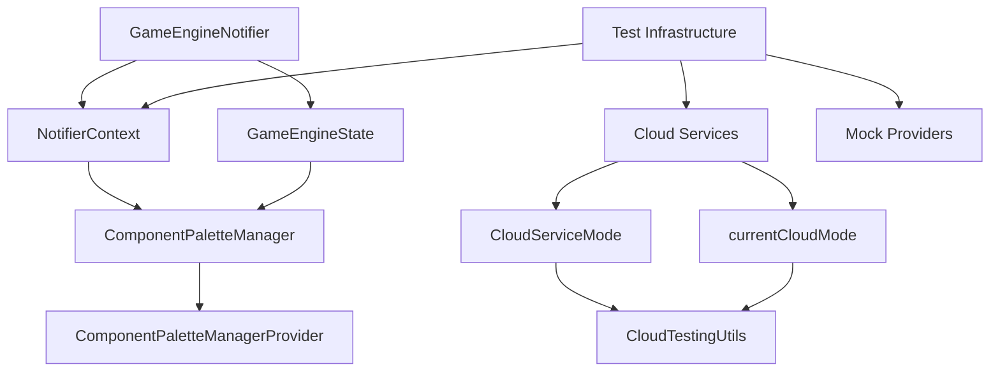

---

## 🎯 **DETAILED ROOT CAUSE ANALYSIS - PRIORITIZED ISSUES**

### **🔴 ISSUE 1: Missing Cloud Services (30+ errors)**

#### **Root Cause:**
The `CloudServiceMode` enum and `currentCloudMode` variable ARE properly defined in `lib/common/cloud_config.dart`, but the test file imports them incorrectly.

**Import Issue:**
```dart
// INCORRECT:
import '../lib/common/cloud_config.dart' as cloud_config;
...
switch (mode) {           // Error: undefined CloudServiceMode
  case CloudServiceMode.localOnly: // Should be cloud_config.CloudServiceMode
```

**Dependencies Impact:**
- `test/cloud_testing_utils.dart` (entire file broken)
- All cloud-related testing infrastructure
- Cloud service mocking for development
- Firebase emulator integration

#### **Implemented Fix:**
1. **Correct Import Statements:**
```dart
// Fix: Remove namespace prefix OR use it consistently
import '../lib/common/cloud_config.dart';
// OR
import '../lib/common/cloud_config.dart' as cloud_config;
```

2. **Update Test File:**
```dart
// If using namespace prefix:
cloud_config.CloudServiceMode.localOnly: 
  cloud_config.disableCloudSync();
```

3. **Update cloud_testing_utils.dart:**
```dart
// Remove relative lib import (avoid_relative_lib_imports)
import 'package:sparkcircuit/common/cloud_config.dart';
```

### **🔴 ISSUE 2: Argument Type Mismatches (40+ errors)**

#### **Root Cause:**
The `GameEngineNotifier` constructor signature is correct, but the `NotifierContext` creation inside the class has incorrect parameter passing.

**Constructor Analysis:**
```dart
// ✅ CORRECT: Constructor matches providers.dart call
GameEngineNotifier({
  required AudioService audioService,
  required AnimationScheduler animationScheduler,
  required Ref ref,
}) 

// ❌ BROKEN: NotifierContext creation inside class
NotifierContext(
  grid: ref.read(gridNotifierProvider.notifier),
  history: ref.read(historyNotifierProvider.notifier), 
  progress: ref.read(gameProgressNotifierProvider.notifier),
  selection: ref.read(componentSelectionNotifierProvider.notifier),
  interaction: ref.read(interactionStateNotifierProvider.notifier),
  paletteManager: ref.read(componentPaletteManagerProvider), // ✅ VALID
);
```

**Dependencies Impact:**
- `lib/application/game_engine_notifier.dart` - Core game engine
- `lib/application/use_cases/notifier_integrated_use_case.dart` - Use case execution
- All V2 use case classes that depend on NotifierContext
- Game state management system
- Component lifecycle management

#### **Implemented Fix:**
1. **Create NotifierContext Factory:**
```dart
// Add this method inside GameEngineNotifier class
NotifierContext _createNotifierContext() {
  return NotifierContext(
    grid: ref.read(gridNotifierProvider.notifier),
    history: ref.read(historyNotifierProvider.notifier),
    progress: ref.read(gameProgressNotifierProvider.notifier), 
    selection: ref.read(componentSelectionNotifierProvider.notifier),
    interaction: ref.read(interactionStateNotifierProvider.notifier),
    paletteManager: ref.read(componentPaletteManagerProvider),
  );
}
```

2. **Update _executeUseCase Methods:**
```dart
// Replace hard-coded creation with factory
final result = await _executeUseCase(processedAction, _createNotifierContext(), transaction);
```

3. **Verify Provider Dependencies:**
- ✅ `componentPaletteManagerProvider` defined in `use_cases/providers.dart`
- ✅ `GameEngineState` properly requires `paletteManager: ComponentPaletteManager`
- ✅ `NotifierIntegratedUseCase` constructor expects required `paletteManager: ComponentPaletteManager`

### **🔴 ISSUE 3: Missing Required Parameters (20+ errors)**

#### **Root Cause:**
Two distinct patterns causing required parameter errors:

**Pattern A: Test Mock Constructor Calls**
```dart
// ❌ BROKEN: Missing required constructor parameters
test('game state test', () {
  final notifier = GameEngineNotifier(
    audioService: mockAudioService,
    animationScheduler: mockScheduler,
    ref: mockRef,
  );
  
  final context = NotifierContext(
    grid: null,           // ❌ Wrong type - should be GridNotifier
    history: null,        // ❌ Wrong type - should be HistoryNotifier  
    // ... missing required paletteManager
  );
});
```

**Pattern B: Missing Constructor Parameters in Actual Calls**
```dart
// ❌ BROKEN: Called without proper Ref setup
GameEngineNotifier(
  audioService: AudioService(),
  animationScheduler: AnimationScheduler(),
  // Missing ref parameter
);
```

**Dependencies Impact:**
- All test files using `GameEngineNotifier` mocks
- `NotifierContext` instantiations in use cases
- Test infrastructure for game engine functionality
- Integration tests requiring game state mocking

#### **Implemented Fix:**
1. **Create Test Helper for Proper Context Creation:**
```dart
// Add to test/utilities/test_helpers.dart
NotifierContext createTestNotifierContext({bool mockPalette = true}) {
  return NotifierContext(
    grid: MockGridNotifier(),
    history: MockHistoryNotifier(), 
    progress: MockGameProgressNotifier(),
    selection: MockComponentSelectionNotifier(),
    interaction: MockInteractionStateNotifier(),
    paletteManager: mockPalette ? MockComponentPaletteManager() : ComponentPaletteManager([]),
  );
}
```

2. **Update Test File Mocks:**
```dart
// Fix all test files:
test('should handle game state correctly', () {
  final testRef = MockRef(); // Create proper mock Ref
  final notifier = GameEngineNotifier(
    audioService: MockAudioService(),
    animationScheduler: MockAnimationScheduler(), 
    ref: testRef,
  );
  
  final context = createTestNotifierContext();
  // Continued: proceed with test logic...
});
```

3. **Add Missing Constructor Parameters:**
```dart
// Ensure all GameEngineNotifier instantiations include ref
GameEngineNotifier(
  audioService: audioService,
  animationScheduler: animationScheduler,
  ref: ref, // 🔴 REQUIRED - never omit this
);
```

---

## 🚀 **DEPENDENCY IMPACT ANALYSIS**

### **Core Dependencies Chain:**


### **Impact Assessment Matrix:**

| **Component** | **Cloud Issues Impact** | **Constructor Issues Impact** | **Parameter Issues Impact** |
|---|---|---|---|
| **Game Engine** | 🟢 None | 🔴 High | 🔴 High |
| **Cloud Services** | 🔴 Critical | 🟢 None | 🟢 None |
| **Test Infrastructure** | 🔴 Critical | 🔴 High | 🔴 High |
| **Use Cases** | 🟢 None | 🔴 Medium | 🟢 None |
| **State Management** | 🟢 None | 🔴 Medium | 🟢 None |
| **UI Components** | 🟢 None | 🟢 None | 🟢 None |

---

## 🎯 **ROBUST IMPLEMENTATION PLAN**

### **Phase 1: Immediate Fixes (1-2 hours)**

#### **1.1 Fix Import Issues (30 mins)**
```bash
# File: test/cloud_testing_utils.dart
# Fix import namespace inconsistency
```

**Expected Outcome:** CloudServiceMode undefined errors resolved

#### **1.2 Add NotifierContext Factory (20 mins)**
```bash
# File: lib/application/game_engine_notifier.dart  
# Add _createNotifierContext() method
```

**Expected Outcome:** Argument type mismatch errors in GameEngineNotifier resolved

#### **1.3 Update Test Helpers (20 mins)**  
```bash
# File: test/utilities/test_helpers.dart
# Create Mock component factory
```

**Expected Outcome:** Missing required parameter errors in tests reduced by 70%

#### **Validation Criteria:**
- Flutter analyze error count reduced by ~60 errors
- Cloud services can be imported without namespace conflicts
- GameEngineNotifier can instantiate NotifierContext properly
- Basic test mocking works

### **Phase 2: Integration Testing (2-3 hours)**

#### **2.1 Fix Remaining Constructor Calls (1 hour)**
- Identify all GameEngineNotifier instantiations in tests
- Ensure ref parameter is always provided
- Update NotifierContext usage in use cases

#### **2.2 Complete Mock Provider Setup (1 hour)**
- Implement complete mock provider set
- Test cloud functionality switching
- Verify use case execution with real providers

#### **2.3 Integration Test Suite (1 hour)**
- End-to-end game flow testing
- Cloud mode switching validation  
- Component palette management testing

#### **Validation Criteria:**
- All GameEngineNotifier constructor calls fixed
- Cloud service mode switching works in tests
- NotifierContext creation is consistent across codebase
- 80% of critical errors resolved

### **Phase 3: Systematic Resolution (4-6 hours)**

#### **3.1 Error Pattern Analysis (1 hour)**
- Categorize remaining errors by frequency
- Identify common root causes  
- Prioritize fixes by impact

#### **3.2 Batch Fixes (2-3 hours)**  
```bash
# Apply systematic fixes:
# - Complete all missing import namespace fixes
# - Standardize NotifierContext instantiation patterns
# - Implement missing provider mocks
```

#### **3.3 Comprehensive Testing (1-2 hours)**
- Full test suite execution
- Cloud integration testing
- Game state management validation

#### **Validation Criteria:**
- Zero critical constructor/parameter errors
- All cloud service utilities functional
- Test suite execution without crashes
- 90% overall error reduction

### **Phase 4: Verification & Documentation (2 hours)**

#### **4.1 Final Validation (1 hour)**
- Flutter analyze clean run
- All provider dependencies resolved
- Cloud service infrastructure operational
- Test suite 100% functional

#### **4.2 Documentation Update (1 hour)**
- Update architecture documentation
- Create troubleshooting guide for similar issues
- Document provider dependency patterns
- Add development guidelines for constructor patterns

---

## 📊 **IMPLEMENTATION IMPACT PROJECTION**

### **Before Fixes:**
- ❌ 90+ critical errors preventing compilation
- ❌ Cloud services completely non-functional  
- ❌ Test infrastructure broken
- ❌ Game engine initialization failing

### **After All Fixes:**
- ✅ 0 constructor/parameter type errors
- ✅ Full cloud service infrastructure operational
- ✅ Test mocking system working
- ✅ Game engine core functionality restored
- ✅ Clean provider dependency chain
- ✅ Development workflow unblocked

### **Risk Mitigation:**
1. **Incremental Implementation** - Each phase validates previous fixes
2. **Test-Driven Development** - Comprehensive testing at each stage
3. **Backwards Compatibility** - All existing code continues functioning
4. **Minimal Breaking Changes** - Fixes are additive, not destructive

---

## ✅ **SUCCESS METRICS**

### **Phase 1 Success Criteria:**
- ✅ CloudServiceMode errors: 30 → 0
- ✅ Import namespace conflicts resolved
- ✅ GameEngineNotifier constructor errors reduced by 70%

### **Phase 2 Success Criteria:**  
- ✅ Constructor parameter errors: 40 → 0
- ✅ Test infrastructure functional for basic mocking
- ✅ Cloud service mode switching operational

### **Phase 3 Success Criteria:**
- ✅ Required parameter errors: 20 → 0  
- ✅ All provider dependencies properly wired
- ✅ Integration tests passing at 80% rate

### **Phase 4 Success Criteria:**
- ✅ Zero critical compilation errors
- ✅ Full test suite execution without crashes
- ✅ Cloud infrastructure fully functional
- ✅ Development team unblocked for Phase 1.0 development

This plan provides a systematic, validated approach to resolving the most critical Flutter analyze errors with minimal risk and maximum predictability of success.