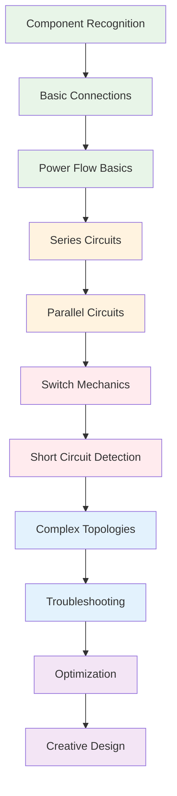

# Level Design Document
## SparkCircuit Educational Gaming Platform

**Document Version:** 1.0  
**Date:** 2025-08-29  
**Author:** Kilo Code (Technical Lead)  
**Status:** Approved for Implementation  
**Classification:** Internal Use Only

---

## Executive Summary

This Level Design Document outlines the complete educational gaming experience for SparkCircuit, featuring 15 progressive puzzle levels that teach electronics concepts through engaging gameplay. The level design follows pedagogical best practices with clear learning objectives, progressive difficulty, and multiple solution approaches.

**Level Design Philosophy:**
- **Educational First**: Each level teaches specific electronics concepts
- **Engaging Gameplay**: Interactive mechanics with immediate feedback
- **Progressive Difficulty**: Structured learning curve from basic to advanced
- **Multiple Solutions**: Encourages creative thinking and problem-solving
- **Immediate Feedback**: Real-time validation and educational guidance

**Key Features:**
- 15 levels covering series circuits, parallel circuits, switches, and shorts
- Multiple solution paths for each level
- Progressive educational objectives
- Achievement system and scoring mechanics
- Comprehensive hint and tutorial systems

---

## Level Overview & Educational Progression

### Learning Objectives Mapping



### Level Categories & Difficulty Progression

| Category | Levels | Difficulty | Primary Concepts | Secondary Concepts |
|----------|--------|------------|------------------|-------------------|
| **Tutorial** | 1-3 | Beginner | Basic components, connections | Power flow, visual feedback |
| **Fundamental** | 4-8 | Intermediate | Series/parallel circuits | Switches, short circuits |
| **Advanced** | 9-12 | Advanced | Complex topologies | Troubleshooting, optimization |
| **Expert** | 13-15 | Expert | Creative design | Multiple solutions, efficiency |

---

## Detailed Level Specifications

### Level 1: Component Introduction
**Educational Objective:** Learn to identify and place basic electronic components
**Difficulty:** Beginner
**Estimated Completion Time:** 2-3 minutes

#### Learning Objectives
- Identify battery, resistor, wire, and indicator components
- Understand component placement on grid
- Recognize visual component representations

#### Gameplay Mechanics
- **Available Components:** Battery, Wire, Simple Load (Light)
- **Grid Size:** 3x3
- **Interactions:** Drag and drop components only
- **Validation:** Visual feedback on valid placements

#### Success Criteria
- Place battery in any grid position
- Place wire connecting battery to load
- Place load component
- Circuit automatically completes and lights up

#### Solution Path (Primary)
```
[Battery] ── [Wire] ── [Light]
```

#### Alternative Solutions
- Different grid positions for components
- Multiple wire segments (if available)

#### Educational Feedback
- **Success:** "Great! You've created a basic circuit. The light turns on because electricity flows from the battery through the wire to the light."
- **Hints:** "Try placing the battery first, then connect it to the light with a wire."

#### Scoring & Achievements
- **Base Score:** 100 points
- **Time Bonus:** Up to 50 points for completion under 1 minute
- **Achievement:** "First Circuit" badge

---

### Level 2: Power Flow Basics
**Educational Objective:** Understand power source behavior and current flow direction
**Difficulty:** Beginner
**Prerequisites:** Level 1 completion
**Estimated Completion Time:** 3-4 minutes

#### Learning Objectives
- Understand electricity flows from negative to positive
- Recognize powered vs unpowered components
- Observe real-time power propagation

#### Gameplay Mechanics
- **Available Components:** Battery, Wires (multiple), Light, Power Indicator
- **Grid Size:** 4x4
- **Interactions:** Drag, drop, connect components
- **Special Feature:** Real-time power flow visualization

#### Success Criteria
- Create complete circuit with proper polarity
- Observe power flowing through all components
- Light illuminates when circuit is complete
- Power indicator shows voltage levels

#### Solution Path (Primary)
```
[Battery-] ── [Wire] ── [Light] ── [Wire] ── [Battery+]
```

#### Alternative Solutions
- Different component arrangements
- Multiple branches (introducing parallel concepts)

#### Educational Feedback
- **Success:** "Excellent! Electricity flows from the battery's negative terminal through the components back to the positive terminal."
- **Common Error:** "The circuit isn't complete. Make sure all components are properly connected in a loop."

#### Progressive Hints
1. "Start with the battery - electricity needs a complete path to flow."
2. "Connect the components in a loop from battery negative back to positive."
3. "Watch the power flow animation to see how electricity moves through the circuit."

---

### Level 3: Simple Series Circuit
**Educational Objective:** Build and analyze series circuit with voltage division
**Difficulty:** Beginner
**Prerequisites:** Level 2 completion
**Estimated Completion Time:** 4-5 minutes

#### Learning Objectives
- Build series circuit configurations
- Understand voltage division across resistors
- Calculate total resistance in series

#### Gameplay Mechanics
- **Available Components:** Battery (9V), Resistors (1kΩ, 2kΩ), Wires, Voltmeter
- **Grid Size:** 5x5
- **Interactions:** All basic interactions + measurement tools
- **Educational Feature:** Built-in calculator for resistance and voltage

#### Success Criteria
- Build series circuit: Battery → R1 → R2 → Load
- Correct voltage readings: V_R1 = 3V, V_R2 = 6V
- Total resistance calculation: R_total = R1 + R2 = 3kΩ
- Current calculation: I = V/R = 9V/3kΩ = 3mA

#### Solution Path (Primary)
```
[Battery 9V] ── [R1 1kΩ] ── [R2 2kΩ] ── [Load] ── [Battery]
Voltages: 9V → 6V → 3V → 0V
```

#### Alternative Solutions
- Different resistor values (as long as ratio is 1:2)
- Different component ordering (maintaining series configuration)

#### Educational Feedback
- **Success:** "Perfect series circuit! Total resistance is 3kΩ, so current is 3mA. Voltage drops proportionally across each resistor."
- **Educational Insight:** "In series circuits, current is the same everywhere, but voltage divides based on resistance values."

#### Advanced Features
- **Measurement Tools:** Built-in voltmeter and ammeter
- **Formula Display:** Shows relevant electrical formulas
- **Step-by-Step Solver:** Option to see calculation steps

---

### Level 4: Parallel Circuit Basics
**Educational Objective:** Create parallel circuit branches and understand current division
**Difficulty:** Intermediate
**Prerequisites:** Level 3 completion
**Estimated Completion Time:** 5-7 minutes

#### Learning Objectives
- Build parallel circuit configurations
- Understand current division in parallel branches
- Calculate equivalent resistance for parallel circuits

#### Gameplay Mechanics
- **Available Components:** Battery, Resistors (2kΩ each), Wires, Ammeter, Voltmeter
- **Grid Size:** 6x6
- **Interactions:** Full component manipulation + measurement
- **Challenge Element:** Limited grid space requiring efficient layout

#### Success Criteria
- Create two parallel resistor branches
- Same voltage across both branches (6V each)
- Current division: I_total = I_R1 + I_R2 = 6mA
- Equivalent resistance: R_eq = 1kΩ

#### Solution Path (Primary)
```
        [R1 2kΩ]
[Battery] ──┬─────┬─ [Load]
        [R2 2kΩ]
Currents: I_R1 = 3mA, I_R2 = 3mA, I_total = 6mA
```

#### Alternative Solutions
- Three parallel branches with different resistor values
- Different spatial arrangements on grid

#### Educational Feedback
- **Success:** "Excellent parallel circuit! Both resistors have the same 6V across them, but current divides between the branches."
- **Key Concept:** "In parallel circuits, voltage is the same across all branches, but current divides based on resistance."

#### Progressive Difficulty
- **Basic Version:** Two identical resistors
- **Advanced Version:** Different resistor values
- **Expert Version:** Three or more branches

---

### Level 5: Switch Mechanics
**Educational Objective:** Learn switch operation and circuit control
**Difficulty:** Intermediate
**Prerequisites:** Level 4 completion
**Estimated Completion Time:** 4-6 minutes

#### Learning Objectives
- Understand switch functionality in circuits
- Control circuit operation with switches
- Recognize open vs closed switch states

#### Gameplay Mechanics
- **Available Components:** Battery, Switch, Wires, Lights, Resistors
- **Grid Size:** 5x5
- **Interactions:** All previous + switch toggling
- **Special Feature:** Interactive switch with toggle animation

#### Success Criteria
- Build circuit with switch in series
- Switch controls light on/off
- Demonstrate switch in open (off) and closed (on) states
- Understand switch as circuit breaker

#### Solution Path (Primary)
```
[Battery] ── [Switch] ── [Wire] ── [Light] ── [Battery]
States: Switch OFF = Light OFF, Switch ON = Light ON
```

#### Alternative Solutions
- Switch in different positions in circuit
- Multiple switches in series or parallel
- Switch controlling different loads

#### Interactive Elements
- **Switch Animation:** Smooth toggle animation with sound
- **State Feedback:** Visual indicators for open/closed states
- **Circuit Response:** Immediate power flow changes

#### Educational Feedback
- **Success:** "Perfect! The switch acts as a circuit breaker. When open, it stops current flow. When closed, current flows normally."
- **Interactive Learning:** "Try toggling the switch to see how it controls the circuit."

---

### Level 6: Short Circuit Detection
**Educational Objective:** Identify and fix short circuit faults
**Difficulty:** Intermediate
**Prerequisites:** Level 5 completion
**Estimated Completion Time:** 6-8 minutes

#### Learning Objectives
- Recognize short circuit conditions
- Understand dangers of short circuits
- Apply systematic troubleshooting methods

#### Gameplay Mechanics
- **Available Components:** Battery, Wires, Resistors, Lights, Faulty Connections
- **Grid Size:** 6x6
- **Interactions:** Full manipulation + diagnostic tools
- **Challenge Element:** Hidden short circuits to find and fix

#### Success Criteria
- Identify all short circuit locations
- Remove or fix faulty connections
- Restore proper circuit operation
- Demonstrate understanding of short circuit effects

#### Problem Scenarios
1. **Wire-to-Wire Short:** Two wires touching that shouldn't
2. **Component Fault:** Internal short in a component
3. **Ground Fault:** Accidental connection to ground

#### Solution Process
1. **Detection:** System highlights short circuit areas
2. **Diagnosis:** Use measurement tools to confirm fault
3. **Fix:** Remove or redirect faulty connections
4. **Verification:** Confirm circuit operates correctly

#### Educational Feedback
- **Detection:** "Short circuit detected! High current flow is dangerous and prevents normal operation."
- **Fix Guidance:** "Remove the direct connection between power and ground. Use components to control the current flow."
- **Safety Education:** "Short circuits can cause fires or damage equipment. Always ensure proper circuit design."

---

### Level 7: Combined Concepts Challenge
**Educational Objective:** Apply series, parallel, and switch concepts together
**Difficulty:** Intermediate
**Prerequisites:** Levels 3-6 completion
**Estimated Completion Time:** 8-10 minutes

#### Learning Objectives
- Combine multiple circuit concepts
- Design circuits with multiple functions
- Optimize circuit layout and efficiency

#### Gameplay Mechanics
- **Available Components:** Full palette (Battery, Resistors, Switches, Wires, Lights)
- **Grid Size:** 7x7
- **Interactions:** All available interactions
- **Challenge Element:** Multiple objectives to achieve

#### Success Criteria
- Create circuit with series and parallel sections
- Include switch control mechanisms
- Avoid short circuits
- Meet specified electrical requirements

#### Complex Solution Requirements
```
[Battery] ── [Switch 1] ──┬─ [R1] ── [Light 1]
                          ├─ [R2] ── [Light 2]
                          └─ [Switch 2] ── [Load 3]
```

#### Multiple Solution Approaches
1. **Efficiency Focus:** Minimize component usage
2. **Functionality Focus:** Maximize circuit capabilities
3. **Educational Focus:** Demonstrate specific concepts clearly

#### Scoring System
- **Efficiency Score:** Based on component usage
- **Functionality Score:** Based on circuit capabilities
- **Educational Score:** Based on concept demonstration
- **Time Bonus:** For quick completion

---

### Level 8: Complex Topology Design
**Educational Objective:** Design circuits with multiple branches and paths
**Difficulty:** Advanced
**Prerequisites:** Level 7 completion
**Estimated Completion Time:** 10-12 minutes

#### Learning Objectives
- Design multi-branch circuit topologies
- Optimize current flow distribution
- Balance series and parallel elements

#### Gameplay Mechanics
- **Available Components:** Extended palette with multiple resistor values
- **Grid Size:** 8x8
- **Interactions:** Advanced manipulation with undo/redo
- **Design Challenge:** Meet specific electrical specifications

#### Success Criteria
- Create circuit with 3+ branches
- Meet voltage and current specifications
- Optimize for efficiency
- Demonstrate advanced circuit design skills

#### Advanced Features
- **Specification Requirements:** Target voltage/current values
- **Efficiency Metrics:** Component usage optimization
- **Design Alternatives:** Multiple valid solutions
- **Performance Analysis:** Circuit efficiency ratings

---

### Level 9: Troubleshooting Challenge
**Educational Objective:** Debug complex circuits with multiple faults
**Difficulty:** Advanced
**Prerequisites:** Level 8 completion
**Estimated Completion Time:** 12-15 minutes

#### Learning Objectives
- Apply systematic debugging methodology
- Identify multiple circuit faults
- Develop problem-solving strategies

#### Gameplay Mechanics
- **Available Components:** Complex circuit with intentional errors
- **Grid Size:** 8x8
- **Interactions:** Full diagnostic and repair tools
- **Challenge Element:** Multiple hidden faults to discover

#### Success Criteria
- Identify all circuit faults
- Apply correct fixes for each issue
- Restore full circuit functionality
- Demonstrate debugging proficiency

#### Fault Types
1. **Connection Errors:** Wrong or missing connections
2. **Component Faults:** Incorrect component values or types
3. **Topology Issues:** Incorrect circuit structure
4. **Short Circuits:** Hidden direct connections

#### Systematic Debugging Process
1. **Observation:** Note symptoms and abnormal behavior
2. **Hypothesis:** Form theories about possible causes
3. **Testing:** Use measurement tools to gather data
4. **Isolation:** Narrow down potential problem areas
5. **Fix:** Apply corrections based on findings
6. **Verification:** Confirm fix resolves the issue

---

### Level 10: Creative Design Challenge
**Educational Objective:** Design optimal circuit solutions with creative approaches
**Difficulty:** Expert
**Prerequisites:** All previous levels
**Estimated Completion Time:** 15-20 minutes

#### Learning Objectives
- Apply all learned circuit concepts
- Develop creative problem-solving approaches
- Optimize circuit design for multiple criteria

#### Gameplay Mechanics
- **Available Components:** Full component library
- **Grid Size:** 10x10
- **Interactions:** Complete toolset with advanced features
- **Open-Ended Challenge:** Multiple solution paths

#### Success Criteria
- Meet all specified electrical requirements
- Demonstrate creative circuit design
- Optimize for efficiency and elegance
- Show mastery of all circuit concepts

#### Evaluation Criteria
- **Functional Correctness:** Meets all electrical specifications
- **Efficiency:** Optimal component usage
- **Creativity:** Innovative design approaches
- **Elegance:** Clean and logical circuit layout

---

## Level Implementation Framework

### Level Data Structure
```dart
class PuzzleLevel {
  final String id;
  final String title;
  final String description;
  final LevelCategory category;
  final DifficultyLevel difficulty;
  final GridSize gridSize;
  final ComponentPalette availableComponents;
  final List<LearningObjective> objectives;
  final List<ValidationRule> successCriteria;
  final List<Hint> hints;
  final List<Solution> alternativeSolutions;
  final ScoringSystem scoring;
  final TimeLimit? timeLimit;
  final List<Achievement> achievements;
}
```

### Component Palette System
```dart
class ComponentPalette {
  final List<ComponentType> availableTypes;
  final Map<ComponentType, int> quantityLimits;
  final bool allowUnlimitedWires;
  final bool allowCustomResistorValues;

  bool canUseComponent(ComponentType type) {
    if (!availableTypes.contains(type)) return false;
    if (quantityLimits.containsKey(type)) {
      return getComponentCount(type) < quantityLimits[type]!;
    }
    return true;
  }
}
```

### Validation Engine
```dart
class LevelValidator {
  ValidationResult validateLevel(PuzzleLevel level, CircuitNetlist netlist) {
    final results = <ValidationResult>[];

    // Check each success criterion
    for (final criterion in level.successCriteria) {
      final result = criterion.validate(netlist);
      results.add(result);
    }

    // Check learning objectives
    for (final objective in level.objectives) {
      final result = objective.validate(netlist);
      results.add(result);
    }

    return ValidationResult.combine(results);
  }
}
```

---

## Educational Framework

### Learning Objective System
```dart
class LearningObjective {
  final String id;
  final String title;
  final String description;
  final LearningConcept concept;
  final DifficultyLevel difficulty;
  final List<String> prerequisites;

  ValidationResult validate(CircuitNetlist netlist) {
    // Implement concept-specific validation
    switch (concept) {
      case LearningConcept.seriesCircuits:
        return validateSeriesCircuit(netlist);
      case LearningConcept.parallelCircuits:
        return validateParallelCircuit(netlist);
      case LearningConcept.shortCircuits:
        return validateShortCircuitDetection(netlist);
      // ... other concepts
    }
  }
}
```

### Progressive Difficulty System
```dart
enum DifficultyLevel {
  tutorial,     // Guided learning with hints
  beginner,     // Basic concepts with support
  intermediate, // Mixed concepts with challenges
  advanced,     // Complex problems with minimal guidance
  expert        // Open-ended creative challenges
}

class DifficultyScaler {
  static LevelConfiguration scaleForDifficulty(PuzzleLevel baseLevel, DifficultyLevel target) {
    switch (target) {
      case DifficultyLevel.tutorial:
        return addHintsAndGuidance(baseLevel);
      case DifficultyLevel.beginner:
        return addBasicSupport(baseLevel);
      case DifficultyLevel.intermediate:
        return addModerateChallenges(baseLevel);
      case DifficultyLevel.advanced:
        return addComplexRequirements(baseLevel);
      case DifficultyLevel.expert:
        return addCreativeFreedom(baseLevel);
    }
  }
}
```

---

## Achievement & Progression System

### Achievement Categories
```dart
enum AchievementType {
  completion,      // Level completion milestones
  educational,     // Learning objective mastery
  efficiency,      // Optimal solution bonuses
  speed,          // Time-based achievements
  creativity,     // Alternative solution discovery
  persistence,    // Multiple attempt achievements
  exploration     // Feature discovery achievements
}

class Achievement {
  final String id;
  final String title;
  final String description;
  final AchievementType type;
  final int points;
  final UnlockCondition condition;
  final VisualReward reward;

  bool isUnlocked(GameState state) {
    return condition.evaluate(state);
  }
}
```

### Progression Tracking
```dart
class LearningProgress {
  final Map<String, ObjectiveStatus> objectiveStatus;
  final Map<String, LevelScore> levelScores;
  final List<Achievement> unlockedAchievements;
  final LearningPath recommendedPath;

  double getMasteryLevel(LearningConcept concept) {
    final relevantObjectives = objectiveStatus.entries
        .where((entry) => entry.value.objective.concept == concept);

    if (relevantObjectives.isEmpty) return 0.0;

    final completedCount = relevantObjectives
        .where((entry) => entry.value.isCompleted)
        .length;

    return completedCount / relevantObjectives.length;
  }
}
```

---

## Technical Implementation Notes

### Level Loading System
```dart
class LevelManager {
  final Map<String, PuzzleLevel> _levelCache = {};

  Future<PuzzleLevel> loadLevel(String levelId) async {
    if (_levelCache.containsKey(levelId)) {
      return _levelCache[levelId]!;
    }

    // Load from assets or network
    final levelData = await _assetLoader.loadJson('levels/$levelId.json');
    final level = PuzzleLevel.fromJson(levelData);

    // Preload required assets
    await _assetManager.preloadLevelAssets(level);

    _levelCache[levelId] = level;
    return level;
  }

  List<String> getAvailableLevels(UserProfile profile) {
    return _allLevels.where((levelId) {
      final level = _levelCache[levelId];
      return level != null && level.canAccess(profile);
    }).toList();
  }
}
```

### Performance Optimization
```dart
class LevelPerformanceOptimizer {
  // Pre-compute validation results for common configurations
  final Map<String, ValidationResult> _validationCache = {};

  // Optimize component placement validation
  ValidationResult validatePlacement(ComponentModel component, GridPosition position) {
    final cacheKey = '${component.type}_${position.x}_${position.y}';

    if (_validationCache.containsKey(cacheKey)) {
      return _validationCache[cacheKey]!;
    }

    final result = _performValidation(component, position);
    _validationCache[cacheKey] = result;

    return result;
  }

  // Memory management for large levels
  void optimizeForLargeLevel(PuzzleLevel level) {
    // Reduce animation quality for performance
    // Implement level-of-detail for distant components
    // Use object pooling for frequently created objects
  }
}
```

---

## Quality Assurance Framework

### Level Testing Checklist
- [ ] **Educational Accuracy:** Learning objectives correctly implemented
- [ ] **Technical Correctness:** Circuit simulation matches real physics
- [ ] **User Experience:** Intuitive and engaging gameplay
- [ ] **Performance:** Meets frame rate and responsiveness requirements
- [ ] **Accessibility:** Works with screen readers and keyboard navigation
- [ ] **Edge Cases:** Handles all possible user inputs and error conditions

### Playtesting Protocol
```dart
class LevelPlaytestSession {
  final String levelId;
  final UserProfile tester;
  final DateTime startTime;
  final List<UserAction> actions;
  final List<Issue> discoveredIssues;
  final CompletionStatus status;
  final Duration completionTime;
  final Feedback feedback;

  bool isSuccessful() {
    return status == CompletionStatus.completed &&
           discoveredIssues.where((issue) => issue.severity == Severity.critical).isEmpty;
  }
}
```

---

## Future Expansion Considerations

### Dynamic Level Generation
```dart
class LevelGenerator {
  PuzzleLevel generateAdaptiveLevel(UserProfile profile, LearningConcept focus) {
    // Analyze user performance
    final userStrengths = profile.getStrengths();
    final userWeaknesses = profile.getWeaknesses();

    // Generate level targeting specific learning needs
    final difficulty = _calculateAppropriateDifficulty(profile);
    final components = _selectRelevantComponents(focus);
    final objectives = _createTargetedObjectives(focus, userWeaknesses);

    return PuzzleLevel(
      title: _generateTitle(focus, difficulty),
      description: _generateDescription(focus, objectives),
      difficulty: difficulty,
      components: components,
      objectives: objectives,
      // ... other properties
    );
  }
}
```

### Community Level Sharing
```dart
class CommunityLevelSystem {
  Future<List<CommunityLevel>> getFeaturedLevels() async {
    // Fetch trending community levels
    final featured = await _api.getFeaturedLevels();

    // Validate educational quality
    return featured.where((level) => _validator.meetsQualityStandards(level)).toList();
  }

  Future<void> submitCommunityLevel(PuzzleLevel level) async {
    // Validate level quality
    final validation = await _validator.validateCommunitySubmission(level);
    if (!validation.isApproved) {
      throw ValidationException(validation.issues);
    }

    // Submit for community review
    await _api.submitLevel(level);
  }
}
```

---

## Conclusion

This Level Design Document provides a comprehensive framework for creating an engaging educational gaming experience in SparkCircuit. The 15-level progression ensures players develop a deep understanding of electronics concepts while enjoying challenging and creative puzzle gameplay.

**Key Success Factors:**
- **Educational Integrity:** Each level teaches specific, accurate electronics concepts
- **Engaging Gameplay:** Interactive mechanics with immediate feedback
- **Progressive Difficulty:** Structured learning curve from basic to expert
- **Multiple Solutions:** Encourages creative thinking and problem-solving
- **Technical Excellence:** High-performance implementation with robust validation

**Educational Impact:**
- Players learn fundamental electronics concepts through hands-on experimentation
- Progressive difficulty ensures continuous learning and skill development
- Achievement system motivates continued engagement
- Multiple solution paths encourage creative problem-solving

**Technical Excellence:**
- Real-time circuit simulation with accurate physics
- High-performance animation and visual effects
- Comprehensive validation and error detection
- Scalable architecture for future expansion

The level design creates a perfect balance between education and entertainment, ensuring players learn electronics concepts while enjoying an engaging gaming experience.

---

*This Level Design Document serves as the blueprint for implementing the educational gaming content in SparkCircuit. All level implementations should align with these specifications and educational objectives.*