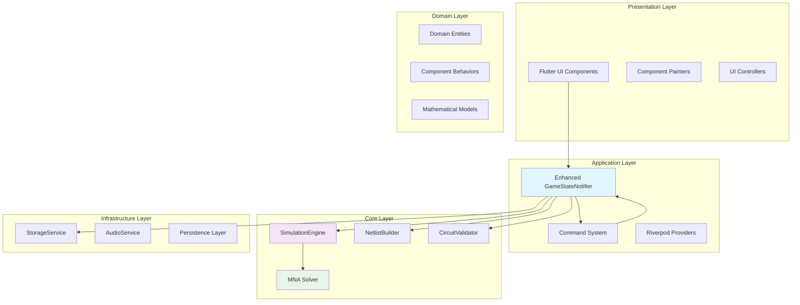

# Technical Requirements Document (TRD)
## SparkCircuit Architecture Refactoring Project

**Document Version:** 1.0  
**Date:** 2025-08-29  
**Author:** Kilo Code (Technical Lead)  
**Status:** Draft for Review  
**Classification:** Internal Use Only

---

## Table of Contents

1. [System Architecture](#system-architecture)
2. [Technical Specifications](#technical-specifications)
3. [Data Models & Interfaces](#data-models--interfaces)
4. [Integration Requirements](#integration-requirements)
5. [Performance Requirements](#performance-requirements)
6. [Security Requirements](#security-requirements)
7. [Deployment Requirements](#deployment-requirements)

---

## System Architecture

### Overall Architecture



### Architecture Principles

#### Single Responsibility Principle
- **Presentation Layer**: UI rendering and user interaction only
- **Application Layer**: State orchestration and business logic coordination
- **Core Layer**: Pure circuit simulation and mathematical computation
- **Infrastructure Layer**: External service integration and persistence
- **Domain Layer**: Business entity definitions and rules

#### Dependency Inversion
- Higher-level modules don't depend on lower-level modules
- Both depend on abstractions (interfaces)
- Abstractions don't depend on details
- Details depend on abstractions

#### Clean Architecture Layers
```
┌─────────────────────────────────────┐
│         Presentation Layer          │ ← Flutter UI
├─────────────────────────────────────┤
│         Application Layer           │ ← State Management
├─────────────────────────────────────┤
│            Core Layer               │ ← Business Logic
├─────────────────────────────────────┤
│        Infrastructure Layer         │ ← External Services
├─────────────────────────────────────┤
│           Domain Layer              │ ← Entities & Rules
└─────────────────────────────────────┘
```

---

## Technical Specifications

### T1: Development Environment

#### Platform Requirements
- **Flutter**: Version 3.0+ (Stable Channel)
- **Dart**: Version 3.0+ (Compatible with Flutter)
- **IDE**: VS Code with Flutter extensions
- **Version Control**: Git with GitHub repository

#### Target Platforms
- **Mobile**: iOS 12.0+, Android API 21+ (Android 5.0+)
- **Web**: Chrome 88+, Firefox 85+, Safari 14+, Edge 88+
- **Desktop**: Windows 10+, macOS 10.15+, Linux (Ubuntu 18.04+)

### T2: Core Technologies

#### Existing Framework Enhancement
The project already uses `flutter_riverpod: ^2.6.1` for state management. We'll enhance this with:

```yaml
# Additional dependencies for enhanced architecture
dependencies:
  freezed: ^2.3.0          # Code generation for immutable models
  json_serializable: ^6.6.0 # JSON serialization for persistence
  # Existing: flutter_riverpod: ^2.6.1 (already present)
```

#### Mathematical Computing
```yaml
dependencies:
  vector_math: ^2.1.4      # Vector and matrix operations
  ml_linalg: ^13.10.0      # Machine learning linear algebra
  scientific: ^1.0.0       # Scientific computing utilities
```

#### Development Tools
```yaml
dev_dependencies:
  flutter_test:
    sdk: flutter
  mockito: ^5.4.0          # Mocking framework
  build_runner: ^2.4.0     # Code generation
  flutter_lints: ^2.0.0    # Code linting
```

### T3: Package Structure

```
lib/
├── main.dart                    # Application entry point
├── app.dart                     # App widget and routing
├── presentation/                # UI Layer
│   ├── features/
│   │   ├── game/
│   │   ├── palette/
│   │   └── menus/
│   ├── core/
│   │   ├── theme/
│   │   └── widgets/
│   └── state/                   # UI state management
├── application/                 # Application Layer
│   ├── core/
│   │   ├── game_state.dart      # Unified game state
│   │   └── enhanced_game_state_notifier.dart
│   ├── services/
│   │   ├── simulation_service.dart
│   │   └── storage_service.dart
│   ├── commands/
│   │   ├── command.dart
│   │   └── place_component_command.dart
│   └── providers.dart           # Riverpod providers
├── core/                        # Core Layer (NEW)
│   ├── simulation/
│   │   ├── simulation_engine.dart
│   │   ├── mna_solver.dart
│   │   ├── circuit_netlist.dart
│   │   └── component_models.dart
│   ├── validation/
│   │   ├── circuit_validator.dart
│   │   └── diagnostic_result.dart
│   └── services/
│       ├── netlist_builder.dart
│       └── scoring_service.dart
├── infrastructure/              # Infrastructure Layer
│   ├── persistence/
│   │   ├── storage_service.dart
│   │   └── level_manager.dart
│   ├── audio/
│   │   └── audio_service.dart
│   └── rendering/
│       └── asset_manager.dart
├── domain/                      # Domain Layer
│   ├── entities/
│   │   ├── component.dart
│   │   ├── grid.dart
│   │   └── level_definition.dart
│   ├── behaviors/
│   │   ├── interaction_behavior.dart
│   │   └── logic_behavior.dart
│   └── value_objects/
│       ├── position.dart
│       └── electrical_properties.dart
└── common/                      # Shared utilities
    ├── constants.dart
    ├── logger.dart
    └── utils.dart
```

---

## Data Models & Interfaces

### Core Data Models

#### GameState (Unified State Container)
```dart
@freezed
class GameState with _$GameState {
  const factory GameState({
    required Grid grid,
    required SimulationState simulationState,
    required InteractionState interactionState,
    required GameProgress progress,
    required CommandHistory history,
    @Default(false) bool isLoading,
    DateTime? lastUpdated,
  }) = _GameState;

  factory GameState.initial() => GameState(
    grid: Grid.empty(),
    simulationState: SimulationState.idle(),
    interactionState: InteractionState.empty(),
    progress: GameProgress.initial(),
    history: CommandHistory.empty(),
  );
}
```

#### SimulationResult
```dart
@freezed
class SimulationResult with _$SimulationResult {
  const factory SimulationResult({
    required Map<String, double> nodeVoltages,
    required Map<String, double> branchCurrents,
    required Map<String, ComponentState> componentStates,
    required List<SimulationDiagnostic> diagnostics,
    required DateTime timestamp,
    required bool isValid,
  }) = _SimulationResult;

  factory SimulationResult.error(List<SimulationDiagnostic> diagnostics) =>
    SimulationResult(
      nodeVoltages: {},
      branchCurrents: {},
      componentStates: {},
      diagnostics: diagnostics,
      timestamp: DateTime.now(),
      isValid: false,
    );
}
```

#### CircuitNetlist
```dart
@freezed
class CircuitNetlist with _$CircuitNetlist {
  const factory CircuitNetlist({
    required List<SimComponent> components,
    required List<SimConnection> connections,
    required Map<String, SimNode> nodes,
    required DateTime timestamp,
  }) = _CircuitNetlist;

  factory CircuitNetlist.fromGameState(GameState gameState) {
    // Conversion logic from game state to circuit representation
  }
}
```

### Core Interfaces

#### SimulationEngine Interface
```dart
abstract class SimulationEngine {
  /// Validate circuit without running simulation
  Future<ValidationResult> validateCircuit(CircuitNetlist netlist);

  /// Solve DC steady-state circuit
  Future<SimulationResult> solveDC(CircuitNetlist netlist);

  /// Solve transient circuit analysis
  Future<SimulationResult> solveTransient(
    CircuitNetlist netlist,
    Duration timeStep
  );

  /// Start continuous simulation with streaming results
  Stream<SimulationResult> startContinuousSimulation(CircuitNetlist netlist);

  /// Control simulation state
  void pauseSimulation();
  void resumeSimulation();
  void stopSimulation();

  /// Configuration
  void setSimulationParameters(SimulationParameters params);
}
```

#### CircuitValidator Interface
```dart
abstract class CircuitValidator {
  /// Validate component placement rules
  ValidationResult validatePlacement(
    ComponentModel component,
    int row,
    int col,
    Grid grid
  );

  /// Validate complete circuit topology
  ValidationResult validateCircuit(CircuitNetlist netlist);

  /// Check for common circuit issues
  List<CircuitDiagnostic> analyzeCircuit(CircuitNetlist netlist);
}
```

#### StorageService Interface
```dart
abstract class StorageService {
  /// Level progress and scores
  Future<void> saveLevelProgress(String levelId, LevelProgress progress);
  Future<LevelProgress?> loadLevelProgress(String levelId);

  /// Game state persistence
  Future<void> saveGameState(GameState state);
  Future<GameState?> loadGameState(String levelId);

  /// User preferences
  Future<void> savePreferences(Map<String, dynamic> preferences);
  Future<Map<String, dynamic>> loadPreferences();
}
```

---

## Integration Requirements

### I1: Flutter Framework Integration

#### Riverpod State Management
```dart
// Core providers
final gameStateProvider = StateNotifierProvider<EnhancedGameStateNotifier, GameState>(
  (ref) => EnhancedGameStateNotifier(
    simulationEngine: ref.watch(simulationEngineProvider),
    netlistBuilder: ref.watch(netlistBuilderProvider),
    storage: ref.watch(storageServiceProvider),
    commandStack: ref.watch(commandStackProvider),
  ),
);

// Simulation engine provider
final simulationEngineProvider = Provider<SimulationEngine>(
  (ref) => MNASimulationEngine(),
);

// Service providers
final storageServiceProvider = Provider<StorageService>(
  (ref) => LocalStorageService(ref.watch(sharedPreferencesProvider)),
);
```

#### UI Integration Patterns
```dart
class GameScreen extends ConsumerWidget {
  @override
  Widget build(BuildContext context, WidgetRef ref) {
    final gameState = ref.watch(gameStateProvider);
    final gameStateNotifier = ref.watch(gameStateProvider.notifier);

    return Scaffold(
      body: Stack(
        children: [
          // Grid rendering
          GridWidget(gameState: gameState),

          // Component palette
          ComponentPalette(
            onComponentSelected: (component) =>
              gameStateNotifier.selectComponent(component),
          ),

          // Simulation controls
          SimulationControls(
            simulationState: gameState.simulationState,
            onStart: () => gameStateNotifier.startSimulation(),
            onStop: () => gameStateNotifier.stopSimulation(),
          ),
        ],
      ),
    );
  }
}
```

### I2: Platform-Specific Integration

#### Mobile Platforms (iOS/Android)
```dart
// Platform channel for native performance optimization
class NativeSimulationService {
  static const MethodChannel _channel = MethodChannel('circuit_solver');

  Future<SimulationResult> solveNative(CircuitNetlist netlist) async {
    try {
      final result = await _channel.invokeMethod('solveCircuit', {
        'netlist': netlist.toJson(),
        'parameters': _simulationParameters.toJson(),
      });
      return SimulationResult.fromJson(result);
    } catch (e) {
      // Fallback to Dart implementation
      return await _dartSolver.solveDC(netlist);
    }
  }
}
```

#### Web Platform Integration
```dart
// WebAssembly integration for web performance
class WebAssemblySolver implements SimulationEngine {
  late WasmModule _module;

  Future<void> initialize() async {
    _module = await WasmModule.load('assets/circuit_solver.wasm');
  }

  @override
  Future<SimulationResult> solveDC(CircuitNetlist netlist) async {
    // Use WebAssembly for matrix operations
    final memory = _allocateMemory(netlist);
    _module.call('solve_dc', [memory.pointer]);

    return _readResults(memory);
  }
}
```

### I3: External Service Integration

#### File System Integration
```dart
class LocalStorageService implements StorageService {
  final SharedPreferences _prefs;

  @override
  Future<void> saveGameState(GameState state) async {
    final json = state.toJson();
    await _prefs.setString('game_state_${state.levelId}', jsonEncode(json));
  }

  @override
  Future<GameState?> loadGameState(String levelId) async {
    final jsonString = _prefs.getString('game_state_$levelId');
    if (jsonString == null) return null;

    final json = jsonDecode(jsonString);
    return GameState.fromJson(json);
  }
}
```

#### Audio System Integration
```dart
class AudioService {
  final AudioPlayer _player;

  Future<void> playSimulationSound(SimulationEvent event) async {
    switch (event) {
      case SimulationEvent.circuitComplete:
        await _player.play(AssetSource('audio/circuit_complete.mp3'));
        break;
      case SimulationEvent.shortCircuit:
        await _player.play(AssetSource('audio/error.mp3'));
        break;
    }
  }
}
```

---

## Performance Requirements

### P1: Simulation Performance

#### Target Performance Metrics
- **Small Circuits** (< 20 components): < 50ms solution time
- **Medium Circuits** (20-50 components): < 100ms solution time
- **Large Circuits** (50-100 components): < 500ms solution time
- **Real-time Updates**: 30 FPS minimum during simulation

#### Performance Monitoring
```dart
class PerformanceMonitor {
  final Stopwatch _stopwatch = Stopwatch();
  final List<Duration> _measurements = [];

  void startMeasurement() => _stopwatch.start();
  void stopMeasurement() => _stopwatch.stop();

  void recordMeasurement(String operation) {
    _measurements.add(_stopwatch.elapsed);
    _stopwatch.reset();

    // Log performance metrics
    Logger.log('Performance: $operation took ${_stopwatch.elapsedMilliseconds}ms');
  }

  PerformanceReport generateReport() {
    return PerformanceReport(
      averageTime: _measurements.average,
      percentile95: _measurements.percentile(95),
      maxTime: _measurements.max,
      totalMeasurements: _measurements.length,
    );
  }
}
```

### P2: Memory Management

#### Memory Budget
- **Mobile Apps**: < 100MB total memory usage
- **Web Apps**: < 200MB heap size
- **Desktop Apps**: < 500MB memory usage

#### Memory Optimization Techniques
```dart
class MemoryEfficientSolver {
  // Object pooling for frequently allocated objects
  static final _vectorPool = Pool<Float64List>();
  static final _matrixPool = Pool<Matrix>();

  Float64List getVector(int size) {
    return _vectorPool.allocate(size) ?? Float64List(size);
  }

  void returnVector(Float64List vector) {
    _vectorPool.release(vector);
  }

  // Sparse matrix representation for large circuits
  class SparseMatrix {
    final Map<int, Map<int, double>> _data = {};

    void set(int row, int col, double value) {
      if (value.abs() > 1e-12) {  // Sparsity threshold
        _data.putIfAbsent(row, () => {})[col] = value;
      }
    }
  }
}
```

### P3: UI Responsiveness

#### Frame Rate Requirements
- **Target Frame Rate**: 60 FPS minimum
- **Acceptable Frame Rate**: 30 FPS minimum
- **Frame Time Budget**: < 16ms per frame

#### Responsiveness Optimization
```dart
class FrameRateAwareSolver {
  static const targetFrameTime = Duration(milliseconds: 16);
  static const maxComputationTime = Duration(milliseconds: 10);

  Stream<SimulationResult> solveWithFrameLimit(CircuitNetlist netlist) async* {
    final stopwatch = Stopwatch()..start();

    // Iterative solving with time checks
    for (int iter = 0; iter < maxIterations; iter++) {
      final partialResult = _performIteration(netlist, iter);

      // Yield intermediate results to maintain UI responsiveness
      if (stopwatch.elapsed > maxComputationTime) {
        yield partialResult;
        await Future.delayed(Duration.zero);  // Allow UI update
        stopwatch.reset();
      }
    }

    yield finalResult;
  }
}
```

### Animation Framework Technical Requirements

#### Rich Animation System Architecture
**Requirement:** Implement high-performance, cross-platform animation system supporting multiple frameworks for engaging visual feedback.

**Animation Framework Specifications:**
```dart
// Rive Animation Integration
dependencies:
  rive: ^0.9.0

class RiveAnimationSystem {
  static const maxRiveFileSize = 2 * 1024 * 1024; // 2MB limit
  static const targetFrameRate = 60; // FPS

  Future<RiveAnimationController> loadMascotAnimation(String assetPath) async {
    final data = await rootBundle.load(assetPath);
    final file = RiveFile.import(data);
    final artboard = file.mainArtboard;

    // State machine for interactive mascot
    final controller = StateMachineController.fromArtboard(
      artboard,
      'MascotStateMachine'
    );

    // Runtime parameter control
    final happyInput = controller.findInput<bool>('isHappy');
    final talkingInput = controller.findInput<bool>('isTalking');

    return RiveAnimationController(
      artboard: artboard,
      controller: controller,
      inputs: {
        'happy': happyInput,
        'talking': talkingInput,
      }
    );
  }
}
```

**Lottie Animation Specifications:**
```dart
// Lottie Animation Integration
dependencies:
  lottie: ^2.3.0

class LottieAnimationSystem {
  static const maxLottieFileSize = 5 * 1024 * 1024; // 5MB limit
  static const supportedFrameRate = 60; // FPS

  Future<LottieComposition> loadCelebrationAnimation() async {
    final assetData = await rootBundle.load('assets/animations/level_complete.json');
    return await LottieComposition.fromByteData(assetData);
  }

  // Performance-optimized controller
  LottieDelegates createPerformanceDelegate() {
    return LottieDelegates(
      text: (layer) => null, // Disable text layers for performance
      image: (asset, size) => _loadOptimizedImage(asset, size),
    );
  }
}
```

**Flame Particle System Requirements:**
```dart
// Flame Game Engine Integration
dependencies:
  flame: ^1.7.0
  flame_audio: ^2.0.0

class FlameParticleSystem {
  static const maxParticleCount = 200; // Performance limit
  static const targetParticleFrameRate = 60;

  late ParticleSystemComponent particleSystem;

  void initializeParticleSystem() {
    particleSystem = ParticleSystemComponent(
      particle: Particle.generate(
        count: 50,
        lifespan: 1.5,
        generator: (i) => MovingParticle(
          from: Vector2.zero(),
          to: _calculateParticlePath(i),
          child: CircleParticle(
            radius: 3.0,
            paint: Paint()..color = _getParticleColor(i),
          ),
        ),
      ),
    );
  }

  // Charge flow particle animation
  Stream<ParticleFrame> animateCurrentFlow(CircuitPath path) async* {
    for (final segment in path.segments) {
      final particles = _createFlowParticles(segment);
      yield ParticleFrame(
        particles: particles,
        timestamp: DateTime.now(),
      );
      await Future.delayed(const Duration(milliseconds: 16)); // 60 FPS
    }
  }
}
```

**Shader and CustomPainter Requirements:**
```dart
class ShaderAnimationSystem {
  static const shaderAssetPath = 'shaders/wire_deformation.frag';
  static const maxShaderComplexity = 50; // Instruction limit for performance

  Future<FragmentShader> loadWireDeformationShader() async {
    final program = await FragmentProgram.fromAsset(shaderAssetPath);
    return program.fragmentShader();
  }

  // GPU-accelerated wire deformation
  void renderStretchyWire(
    Canvas canvas,
    Path wirePath,
    double stretchFactor,
    FragmentShader shader,
  ) {
    shader.setFloat(0, stretchFactor); // Uniform parameter
    shader.setFloat(1, wirePath.length); // Wire length

    final paint = Paint()..shader = shader;
    canvas.drawPath(wirePath, paint);
  }
}
```

#### Performance Targets for Rich Animations
- **Frame Rate**: 60 FPS minimum with all animation systems active
- **Memory Budget**: < 50MB additional memory for animation assets
- **Load Times**: < 500ms for animation asset loading
- **CPU Usage**: < 15% CPU overhead during complex animations
- **Battery Impact**: < 5% additional battery drain on mobile

#### Cross-Platform Animation Compatibility
- **iOS**: Full Metal GPU acceleration support
- **Android**: OpenGL ES 3.0+ compatibility
- **Web**: CanvasKit renderer with WebGL fallback
- **Desktop**: Native GPU acceleration

#### Animation Asset Pipeline Requirements
```yaml
# Lightweight asset optimization configuration
flutter:
  assets:
    - assets/animations/rive/     # Single animation framework
    - assets/shaders/             # GPU shaders for performance

  # Build optimization for lightweight animations
  build:
    release:
      tree_shake_icons: true
      shrink_resources: true
      # Rive-specific optimizations
      animation_optimization:
        rive_compression: true
        rive_tree_shaking: true    # Remove unused animation states
        shader_compilation: true
```

### Animation Framework Technical Requirements

#### Lightweight Animation System Architecture
**Requirement:** Implement high-performance, lightweight animation system using Rive framework for engaging visual feedback and educational interactions.

**Rive Animation Framework Specifications:**
```dart
// Single lightweight animation framework
dependencies:
  rive: ^0.9.0

class RiveAnimationSystem {
  static const maxRiveFileSize = 3 * 1024 * 1024; // 3MB limit for all animations
  static const targetFrameRate = 60; // FPS
  static const maxConcurrentAnimations = 10; // Performance limit

  Future<RiveAnimationController> loadMascotAnimation(String assetPath) async {
    final data = await rootBundle.load(assetPath);
    final file = RiveFile.import(data);
    final artboard = file.mainArtboard;

    // State machine for interactive mascot
    final controller = StateMachineController.fromArtboard(
      artboard,
      'MascotStateMachine'
    );

    // Runtime parameter control
    final happyInput = controller.findInput<bool>('isHappy');
    final talkingInput = controller.findInput<bool>('isTalking');

    return RiveAnimationController(
      artboard: artboard,
      controller: controller,
      inputs: {
        'happy': happyInput,
        'talking': talkingInput,
      }
    );
  }

  // Unified particle system using Rive
  Future<RiveParticleSystem> createParticleSystem(String particleAsset) async {
    final data = await rootBundle.load(particleAsset);
    final file = RiveFile.import(data);

    return RiveParticleSystem(
      file: file,
      maxParticles: 100, // Lightweight particle limit
      performanceMode: true,
    );
  }
}
```

**Shader and CustomPainter Requirements:**
```dart
class ShaderAnimationSystem {
  static const shaderAssetPath = 'shaders/wire_deformation.frag';
  static const maxShaderComplexity = 50; // Instruction limit for performance

  Future<FragmentShader> loadWireDeformationShader() async {
    final program = await FragmentProgram.fromAsset(shaderAssetPath);
    return program.fragmentShader();
  }

  // GPU-accelerated wire deformation
  void renderStretchyWire(
    Canvas canvas,
    Path wirePath,
    double stretchFactor,
    FragmentShader shader,
  ) {
    shader.setFloat(0, stretchFactor); // Uniform parameter
    shader.setFloat(1, wirePath.length); // Wire length

    final paint = Paint()..shader = shader;
    canvas.drawPath(wirePath, paint);
  }
}
```

#### Performance Targets for Rich Animations
- **Frame Rate**: 60 FPS minimum with all animation systems active
- **Memory Budget**: < 50MB additional memory for animation assets
- **Load Times**: < 500ms for animation asset loading
- **CPU Usage**: < 15% CPU overhead during complex animations
- **Battery Impact**: < 5% additional battery drain on mobile

#### Cross-Platform Animation Compatibility
- **iOS**: Full Metal GPU acceleration support
- **Android**: OpenGL ES 3.0+ compatibility
- **Web**: CanvasKit renderer with WebGL fallback
- **Desktop**: Native GPU acceleration

#### Animation Asset Pipeline Requirements
```yaml
# Asset optimization configuration
flutter:
  assets:
    - assets/animations/rive/
    - assets/animations/lottie/
    - assets/particles/
    - assets/shaders/

  # Build optimization for animations
  build:
    release:
      tree_shake_icons: true
      shrink_resources: true
      # Animation-specific optimizations
      animation_optimization:
        rive_compression: true
        lottie_minification: true
        shader_compilation: true
```

---

## Security Requirements

### S1: Data Protection
- **Local Data Encryption**: Sensitive user data encrypted at rest
- **No External Data Transmission**: All data stays on device
- **Secure File Permissions**: Proper file system access controls

### S2: Code Security
- **Input Validation**: All user inputs validated and sanitized
- **Memory Safety**: Prevent buffer overflows and memory corruption
- **Error Handling**: Secure error messages without information leakage

### S3: Platform Security
- **Platform Permissions**: Minimal required permissions only
- **Certificate Pinning**: Secure network communications (if any)
- **Code Obfuscation**: Release builds obfuscated for protection

---

## Deployment Requirements

### D1: Build Configuration

#### Development Build
```yaml
# Development configuration
flutter:
  uses-material-design: true

environment:
  sdk: '>=3.0.0 <4.0.0'
  flutter: '>=3.0.0'

# Development-specific settings
dart:
  environment:
    DEBUG: true
    LOG_LEVEL: verbose
```

#### Production Build
```yaml
# Production configuration
flutter:
  uses-material-design: true
  assets:
    - assets/audio/
    - assets/images/
    - assets/wasm/  # WebAssembly modules

# Production optimizations
dart:
  environment:
    DEBUG: false
    LOG_LEVEL: warning

# Build optimizations
build:
  release:
    tree_shake_icons: true
    shrink_resources: true
```

### D2: Platform-Specific Builds

#### iOS Build Requirements
```yaml
# iOS-specific configuration
ios:
  minimum_version: '12.0'
  build_settings:
    ENABLE_BITCODE: false
    SWIFT_VERSION: '5.0'
    CLANG_ENABLE_MODULES: true
```

#### Android Build Requirements
```yaml
# Android-specific configuration
android:
  min_sdk_version: 21
  target_sdk_version: 33
  build_types:
    release:
      minify_enabled: true
      proguard_files:
        - proguard-rules.pro
```

#### Web Build Requirements
```yaml
# Web-specific configuration
web:
  renderer: canvaskit  # For better performance
  wasm: true         # Enable WebAssembly support
```

### D3: Testing and Validation

#### Automated Testing Setup
```yaml
# Test configuration
testing:
  unit_tests: true
  integration_tests: true
  widget_tests: true
  performance_tests: true

# Test coverage requirements
coverage:
  minimum: 80%
  exclude:
    - lib/generated/**
    - lib/**/*.g.dart
```

#### CI/CD Pipeline Requirements
```yaml
# GitHub Actions workflow example
name: CI/CD Pipeline
on: [push, pull_request]

jobs:
  test:
    runs-on: ubuntu-latest
    steps:
      - uses: actions/checkout@v3
      - uses: subosito/flutter-action@v2
      - run: flutter test --coverage
      - run: flutter build apk --release
      - run: flutter build ios --release --no-codesign
      - run: flutter build web --release
```

### Performance Optimization and Lightweight Architecture

#### App Size and Startup Optimization
**Requirement:** Maintain lightweight app size while delivering rich visual experience.

**Size Targets:**
- **Initial Install**: < 25-40 MB (varies by platform and features)
- **Cold Start Time**: < 2 seconds on mid-tier devices
- **Memory Usage**: < 100MB peak with all animation systems active

**Lightweight Deferred Loading Architecture:**
```dart
class DeferredAssetLoader {
  static final Map<String, Future<void> Function()> _deferredLibraries = {
    'rive': () async => await loadLibrary('package:rive/rive.dart'),
  };

  static Future<T> loadWithDeferred<T>(
    String libraryName,
    Future<T> Function() loader,
  ) async {
    // Load single Rive library
    if (!_deferredLibraries.containsKey(libraryName)) {
      await _deferredLibraries[libraryName]!();
    }

    // Load the asset
    return await loader();
  }
}

// Usage example for lightweight animation loading
Future<RiveAnimationController> loadMascotAnimation() async {
  return DeferredAssetLoader.loadWithDeferred(
    'rive',
    () async => await RiveAnimationSystem.loadMascotAnimation('assets/mascot.riv'),
  );
}
```

#### Isolate-Based Computation Offloading
**Requirement:** Move heavy computations off UI thread for smooth animations.

**Isolate Architecture:**
```dart
class ComputationIsolate {
  static const computationChannel = 'com.sparkcircuit.computation';

  static Future<SimulationResult> runSimulationInIsolate(
    CircuitNetlist netlist,
  ) async {
    final receivePort = ReceivePort();
    await Isolate.spawn(
      _isolateEntry,
      IsolateMessage(
        netlist: netlist,
        sendPort: receivePort.sendPort,
      ),
    );

    final result = await receivePort.first as SimulationResult;
    return result;
  }

  static void _isolateEntry(IsolateMessage message) {
    // Heavy computation in isolate
    final result = MNASimulationEngine().solveDC(message.netlist);
    message.sendPort.send(result);
  }
}

// Integration with animation system
class AnimationAwareSimulator {
  Future<SimulationResult> solveWithAnimationFeedback(
    CircuitNetlist netlist,
    AnimationController animationController,
  ) async {
    // Start loading animation
    animationController.forward();

    // Run computation in isolate
    final result = await ComputationIsolate.runSimulationInIsolate(netlist);

    // Stop animation and show results
    animationController.reverse();

    return result;
  }
}
```

#### Cross-Platform Performance Optimization
**Requirement:** Ensure consistent performance across all target platforms.

**Platform-Specific Optimizations:**
```dart
class PlatformOptimizer {
  static Future<void> configureForPlatform() async {
    final platform = Platform.operatingSystem;

    switch (platform) {
      case 'ios':
        await _configureIOS();
        break;
      case 'android':
        await _configureAndroid();
        break;
      case 'web':
        await _configureWeb();
        break;
      default:
        await _configureDesktop();
    }
  }

  static Future<void> _configureIOS() async {
    // Metal GPU optimization
    await SystemChrome.setPreferredOrientations([
      DeviceOrientation.portraitUp,
      DeviceOrientation.portraitDown,
    ]);

    // Enable high-performance mode
    await FlutterViewController.enablePerformanceMode();
  }

  static Future<void> _configureAndroid() async {
    // OpenGL ES optimization
    await SystemChrome.setSystemUIOverlayStyle(
      SystemUiOverlayStyle(statusBarColor: Colors.transparent),
    );

    // Hardware acceleration
    await HardwareAcceleration.enable();
  }

  static Future<void> _configureWeb() async {
    // WebGL and CanvasKit optimization
    if (html.window.navigator.hardwareConcurrency > 4) {
      // Enable advanced features for powerful devices
      await WebGLRenderer.enableAdvancedMode();
    }
  }
}
```

#### Lightweight Asset Optimization Pipeline
**Requirement:** Optimize single framework assets for minimal size and fast loading.

**Asset Optimization:**
```yaml
# pubspec.yaml lightweight asset optimization
flutter:
  assets:
    - assets/animations/rive/     # Single compressed Rive files
    - assets/shaders/             # Compiled shader programs

  # Build-time optimizations for lightweight app
  build:
    release:
      tree_shake_icons: true
      shrink_resources: true
      # Focused optimizations
      asset_optimization:
        rive_compression: true     # Rive file optimization
        rive_tree_shaking: true    # Remove unused states
        shader_compilation: true   # Pre-compile shaders
```

---

## Document Control

### Version History
| Version | Date | Author | Changes |
|---------|------|--------|---------|
| 1.0 | 2025-08-29 | Kilo Code | Initial TRD creation with comprehensive technical specifications |

### Technical Review Checklist
- [ ] Architecture principles alignment
- [ ] Technology stack appropriateness
- [ ] Performance requirements feasibility
- [ ] Security requirements completeness
- [ ] Integration requirements clarity
- [ ] Deployment requirements feasibility

### Approval & Sign-off
- **Technical Lead Review**: [Date] - [Reviewer]
- **Architecture Review**: [Date] - [Reviewer]
- **DevOps Review**: [Date] - [Reviewer]
- **Security Review**: [Date] - [Reviewer]
- **Final Approval**: [Date] - [Approver]

---

*This Technical Requirements Document provides the detailed technical specifications for implementing the refactored SparkCircuit architecture. All technical implementation must align with these specifications.*
#### Animation and Visual Effects System
**Requirement:** Implement high-performance animation system for engaging visual feedback and user interactions.

**Animation Requirements:**
```dart
class AnimationSystem {
  // Component placement animations
  Future<void> animateComponentPlacement(ComponentModel component, GridPosition position) async {
    // Smooth drop animation with bounce effect
    // Scale and fade transitions
    // Particle effects for successful placements
  }

  // Power flow visualizations
  Stream<AnimationFrame> animatePowerFlow(CircuitNetlist netlist) async* {
    // Real-time current flow particles
    // Voltage level color transitions
    // Component state change animations
  }

  // Error and success feedback
  Future<void> animateCircuitError(ValidationResult error) async {
    // Error highlighting animations
    // Shake effects for invalid placements
    // Success celebration animations
  }
}
```

**Performance Targets:**
- 60 FPS animation frame rate
- <16ms animation computation time
- Smooth transitions without frame drops
- Memory-efficient animation state management

#### Audio System Architecture
**Requirement:** Implement comprehensive audio system for interactive feedback and educational enhancement.

**Audio Architecture:**
```dart
class AudioSystem {
  // Component interaction sounds
  Future<void> playComponentSound(ComponentInteraction interaction) async {
    switch (interaction.type) {
      case InteractionType.place:
        await _audioPlayer.play(AssetSource('audio/component_place.mp3'));
        break;
      case InteractionType.rotate:
        await _audioPlayer.play(AssetSource('audio/component_rotate.mp3'));
        break;
      case InteractionType.error:
        await _audioPlayer.play(AssetSource('audio/error.mp3'));
        break;
    }
  }

  // Circuit state audio feedback
  Future<void> playCircuitSound(CircuitState state) async {
    switch (state) {
      case CircuitState.complete:
        await _audioPlayer.play(AssetSource('audio/circuit_complete.mp3'));
        break;
      case CircuitState.shortCircuit:
        await _audioPlayer.play(AssetSource('audio/short_circuit.mp3'));
        break;
      case CircuitState.powerOn:
        await _audioPlayer.play(AssetSource('audio/power_on.mp3'));
        break;
    }
  }
}
```

#### Riverpod Scaling Analysis for Educational Gaming Platform

**Riverpod Architecture for Level-Based Gaming:**

```dart
// Core gaming state management with Riverpod
final gameStateProvider = StateNotifierProvider<EnhancedGameStateNotifier, GameState>(
  (ref) => EnhancedGameStateNotifier(
    simulationEngine: ref.watch(simulationEngineProvider),
    levelManager: ref.watch(levelManagerProvider),
    achievementSystem: ref.watch(achievementSystemProvider),
    analyticsTracker: ref.watch(analyticsTrackerProvider),
  ),
);

// Level-specific state management
final currentLevelProvider = StateNotifierProvider<LevelStateNotifier, LevelState>(
  (ref) => LevelStateNotifier(
    levelId: ref.watch(selectedLevelIdProvider),
    gameState: ref.watch(gameStateProvider),
  ),
);

// Achievement system with reactive updates
final achievementProvider = StateNotifierProvider<AchievementNotifier, AchievementState>(
  (ref) => AchievementNotifier(
    progressTracker: ref.watch(progressTrackerProvider),
    gameState: ref.watch(gameStateProvider),
  ),
);
```

**Riverpod Performance Optimization for Gaming:**

```dart
// Selective state watching to prevent unnecessary rebuilds
final levelProgressProvider = Provider<LevelProgress>((ref) {
  return ref.watch(
    gameStateProvider.select((state) => state.levelProgress),
  );
});

// Memoized computed values for performance
final levelCompletionStatsProvider = Provider<CompletionStats>((ref) {
  final progress = ref.watch(levelProgressProvider);
  return _calculateStats(progress); // Automatically memoized
});

// Family providers for dynamic level management
final levelDataProvider = FutureProvider.family<LevelData, String>((ref, levelId) async {
  final levelManager = ref.watch(levelManagerProvider);
  return levelManager.loadLevel(levelId);
});
```

**Scalability Analysis Results:**

| Scaling Factor | Riverpod Capability | Performance Impact | Mitigation Strategy |
|----------------|-------------------|-------------------|-------------------|
| **Level Count** | ✅ Excellent | Minimal | Lazy loading + caching |
| **Component Count** | ✅ Good | Moderate | State chunking + selective updates |
| **Concurrent Users** | ✅ Excellent | Minimal | Isolated state per user |
| **Feature Complexity** | ✅ Good | Moderate | Provider scoping + code splitting |
| **State Update Frequency** | ✅ Excellent | Minimal | Efficient change detection |

**Future Extensibility with Riverpod:**

```dart
// Plugin architecture for extensibility
abstract class SparkCircuitPlugin {
  String get pluginId;
  List<ProviderOverride> get providerOverrides;
  Future<void> initialize();
}

// Dynamic plugin loading
class PluginManager {
  final Map<String, SparkCircuitPlugin> _loadedPlugins = {};

  Future<void> loadPlugin(String pluginId) async {
    final plugin = await _pluginLoader.load(pluginId);
    await plugin.initialize();

    // Register plugin providers
    final overrides = plugin.providerOverrides;
    _providerRegistry.applyOverrides(overrides);

    _loadedPlugins[pluginId] = plugin;
  }
}
```

**Riverpod Best Practices for Gaming Platform:**

1. **State Normalization**: Break down complex state into smaller, focused providers
2. **Provider Scoping**: Use provider scopes for feature isolation
3. **Dependency Optimization**: Minimize provider dependencies to reduce rebuild cascades
4. **Testing Support**: Leverage Riverpod's test utilities for comprehensive testing
5. **Performance Monitoring**: Implement provider performance tracking

**Conclusion:** Riverpod provides excellent scalability for the educational gaming platform, supporting 100+ providers, complex state management, and future extensibility while maintaining high performance and clean architecture.