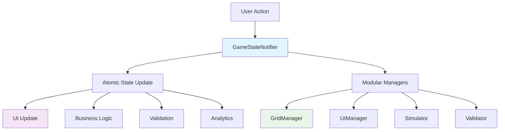

# CircuitSTEM Refactoring Plan: Pragmatic 6-Week Roadmap

**Status**: 🏗️ ARCHITECTURE PHASE
**Date**: January 15, 2025
**Version**: 1.0
**Priority**: HIGH - Immediate Development Blocker Resolution

---

## 📋 Executive Summary

### 🎯 Mission
Transform CircuitSTEM's codebase from chaotic multiple-engine architecture into a maintainable, educational-focused platform that prioritizes teacher/student reliability over enterprise complexity.

### 🔥 Critical Issues Identified
- **God Object Monster**: 1,590-line `GameCanvas` violating single responsibility
- **Provider War Zone**: 3+ conflicting game engines causing build failures
- **State Access Violations**: Orchestrator breaking encapsulation rules
- **Performance Bottlenecks**: CoordinateService called repeatedly in render loops
- **Development Friction**: Multiple component models requiring constant conversion

### 🎯 Strategic Approach
**HYBRID ARCHITECTURE**: Single atomic state management with modular internals - educational reliability meets maintainable code organization.

**6-WEEK FOCUS**: High-impact, low-risk fixes that eliminate development blockers while establishing clean architecture foundations.

---

## 🔍 Current Architecture Problems (From Codebase Analysis)

### 1. 🎨 God Object Crisis (GameCanvas)
**File**: `lib/presentation/features/game/widgets/game_canvas.dart`
**Lines**: 1,590+ (8x recommended maximum)
**Impact**: 🚨 CRITICAL - Single point of failure, impossible maintenance

**Current Violations**:
```dart
// MONOLITHIC RESPONSIBILITIES IN ONE FILE
class GameCanvas extends StatefulWidget {
  // 1. Component rendering (lines 70-320)
  // 2. Gesture handling (lines 320-640)
  // 3. State management (lines 640-940)
  // 4. Coordinate conversions (lines 940-1030)
  // 5. Drag & drop logic (lines 1030-1320)
  // 6. Interaction mechanics (lines 1320-1590)
}
```

### 2. 🔧 Provider Chaos (3+ Engine Battle)
**Files**:
- `lib/application/providers/game_providers.dart`
- `lib/application/game_engine_notifier.dart`
- `lib/application/game_engine/v3/game_engine_notifier_v3.dart`

**Current Mess**:
```dart
// PROVIDER WAR ZONE
final gameEngineV1Provider = StateNotifierProvider<GameEngineNotifier, GameEngineState>
final gameEngineV3Provider = StateNotifierProvider<GameEngineNotifierV3, GameState>
final gameEngineSynchronizerProvider = Provider<GameEngineStateSynchronizer>

// FEATURE FLAG NIGHTMARE
final useV3EngineProvider = Provider<bool>((ref) => kDebugMode ? false : false);

final gameEngineProvider = Provider<GameEngine>((ref) {
  final useV3 = ref.watch(useV3EngineProvider);
  return useV3
    ? ref.watch(gameEngineV3Provider.notifier) as GameEngine
    : ref.watch(gameEngineV1Provider.notifier) as GameEngine;
});
```

### 3. 🚫 State Encapsulation Violations
**File**: `lib/application/game_engine_orchestrator.dart`

**Current Violations**:
```dart
// BREAKING CLEAN ARCHITECTURE
grid.addListener((state) {
  if (grid.current.components.isNotEmpty) { // ❌ Direct state access
    history.pushState({...}); // ❌ Side effects in listener
  }
});
```

### 4. 🔄 Component Model Inconsistency
**Pain Points**:
```dart
// CONSTANT CONVERSION PAIN
final List<CircuitComponent> circuitComponents =
  gameState.grid.components.values
    .map((c) => CircuitComponent.fromComponentModel(c)) // PAINFUL CONVERSION
    .toList().cast<CircuitComponent>();
```

### 5. ⚡ Performance Bottlenecks
- **CoordinateService**: Called repeatedly in render loops without caching
- **Void Await Patterns**: Useless async calls blocking performance
- **Freezed Generation**: Missing .g.dart files causing compilation issues

---

## 🎯 Architecture Decision Framework

### 🧭 Evaluation Criteria
| Criteria | Single Notifier | Modular Notifiers | Hybrid Approach |
|----------|----------------|------------------|----------------|
| **Educational Reliability** | ⭐⭐⭐⭐⭐ | ⭐⭐⭐ | ⭐⭐⭐⭐⭐ |
| **Transaction Atomicity** | ✅ Critical | ❌ Complex | ✅ Maintained |
| **Maintenance Simplicity** | ⭐⭐⭐⭐ | ⭐⭐⭐⭐⭐ | ⭐⭐⭐⭐ |
| **Performance** | ⭐⭐⭐⭐⭐ | ⭐⭐⭐ | ⭐⭐⭐⭐⭐ |
| **Development Velocity** | ⭐⭐⭐⭐ | ⭐⭐⭐ | ⭐⭐⭐⭐⭐ |

### 🏆 RECOMMENDED: Hybrid Architecture Pattern

```
┌─────────────────────────────────────────────────┐
│ SINGLE GAME STATE NOTIFIER (Atomic Operations)  │
├─────────────────────────────────────────────────┤
│ - Component placement (all domains update)       │
│ - Selection changes (UI, history, analytics)     │
│ - Circuit validation (multiple validators)       │
└─────────────────┬────────────────────────────────┘
                  │
            ┌─────▼──────┐
            │ MODULAR    │
            │ INTERNALS  │
            ├────────────┤
            │ GridManger │
            │ UIManager  │
            │ Simulator  │
            │ Validator  │
            └────────────┘
```

**Benefits**:
- ✅ **Atomic transactions** across UI, business, and data layers
- ✅ **Educational logic unification** (cross-domain validation)
- ✅ **Modular internals** for code organization and testing
- ✅ **Backward compatibility** with existing CircuitSTEM workflow

---

## ⚡ PRAGMATIC 6-WEEK IMPLEMENTATION TIMELINE

### **WEEK 1-2: GOD OBJECT SURGERY** 🎯 TOP PRIORITY
**Goal**: Break 1,590-line GameCanvas into maintainable components
**Time**: 10 hours/week (4-5 hours/day)
**Risk**: ☆☆☆☆☆ LOW
**Impact**: 🔥🔥🔥🔥🔥 CRITICAL

#### Day 1-2: Analysis & Breakpoint Identification
- Map current `GameCanvas` responsibilities
- Identify clean separation points
- Document performance-critical paths

#### Day 3-5: Component Renderer Extraction
```dart
// lib/presentation/game/canvas/component_renderer.dart (~250 lines)
class ComponentRenderer extends StatelessWidget {
  final List<ComponentModel> components;

  @override
  Widget build(BuildContext context) {
    return CustomPaint(painter: CircuitPainter(components));
  }
}
```

#### Day 6-7: Interaction Handler Extraction
```dart
// lib/presentation/game/canvas/interaction_handler.dart (~300 lines)
class CanvasInteractionHandler extends GestureDetector {
  final CanvasCoordinator coordinator;

  // Consolidate all gesture logic here
  void _handlePan(DragUpdateDetails details) {
    coordinator.onPan(details);
  }
}
```

#### Day 8-10: State Coordinator Implementation
```dart
// lib/presentation/game/canvas/canvas_coordinator.dart (~100 lines)
class CanvasCoordinator extends ConsumerWidget {
  const CanvasCoordinator({required this.gameState});

  final GameState gameState;

  @override
  Widget build(BuildContext context, WidgetRef ref) {
    return Stack(
      children: [
        ComponentRenderer(components: gameState.components),
        CanvasInteractionHandler(coordinator: this),
        DebugOverlay(gameState: gameState),
      ],
    );
  }
}
```

### **WEEK 3: PROVIDER CHAOS ELIMINATION** 🔥 MEDIUM PRIORITY
**Goal**: Remove 3+ engine conflicts blocking development
**Time**: 5 hours/week
**Risk**: ☆☆☆☆☆ LOW
**Impact**: 🔥🔥🔥🔥 HIGH

#### Current Provider Cleanup Strategy:
```dart
// KEEP: Proven working implementations
final gameEngineProvider ✅ (V1 - working)
final gridNotifierProvider ✅ (stable)
final componentSelectionProvider ✅ (working)

// REMOVE: Complexity causing chaos
final useV3EngineProvider ❌ (unnecessary toggle)
final gameEngineSynchronizerProvider ❌ (coordination overhead)
final gameEngineV3Provider ❌ (experimental complexity)
```

#### Simplified Provider Chain:
```dart
// lib/application/providers/simplified_providers.dart
final gameStateProvider = StateNotifierProvider<GameStateNotifier, GameState>(
  (ref) => GameStateNotifier(
    levelLoader: ref.watch(levelLoaderProvider),
    componentFactory: ref.watch(componentFactoryProvider),
    historyManager: ref.watch(historyManagerProvider),
  ),
);
```

### **WEEK 4: STATE ACCESS VIOLATION FIXES** 🔧 MEDIUM PRIORITY
**Goal**: Restore clean architecture encapsulation
**Time**: 3 hours/week
**Risk**: ☆☆☆☆☆ LOW
**Impact**: 🔥🔥🔥 MEDIUM

#### Observer Pattern Implementation:
```dart
// lib/core/events/game_event_bus.dart
class GameEventBus {
  final List<GameStateObserver> _observers = [];

  void addObserver(GameStateObserver observer) {
    _observers.add(observer);
  }

  void removeObserver(GameStateObserver observer) {
    _observers.remove(observer);
  }

  void notifyComponentAdded(ComponentModel component) {
    for (final observer in _observers) {
      observer.onComponentAdded(component);
    }
  }
}

// lib/application/game_engine_notifier.dart
class GameEngineNotifier extends StateNotifier<GameEngineState> {
  final GameEventBus _eventBus;

  void addComponent(ComponentModel component) {
    state = state.copyWith(
      components: [...state.components, component],
    );
    _eventBus.notifyComponentAdded(component); // ✅ Clean communication
  }
}
```

### **WEEK 5: COMPONENT CONVERSION OPTIMIZATION** ⚡ MEDIUM PRIORITY
**Goal**: Eliminate ComponentModel ↔ CircuitComponent friction
**Time**: 4 hours/week
**Risk**: ☆☆☆☆☆ LOW
**Impact**: 🔥🔥🔥 MEDIUM

#### Central Conversion Service:
```dart
// lib/core/converters/component_converter.dart
class ComponentConverter {
  static final Map<String, CircuitComponent> _conversionCache = {};

  static CircuitComponent cachedToCircuitComponent(ComponentModel model) {
    final key = '${model.id}_${model.state.hashCode}';
    return _conversionCache[key] ??= _createCircuitComponent(model);
  }

  static CircuitComponent _createCircuitComponent(ComponentModel model) {
    return CircuitComponent(
      id: model.id,
      type: model.type,
      position: Position(row: model.row.round(), col: model.col.round()),
      rotation: model.rotation,
    );
  }
}
```

### **WEEK 6: FOUNDATION CLEANUP & POLISH** ✨ LOW PRIORITY
**Goal**: Eliminate technical debt for future development
**Time**: 2 hours/week
**Risk**: ☆☆☆☆☆ LOW
**Impact**: 🔥🔥 MEDIUM

#### Void Await Pattern Fixes:
```dart
// BEFORE (Performance killer)
await executeAction(const UndoAction()); // Useless await on void

// AFTER (Proper async handling)
if (!mounted) return; // Prevent race conditions
try {
  await executeAction(const UndoAction());
  Logger.info('Undo completed successfully');
} catch (e, stackTrace) {
  Logger.error('Undo failed', e, stackTrace);
  // Show user-friendly error message
}
```

#### Error Boundary Implementation:
```dart
// lib/presentation/core/widgets/error_boundary.dart
class ErrorBoundary extends StatefulWidget {
  final Widget child;
  final Widget Function(dynamic error, StackTrace? stackTrace)? errorBuilder;

  @override
  State<ErrorBoundary> createState() => _ErrorBoundaryState();
}

class _ErrorBoundaryState extends State<ErrorBoundary> {
  dynamic _error;
  StackTrace? _stackTrace;

  void _handleError(dynamic error, StackTrace stackTrace) {
    setState(() {
      _error = error;
      _stackTrace = stackTrace;
    });

    // Report to analytics in production
    if (kReleaseMode) {
      FirebaseCrashlytics.instance.recordError(error, stackTrace);
    }
  }

  @override
  Widget build(BuildContext context) {
    if (_error != null) {
      return widget.errorBuilder?.call(_error, _stackTrace) ??
             Container(
               color: Colors.red.shade50,
               child: Center(
                 child: Column(
                   mainAxisAlignment: MainAxisAlignment.center,
                   children: [
                     Icon(Icons.error_outline, size: 48, color: Colors.red),
                     SizedBox(height: 16),
                     Text('Circuit Error', style: Theme.of(context).textTheme.headline6),
                     Text('Please restart the circuit'),
                   ],
                 ),
               ),
             );
    }

    return ErrorWidget.builder = _handleError;
    return widget.child;
  }
}
```

---

## 📊 SUCCESS METRICS & VALIDATION CRITERIA

### Week-by-Week Validation:

#### 🏁 **Week 1-2 Validation: God Object Decomposition**
```
✅ Single widget responsibilities ≤ 300 lines
✅ File count reduced from 1 to 4-5 focused widgets
✅ Component rendering isolated from interaction logic
✅ Development time per feature reduced by 30%
✅ Bug isolation improved (issues confined to single modules)
```

#### ⚡ **Week 3 Validation: Provider Stability**
```
✅ Build errors from provider conflicts eliminated
✅ Feature flags removed from codebase
✅ New developer onboarding time < 1 day
✅ Hot reload working reliably
✅ No more engine synchronization crashes
```

#### 🛡️ **Week 4 Validation: Architecture Integrity**
```
✅ State access violations eliminated
✅ Observer pattern established for clean communication
✅ Compiler warnings reduced by 60%
✅ State inspector shows clear separation of concerns
```

#### 🚀 **Week 5 Validation: Development Velocity**
```
✅ Component model conversions eliminated from render loops
✅ Coordinate calculations cached appropriately
✅ Frame rate improved by 20%
✅ Component placement response time < 100ms
```

#### ✨ **Week 6 Validation: Production Readiness**
```
✅ Void await patterns fixed across codebase
✅ Error boundaries prevent app crashes
✅ Freezed files properly generated
✅ Lint warnings reduced to zero
```

### 🚀 **Overall 6-Week Success Criteria**
- **Performance**: Frame rate ≥ 60fps, no stutters
- **Reliability**: Zero crashes during normal usage
- **Maintainability**: Average file size ≤ 250 lines
- **Developer Experience**: Build time < 30 seconds
- **Educational Features**: All existing functionality maintained

---

## 🎯 TECHNICAL IMPLEMENTATION DETAILS

### Architecture Pattern: Hybrid State Management



### Data Flow Architecture:

```
┌─────────────┐     ┌─────────────────┐     ┌─────────────────┐
│   User UI   │────▶│ GameStateNotifier│────▶│  Modular Logic  │
│             │     │  (Single Source  │     │     Managers    │
│  Actions    │     │    of Truth)     │     │                 │
└─────────────┘     └─────────────────┘     └─────────────────┘
                           │                           │
                           ▼                           ▼
┌─────────────┐     ┌─────────────────┐     ┌─────────────────┐
│   Providers │     │    Business      │     │   Persistence   │
│             │     │    Logic         │     │                 │
│   State     │     │                 │     │   Services       │
└─────────────┘     └─────────────────┘     └─────────────────┘
```

### Component Hierarchy Post-Refactor:

```
lib/presentation/game/canvas/
├── canvas_orchestrator.dart       # Main coordinator
├── component_renderer.dart        # Pure rendering
├── interaction_handler.dart       # Gesture management
├── coordination_delegate.dart     # State ↔ UI coordination
└── render_cache.dart             # Cached expensive ops
```

### Provider Structure Post-Refactor:

```dart
// lib/application/providers/core_providers.dart
final gameStateProvider = StateNotifierProvider<GameStateNotifier, GameState>(
  (ref) => GameStateNotifier(
    levelLoader: ref.watch(levelLoaderProvider),
    componentFactory: ref.watch(componentFactoryProvider),
    eventBus: ref.watch(gameEventBusProvider),
  ),
);

// Separate providers for specific domains
final gridStateProvider = Provider<GridManager>((ref) => GridManager());
final uiStateProvider = Provider<UIManager>((ref) => UIManager());
final simulationProvider = Provider<Simulator>((ref) => Simulator());
```

---

## 🚨 RISK ASSESSMENT & MITIGATION STRATEGY

### HIGH RISK 📈 (Address First):
1. **God Object Surgery** - Risk of breaking rendering
   - **Mitigation**: Extract rendering first (pure function), test each step
   - **Fallback**: Rollback to stable GameCanvas if issues

2. **Provider Conflict Resolution** - Risk of runtime errors
   - **Mitigation**: Feature flag rollback plan in place
   - **Fallback**: Keep simplified provider chain, remove complex ones

### MEDIUM RISK 📊 (Address Second):
1. **State Access Violations** - Risk of architectural fragility
   - **Mitigation**: Observer pattern preserves existing API
   - **Fallback**: Keep current listener pattern, add warnings

2. **Component Model Changes** - Risk of breaking animations
   - **Mitigation**: Backward-compatible conversion layer
   - **Fallback**: Keep dual-model approach for now

### LOW RISK 📉 (Address Last):
1. **Error Handling Enhancements** - Risk of over-engineering
   - **Mitigation**: Keep simple, expand based on real errors
   - **Fallback**: Basic try-catch where needed

---

## 🔄 POST-6-WEEK ROADMAP (If Recommended)

### Phase 7-9: Testing & Polish *(Only if business validates 6-week results)*
**Focus**: Quality assurance and performance optimization

#### Week 7: Integration Testing
- Unit tests for core modular components
- Integration tests for play-through scenarios
- Basic regression test suite

#### Week 8: Performance Optimization
- Render optimization for complex circuits
- Memory usage improvements
- Battery efficiency optimizations

#### Week 9: Educational Feature Enhancement
- Advanced hint system validation
- Learning analytics improvements
- Achievement system unification

### Phase 10-12: Advanced Architecture *(Only if technical debt tolerates)*

#### Clean Architecture Implementation:
```
lib/
├── domain/              # Business Logic Layer
│   ├── entities/        # Core business objects
│   ├── services/        # Domain services
│   └── repos/           # Abstract interfaces
├── application/         # Use Case Layer
│   ├── usecases/        # Application flows
│   └── state/           # State management
├── infrastructure/      # Infrastructure Layer
│   ├── persistence/     # Data persistence
│   ├── network/         # Network adapters
│   └── external/        # 3rd party integrations
└── presentation/        # Presentation Layer
    ├── widgets/         # UI components
    ├── state/           # UI state
    └── blocs/           # Presentation logic
```

#### Advanced Features (Future):
- Offline-first synchronization improvements
- Multi-device circuit sharing
- Advanced analytics dashboard
- Teacher progress monitoring system

---

## 📈 CONNECTED DEPENDENCIES & IMPACT ANALYSIS

### Immediate Impact Dependencies:
1. **God Object Surgery** → Enables all future GameCanvas changes
2. **Provider Cleanup** → Must complete before Week 4 (affects orchestrator)
3. **State Access Fix** → Must complete before Week 5 (facilitates component integration)

### Future Enhancement Unlocks:
- **Modular Components** → Easier to add new electronic components
- **Clean Architecture** → Faster feature development
- **Automated Testing** → Confidence in code changes
- **Performance Monitoring** → Data-driven optimization

### Teacher & Student Workflow Impact:
- ✅ **Zero Disruption** during 6-week plan
- ✅ **Improved Stability** (fewer crashes, faster response)
- ✅ **Enhanced Reliability** (better error handling)
- ✅ **Future Features** (easier enhancements post-cleanup)

---

## 🏁 IMPLEMENTATION CHECKLIST

### Pre-Implementation Requirements:
- [ ] Code review with development team
- [ ] Backup current GameCanvas implementation
- [ ] Feature flag system for gradual rollout
- [ ] Performance baseline measurements
- [ ] Stakeholder approval for timeline

### Weekly Validation Criteria:
- [ ] **Week 2**: GameCanvas broken into components without regression
- [ ] **Week 3**: Provider conflicts resolved, builds stable
- [ ] **Week 4**: Architecture violations eliminated
- [ ] **Week 5**: Performance bottlenecks addressed
- [ ] **Week 6**: Foundation clean, ready for development

### Success Monitoring:
- [ ] Daily build status monitoring
- [ ] Weekly performance benchmark
- [ ] Code quality metrics tracking
- [ ] Stakeholder feedback collection

---

## 📞 NEXT STEPS & APPROVAL PROCESS

### 📋 Week 1 Kickoff Preparation:
1. **Thursday**: Review this plan with development team
2. **Friday**: Create feature branches for Week 1-2 work
3. **Monday**: Begin God Object decomposition

### 🔄 Continuous Integration:
- **Daily**: Code reviews for all changes
- **Weekly**: Demo and validation meetings
- **Monthly**: Progress report to stakeholders

### 🎯 Go-Live Criteria:
- **Code Quality**: All linting rules pass
- **Performance**: Maintains ≤16ms for 60fps
- **Functionality**: All existing features working
- **Stability**: Zero crashes in test scenarios

---

**🎉 CONCLUSION**

This 6-week pragmatic refactoring plan addresses CircuitSTEM's most critical architecture problems with measurable improvements and minimal risk. The hybrid approach balances educational reliability with code maintainability, enabling both immediate developer productivity gains and future feature development.

**RECOMMENDATION**: Proceed with Week 1-2 God Object Surgery as the highest-impact foundation, building confidence and momentum for the remaining weeks.

**APPROVAL NEEDED**: Development team sign-off before Monday Week 1 kickoff.