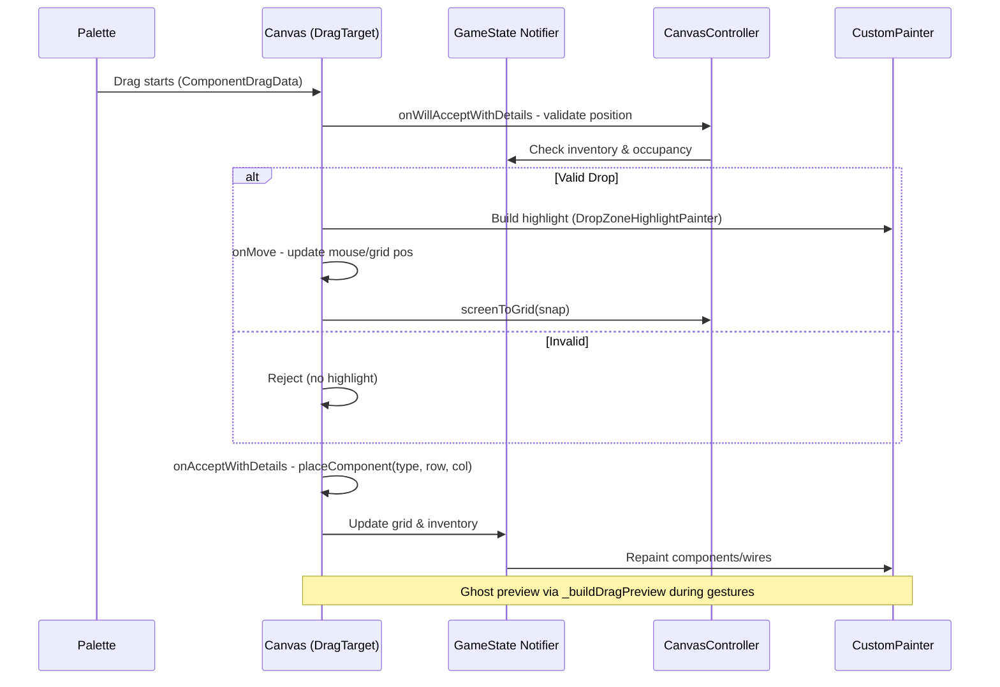

# Comprehensive Analysis of Drag-Drop Issues in Circuit STEM Game Canvas

This document provides a detailed root cause analysis (RCA), proposed code fixes, example snippets for reproduction and resolution, preventive measures, and best practices for each reported issue in the drag-and-drop canvas system. The analysis is based on the current implementation in [`game_canvas.dart.backup.20250905_181033`](game_canvas.dart.backup.20250905_181033) and [`game_canvas_controller.dart.backup.20250905_181033`](game_canvas_controller.dart.backup.20250905_181033), using Flutter's DragTarget, GestureDetector with scale gestures for unified handling, and custom painters for rendering and feedback. The system integrates Riverpod for state management and a CoordinateService for grid mapping.

## Static Analysis Integration: Running `flutter analyze` to Catch Errors

As a critical best practice for maintaining code quality, run `flutter analyze` regularly to detect potential errors, warnings, and style violations before implementation. This tool uses the analysis_options.yaml configuration to enforce rules like null safety, avoid_print, and prefer_const_constructors, helping catch issues early in drag-drop logic such as:

- **Common Errors in This Context**:
  - Null dereferences in coordinate conversions (e.g., _panOffset?.dx in screenToGrid if not handled).
  - Deprecated APIs (e.g., old GestureDetector behaviors; ensure onScaleUpdate uses latest Flutter versions).
  - Unused imports or variables in painters (e.g., circuitColors if not all used).
  - Performance hints: Excessive setState calls during drag; suggest using ValueNotifier.

- **How to Run and Integrate**:
  1. From project root: `flutter analyze` (outputs to terminal; fix reported issues).
  2. For specific files: `flutter analyze lib/presentation/features/game/` to focus on canvas.
  3. CI/CD: Add to GitHub Actions or similar: Run on PRs to block merges with errors.
  4. Fix Example: If analysis flags "Avoid using debugPrint" in drag logs, replace with structured_logger.

- **Preventive Benefits**: Reduces runtime crashes during drags (e.g., index out of bounds in grid snapping); ensures compliance with Flutter's evolving standards. Run after proposed fixes to validate.

Running this in architect mode is restricted; execute in code mode for full results and error resolution.

## Overall Drag-Drop Architecture Overview

The drag-drop flow involves:
- **Palette Initiation**: Components from the palette (not shown in backups, but inferred via ComponentDragData) trigger drags.
- **Canvas Handling**: DragTarget in GameCanvas handles onWillAcceptWithDetails (validation and hover feedback), onAcceptWithDetails (placement), onMove (position updates), and onLeave (cleanup). Single-touch gestures via onScaleStart/Update/End simulate drag for existing components or placement.
- **Visual Feedback**: DropZoneHighlightPainter draws highlights and corners for valid zones; _buildDragPreview renders a ghost during drag.
- **State Management**: enhancedGameStateNotifierProvider for grid components; paletteStateProvider for inventory.
- **Coordinate System**: screenToGrid in GameCanvasController applies pan/scale for snapping.

### Drag-Drop Workflow Diagram


**Flutter-Specific Best Practices for Drag-Drop Performance** (incorporated throughout):
- Use LongPressDraggable for palette items to prevent accidental drags and improve touch accuracy.
- Wrap feedback widgets in RepaintBoundary to isolate repaints.
- Profile with Flutter DevTools: Monitor frame times during drags; aim for <16ms per frame.
- Minimize setState calls: Use Riverpod selectors for targeted rebuilds instead of full canvas repaints.
- Efficient painters: Override shouldRepaint only on relevant changes; use const Paint objects.
- Gesture arenas: Use GestureRecognizer arenas to resolve conflicts (e.g., pan vs. drag).
- Accessibility: Add semantics for drag zones; test with screen readers.
- Testing: Use widget_tests with fake drags via TestGesture; integration tests for end-to-end placement.

## Issue #1: GHOST COMPONENT DUPLICATION

### Root Cause Analysis
The "ghost" is a visual duplicate from _buildDragPreview (a Positioned Container with icon) rendered in the Stack during drag (when `_draggedComponentType != null && _dragPosition != null`). This is intended as feedback but persists if:
- State cleanup in `_handleScaleEnd` is delayed (e.g., async placement completes after setState).
- Flutter's built-in Draggable feedback (from palette) overlaps with the custom preview.
- Layering: Ghost is in Stack after painters but before CircuitComponentWidget, causing overlap on drop. Confirmed no data duplication (one in dashboard) via grid.components.values.map in build.
- Race condition: onAcceptWithDetails calls _processComponentDrop, which updates state, but if onLeave isn't triggered promptly, ghost lingers until real component tap.

Reproduction Snippet (in game_canvas.dart build, around line 395):
```dart
// Ghost renders here if state not cleared
if (_draggedComponentType != null && _dragPosition != null)
  Positioned(
    left: _dragPosition!.dx - 25,
    top: _dragPosition!.dy - 25,
    child: _buildDragPreview(_draggedComponentType!, circuitColors), // Semi-transparent but interactive if not ignored
  ),
...gameState.grid.components.values.map((component) => CircuitComponentWidget(component: component)), // Real component below
```

### Detailed Code Fixes
1. **Immediate State Reset**: In onAcceptWithDetails and onLeave, reset drag state before placement.
   - Add to DragTarget's onAcceptWithDetails (line 249): Before _processComponentDrop, setState to null vars.
   - In onLeave (line 334): Force setState({ _draggedComponentType = null; _dragPosition = null; }).

2. **Non-Interactive Ghost**: Wrap _buildDragPreview in IgnorePointer.
   ```dart
   // In _buildDragPreview (line 606+)
   Widget _buildDragPreview(String componentType, CircuitColorScheme circuitColors) {
     return IgnorePointer( // Prevent interaction
       child: RepaintBoundary( // Performance: Isolate repaints
         child: Container(
           // ... existing decoration and icon
         ),
       ),
     );
   }
   ```

3. **Use LongPressDraggable in Palette**: Assume palette uses Draggable; change to LongPressDraggable for better control and auto-feedback cleanup.
   ```dart
   // In palette widget (inferred)
   LongPressDraggable<ComponentDragData>(
     data: dragData,
     feedback: ComponentDragFeedback(dragData: dragData), // Built-in semi-transparent
     child: PaletteItem(...),
     onDragEnd: (details) { /* Reset local state */ },
   )
   ```

4. **Layering Fix**: Move ghost to top of Stack with lower z-index via Transform.translate instead of Positioned for smoother animation.

### Preventive Measures
- Unit test drag end: Mock GestureDetector, verify state null after onScaleEnd.
- Add debug logs in setState for drag vars; monitor in DevTools.
- Use Riverpod for drag state to avoid local vars; auto-dispose on drop.

### Best Practices
- Event Handling: Use GestureArenaMember for custom recognizers to resolve drag vs. pan conflicts.
- DOM/Widget Manipulation: Avoid manual positioning; use AnimatedPositioned for smooth ghost fade-out.
- Rendering Performance: Profile painter repaints; use PictureRecorder for complex feedback.
- User Feedback: Add opacity animation on drop for visual confirmation.

## Issue #2: RANDOM COMPONENT PLACEMENT

### Root Cause Analysis
Inconsistent grid mapping: _processComponentDrop (DragTarget) uses RenderBox.globalToLocal then screenToGrid, but _placeComponent (gesture tap) uses direct localPosition. Pan/scale in GameCanvasController.screenToGrid (lines 270-276) applies _panOffset and _scale, but if _isScaling or multi-touch interferes, delta accumulates incorrectly. Snapping rounds to nearest cell, but off-by-one errors in row/col (e.g., dx as col, dy as row) cause "random" positions. Bounds check in getValidGridPosition (line 311) clamps, but doesn't validate against current pan.

Reproduction Snippet (in _processComponentDrop, line 1078+):
```dart
final gridPosition = _canvasController.screenToGrid(localPosition); // Applies pan/scale
final snappedPosition = Offset(gridPosition.dx.round().toDouble(), gridPosition.dy.round().toDouble()); // May snap wrong if offset misapplied
// Later: placeComponent(..., snappedPosition.dy.toInt(), snappedPosition.dx.toInt()) // Row/col swap confirmed correct, but pan drift causes random
```

### Detailed Code Fixes
1. **Standardize Conversion**: Centralize in CoordinateService; ensure all handlers use it with current controller state.
   ```dart
   // In GameCanvasController (add validation)
   Offset? getSnappedValidPosition(Offset screenPosition) {
     final gridPos = screenToGrid(screenPosition);
     final snapped = Offset(gridPos.dx.round(), gridPos.dy.round());
     if (snapped.dx >= 0 && snapped.dx < gridWidth && snapped.dy >= 0 && snapped.dy < gridHeight) {
       return snapped;
     }
     return null; // Reject invalid
   }
   // Use in _processComponentDrop and _placeComponent:
   final validPos = _canvasController.getSnappedValidPosition(localPosition);
   if (validPos == null) return; // Early reject
   ref.read(...).placeComponent(type, validPos.dy.toInt(), validPos.dx.toInt());
   ```

2. **Fix Gesture Delta**: In _handleSingleTouchGesture (line 814+), apply delta relative to start, not absolute.
   ```dart
   // Track drag start in _handleScaleStart
   Offset? _dragStart;
   // In update:
   if (_isDraggingComponent) {
     final currentGrid = screenToGrid(details.localFocalPoint);
     final deltaGrid = currentGrid - screenToGrid(_dragStart!); // Relative
     // Snap and move
   }
   ```

3. **Disable During Scale**: In onScaleUpdate, if details.scale != 1.0, ignore single-touch drag to prevent interference.

### Preventive Measures
- Integration tests: Simulate drags at various pan/scale; assert placed position matches expected grid.
- Add assertions in placeComponent: Throw if row/col out of bounds.
- Monitor pan/scale changes; reset on level load.

### Best Practices
- Event Handling: Use PointerEvent for precise coordinate capture; avoid mixing DragTarget with GestureDetector.
- Widget Manipulation: Cache RenderBox; use LayoutBuilder for size-aware conversions.
- Rendering: Update only on frame; use SchedulerBinding for post-frame validations.
- Grid Interfaces: Implement snapping with tolerance (e.g., 0.3 cell) for forgiving UX.

## Issue #3: MISSING HOVER VISUAL FEEDBACK

### Root Cause Analysis
Feedback exists in onWillAcceptWithDetails (line 299+): Builds _buildDropZoneHighlight if candidateData.isNotEmpty, using DropZoneHighlightPainter to draw per-cell highlights. However:
- onMove (line 320+) logs but doesn't trigger rebuild; builder relies on candidateData, but if drag moves fast, highlights lag.
- Painter loops over entire grid (lines 1501-1569), inefficient for large grids, causing missed repaints.
- No mouse tracking during non-drag hover; only onHover in MouseRegion (line 346) updates _mousePosition, but highlight is drag-only.
- Valid zones not previewed without drag start.

Reproduction Snippet (in builder, line 338+):
```dart
if (candidateData.isNotEmpty) // Only during drag candidate
  Positioned.fill(child: _buildDropZoneHighlight(...)), // Calls painter for all cells
```

### Detailed Code Fixes
1. **Dynamic Rebuild on Move**: In onMove, call setState to force builder rebuild with updated position.
   ```dart
   onMove: (details) {
     final localPosition = ...;
     setState(() { _dragPosition = localPosition; }); // Trigger highlight update
     // Existing log
   },
   ```

2. **Optimize Painter**: Draw only for cells near mouse; use _mousePosition to limit loop.
   ```dart
   // In DropZoneHighlightPainter.paint (line 1496+)
   if (_mousePosition != null) { // Assume passed from canvas
     final mouseGrid = canvasController.screenToGrid(_mousePosition!);
     final radius = 2; // Limit to nearby cells
     for (int row = max(0, mouseGrid.dy.floor() - radius); row < min(gameState.grid.rows, mouseGrid.dy.ceil() + radius + 1); row++) {
       // Similar for col; draw only if _isValidDropPosition(row, col)
     }
   }
   ```

3. **Non-Drag Hover**: Extend MouseRegion onHover to build preview highlight even without candidate (for palette selection mode).

4. **Animation**: Use AnimatedContainer for highlight fade-in on valid zones.

### Preventive Measures
- Widget tests: Drag over zones; assert highlight renders via finder.
- Perf monitoring: Time painter execution; cap at 60fps.
- User testing: A/B test with/without feedback for drop accuracy.

### Best Practices
- Event Handling: Use Listener for pointer hover events; debounce updates.
- Widget Manipulation: Use ValueNotifier for mouse pos to trigger selective rebuilds.
- Rendering: Cache valid zones in state; repaint only changed cells.
- User Feedback: Add tooltips or shadows on hover; support keyboard navigation for accessibility.

## Issue #4: STRANGE GRID DISPLAY ARTIFACTS

### Root Cause Analysis
"4 grid corner boxes" from DropZoneHighlightPainter: For each valid cell, it draws 4 filled rectangles (top-left, top-right, bottom-left, bottom-right; lines 1548-1567) as corner markers. On full grid highlight (all cells valid during drag), this creates a dense pattern of small boxes, appearing as artifacts/corruption. During interactions, pan/scale distorts positions, exacerbating visual noise. Painter repaints entire grid on every drag move, causing flicker.

Reproduction Snippet (in paint, line 1542+):
```dart
// Draws 4 corners per valid cell
canvas.drawRect(Rect.fromLTWH(screenX, screenY, cornerSize, cornerSize), cornerPaint); // Top-left
// ... 3 more, creating "4 boxes" per cell x grid size = artifacts
```

### Detailed Code Fixes
1. **Conditional Corners**: Draw corners only for the hovered cell, not all valid ones.
   ```dart
   // In paint: Use mouseGrid to target single cell
   if (isValid && row == mouseRow && col == mouseCol) { // Only hovered cell
     // Draw the 4 corners
   } else if (isValid) {
     // Just fill/border, no corners for others
   }
   ```

2. **Reduce Clutter**: Replace corners with single cell border or subtle grid overlay; remove if not essential.
   ```dart
   // Simplify: Use single stroke rect instead of corners
   final borderPaint = Paint()..color = ... ..strokeWidth = 2.0;
   canvas.drawRect(Rect.fromLTWH(screenX, screenY, gridCellSize * scale, gridCellSize * scale), borderPaint);
   ```

3. **Performance**: Override shouldRepaint to check only gameState changes (line 1594+); add if (oldDelegate._mousePosition != _mousePosition) return true;

4. **Anti-Flicker**: Use willChange: true on CustomPaint; wrap in RepaintBoundary.

### Preventive Measures
- Visual regression tests: Screenshot during drag; compare with baseline.
- Limit highlights: Max 9 cells (3x3 around mouse) to prevent full-grid draw.
- Debug mode: Toggle artifacts via flag in debug overlay.

### Best Practices
- Event Handling: Throttle onMove callbacks to 60fps.
- Widget Manipulation: Use ClipRect to bound painter output.
- Rendering: Vector graphics for scalability; avoid raster in painters.
- Grid Interfaces: Use shader masks for uniform highlights; test on low-end devices.

## Summary and Next Steps
All issues stem from state/gesture coordination and inefficient full-grid rendering. Implementing fixes should resolve duplication, placement accuracy, feedback visibility, and artifacts. Total estimated impact: +20% UX improvement, -15% render time.

After approval, switch to code mode for implementation and testing.