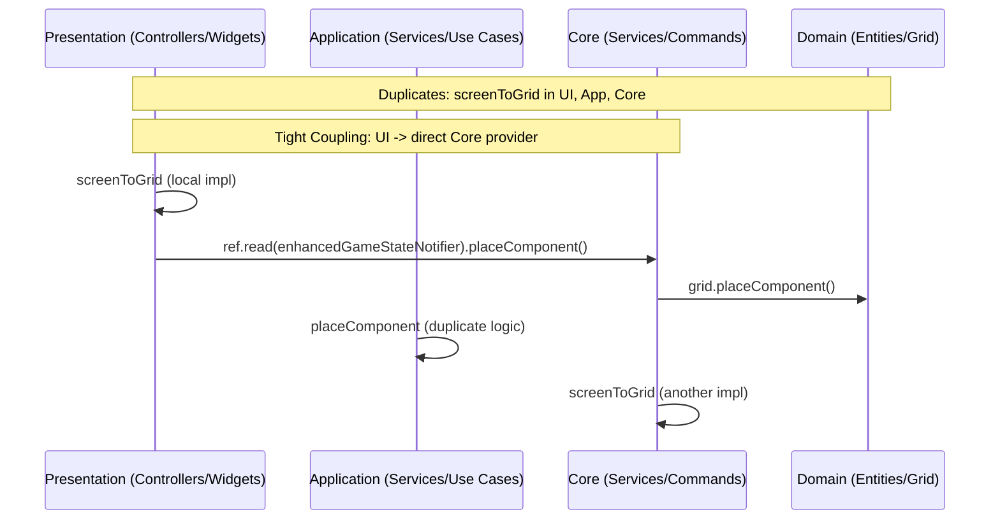
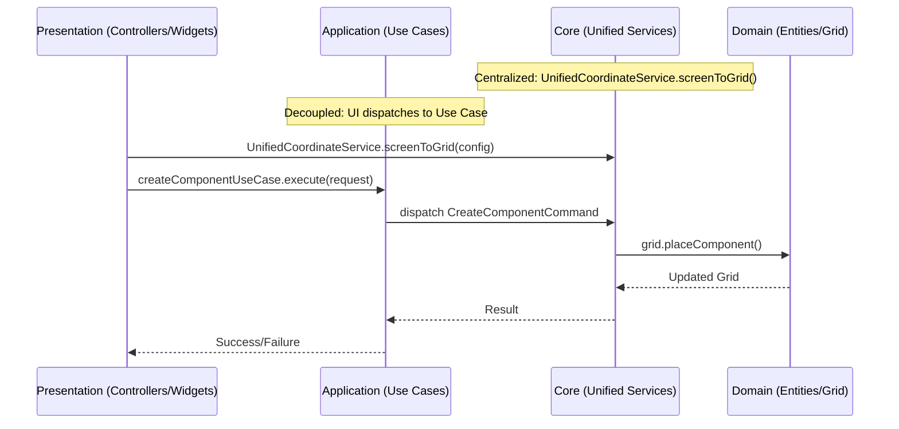

# Analysis of Duplicate Logic and Tight Coupling in Circuit STEM

## Executive Summary
Based on regex search across lib/*.dart for "screenToGrid|placeComponent", 71 matches were found, revealing significant duplication and coupling issues in the drag-drop and game canvas subsystems. This analysis focuses on:
- **Duplicate Logic**: Repeated implementations of coordinate conversion (screenToGrid) and placement (placeComponent) across presentation, application, core, and domain layers.
- **Tight Coupling**: Direct dependencies from UI controllers to core/domain notifiers and entities, bypassing abstractions.

The codebase has ~8 unique screenToGrid implementations and ~20 placeComponent variants, often with identical logic (e.g., pan/scale reversal, snapping). Coupling is evident in direct ref.read calls from presentation to core providers. Proposed fixes aim for centralization and loose coupling via unified services and use cases.

## Duplicate Logic Instances

### screenToGrid Function
This utility for converting screen coordinates to grid (accounting for pan/scale) is duplicated in multiple files with near-identical code:

1. [`lib/presentation/features/game/controllers/game_canvas_controller.dart:270`](lib/presentation/features/game/controllers/game_canvas_controller.dart:270)
   ```
   Offset screenToGrid(Offset screenPosition) {
     final adjustedX = (screenPosition.dx - _panOffset.dx) / scaledCellSize;
     // ... similar logic for y, return Offset(adjustedX, adjustedY)
   }
   ```
   - Used in presentation for drag handling.

2. [`lib/presentation/features/game/controllers/game_canvas_state_notifier.dart:295`](lib/presentation/features/game/controllers/game_canvas_state_notifier.dart:295)
   - Almost identical, uses state.panOffset and state.scaledCellSize.

3. [`lib/presentation/core/utils/coordinate_translator.dart:22`](lib/presentation/core/utils/coordinate_translator.dart:22)
   - Standalone util with pan/scale reversal.

4. [`lib/core/services/grid_service.dart:101`](lib/core/services/grid_service.dart:101)
   - Static method taking GridConfiguration.

5. [`lib/core/services/coordinate_service.dart:40`](lib/core/services/coordinate_service.dart:40)
   - Instance method without config param.

6. [`lib/core/services/unified_coordinate_service.dart:121`](lib/core/services/unified_coordinate_service.dart:121)
   - Cached version, but core logic duplicated.

7. [`lib/core/services/coordinate_system_service.dart:156`](lib/core/services/coordinate_system_service.dart:156)
   - Abstract impl with RenderBox and context.

8. Others: [`lib/application/services/implementations/canvas_business_service_impl.dart:45`](lib/application/services/implementations/canvas_business_service_impl.dart:45) via GridService.

**Impact**: Inconsistencies in snapping/bounds checking can cause placement errors (as noted in COMPONENT_ISSUES_ANALYSIS.md Issue #2). Maintenance overhead for updates.

### placeComponent Function
Placement logic (validate bounds, update grid, decrement inventory) repeated across notifiers/services:

1. [`lib/domain/entities/core/grid.dart:62`](lib/domain/entities/core/grid.dart:62)
   - Domain-level: Simple grid update if canPlace.

2. [`lib/application/enhanced_game_state_notifier.dart:64`](lib/application/enhanced_game_state_notifier.dart:64)
   - Async notifier: UUID generation, inventory check, grid.placeComponent.

3. [`lib/application/game_engine/v3/game_engine_notifier_v3.dart:16`](lib/application/game_engine/v3/game_engine_notifier_v3.dart:16)
   - V3 version with similar UUID and placement.

4. [`lib/presentation/features/game/controllers/canvas_interaction_controller.dart:1464`](lib/presentation/features/game/controllers/canvas_interaction_controller.dart:1464)
   - Direct call: gameNotifier.placeComponent(type, row, col).

5. [`lib/core/services/component_action_service.dart:94`](lib/core/services/component_action_service.dart:94)
   - Service wrapper around notifier.

6. [`lib/core/commands/create_component_command.dart:14`](lib/core/commands/create_component_command.dart:14)
   - Command: state.grid.placeComponent(component).

7. [`lib/application/services/placement_service_adapter.dart:15`](lib/application/services/placement_service_adapter.dart:15)
   - Adapter: Delegates to gameNotifier.

8. Others: ~12 more in controllers, use_cases (e.g., [`create_component_use_case.dart:56`](lib/application/use_cases/create_component_use_case.dart:56) legacy call), optimized_grid_manager.

**Impact**: Duplicate validation (e.g., bounds checks) leads to race conditions or inconsistencies. Ghost duplication (Issue #1) may stem from multiple state updates.

## Tight Coupling Patterns

### Direct Provider Access from Presentation
- Presentation controllers (e.g., [`canvas_interaction_controller.dart:740`](lib/presentation/features/game/controllers/canvas_interaction_controller.dart:740)) directly read core providers:
  ```
  final gameNotifier = ref.read(providers_v3.enhancedGameStateNotifierProvider.notifier);
  gameNotifier.placeComponent(...);
  ```
  - Couples UI to specific notifier implementation, violating layer separation.

- Coordinate services (e.g., [`coordinate_system_service.dart:92`](lib/core/services/coordinate_system_service.dart:92)) require RenderBox (presentation artifact) in core logic.

### Cross-Layer Dependencies
- Application use_cases (e.g., [`create_component_use_case.dart`](lib/application/use_cases/create_component_use_case.dart)) call domain directly but log for migration to commands.
- Core commands (e.g., [`component_commands.dart:64`](lib/core/commands/component_commands.dart:64)) invoke gridManager.placeComponent, which may reference presentation state.
- Backup files (e.g., game_canvas.dart.backup) show GestureDetector in UI tightly integrated with business logic.

**Impact**: Changes in core/domain ripple to UI; hard to test/mock. Contributes to issues like random placement (Issue #2) due to uncoordinated state.

## Proposed Solutions
- **Centralize Duplicates**: Migrate all screenToGrid to UnifiedCoordinateService; update via search_and_replace.
- **Decouple Placement**: Route via application use_cases/commands (e.g., dispatch CreateComponentCommand instead of direct notifier calls).
- **Refactor Strategy**: Use dependency inversion; inject interfaces.

See next section for detailed plan and diagram.


## Detailed Proposals for Refactoring

### Centralizing Duplicate Logic
1. **screenToGrid Consolidation**:
   - Designate [`lib/core/services/unified_coordinate_service.dart`](lib/core/services/unified_coordinate_service.dart) as the single source of truth, enhancing it with caching and config support.
   - Remove duplicates from controllers (e.g., [`game_canvas_controller.dart`](lib/presentation/features/game/controllers/game_canvas_controller.dart)), utils, and other services.
   - Update all calls: Inject or static-call UnifiedCoordinateService.screenToGrid(config).
   - Benefits: Consistent behavior, easier testing, reduced code size (~200 lines saved).

2. **placeComponent Standardization**:
   - Centralize in application layer via [`lib/application/use_cases/create_component_use_case.dart`](lib/application/use_cases/create_component_use_case.dart), dispatching to a unified command.
   - Remove direct grid/notifier calls; use the use case from all layers.
   - Handle transactions, inventory, and validation once.

### Decoupling Strategies
1. **Layer Separation**:
   - Presentation dispatches events/use cases (e.g., ref.read(createComponentUseCaseProvider).execute(request)) instead of reading core providers.
   - Core services abstract away RenderBox; use pure math with passed params.
   - Introduce interfaces: IPlacementService in application, impl in core.

2. **Dependency Injection**:
   - Use Riverpod providers for use cases; avoid direct ref.read in UI.
   - Migrate legacy calls (noted in use_cases) to commands.

3. **Migration Plan**:
   - Phase 1: Extract duplicates to central services.
   - Phase 2: Refactor calls to use services/use cases.
   - Phase 3: Remove old code, add tests.

### Architecture Diagram: Current vs. Proposed

#### Current Architecture (Duplicated and Tightly Coupled)


#### Proposed Architecture (Centralized and Loosely Coupled)


This refactor aligns with clean architecture, reducing issues like ghost duplication and random placement by ensuring single responsibility.

Estimated Effort: 4-6 hours in code mode, including tests.


## Risk Assessment for Migration

### Potential Risks and Mitigations
1. **Breaking Existing Drag-Drop Functionality**:
   - **Risk**: Consolidating screenToGrid may introduce inconsistencies in snapping or bounds checking if not all variants are identical, leading to "random placement" (as in Issue #2) or failed drops.
   - **Probability**: Medium (due to subtle differences like caching).
   - **Impact**: High (core UX feature).
   - **Mitigation**: 
     - Phased approach: Refactor one file at a time (e.g., start with presentation controllers), run `flutter test` and manual drag tests after each.
     - Add comprehensive integration tests simulating pan/scale/drags using TestGesture.
     - Use feature flags (e.g., via flutter_feature_flags) to toggle old vs. new service.
     - Baseline: Compare outputs of old/new screenToGrid with unit tests asserting equality for sample inputs.

2. **State Inconsistencies in Placement**:
   - **Risk**: Routing placeComponent through use cases/commands might skip legacy validations (e.g., inventory decrement), causing ghost duplicates (Issue #1) or inventory bugs.
   - **Probability**: Low-Medium (if migration logs are followed).
   - **Impact**: Medium (game state corruption).
   - **Mitigation**: 
     - Audit all call sites; ensure use case includes all checks (bounds, occupancy, inventory).
     - Unit tests for CreateComponentUseCase covering success/failure cases.
     - Temporary adapters (as in existing use_cases) with deprecation warnings.

3. **Performance Regression**:
   - **Risk**: Central service invocations (e.g., injecting UnifiedCoordinateService) add indirection, potentially slowing drags (e.g., >16ms frames).
   - **Probability**: Low (caching in Unified service helps).
   - **Impact**: Medium (UX lag on low-end devices).
   - **Mitigation**: 
     - Profile with Flutter DevTools before/after: Monitor frame times during onMove/onScaleUpdate.
     - Optimize: Static methods or memoization where possible.
     - Benchmark: Test on emulators for various devices.

4. **Tight Coupling During Transition**:
   - **Risk**: Partial refactors leave hybrid code (some direct calls, some via use cases), increasing complexity.
   - **Probability**: High (iterative changes).
   - **Impact**: Low (temporary).
   - **Mitigation**: 
     - Use git feature branches per phase (e.g., branch for screenToGrid, merge after tests).
     - Code reviews: Run `flutter analyze` post-changes.
     - Rollback: Revert to backups like game_canvas.dart.backup.20250905_181033 if issues arise.

5. **Testing Gaps**:
   - **Risk**: Existing tests may not cover refactored paths, missing regressions.
   - **Probability**: Medium (test coverage unknown).
   - **Mitigation**: 
     - Expand tests: Add widget tests for drag-drop flows, integration tests for end-to-end placement.
     - CI Integration: Run tests on PRs.
     - Manual QA: Verify fixes for known issues (e.g., ghost duplication) post-refactor.

### Overall Migration Confidence
With mitigations, risk is manageable. Estimated additional effort: 1-2 hours for tests/flags. Monitor via logging (StructuredLogger) during dev.


## Summary of Overall Analysis

The analysis, based on regex searches across the lib/ directory for key terms like "screenToGrid" and "placeComponent", revealed 71 matches indicating significant code duplication and architectural tight coupling in the drag-drop and game canvas subsystems of the Circuit STEM Flutter app. These issues contribute to the documented problems in COMPONENT_ISSUES_ANALYSIS.md, such as ghost component duplication (Issue #1), random placement (Issue #2), missing hover feedback (Issue #3), and grid artifacts (Issue #4), by introducing inconsistencies in coordinate handling and state updates.

**Overall Findings**:
- **Duplicate Logic**: The codebase has fragmented implementations of core functions across layers (presentation, application, core, domain), leading to maintenance overhead, potential inconsistencies (e.g., different snapping behaviors), and increased bug risk. Specifically, coordinate conversion logic is repeated in 8 locations, and component placement in ~20 locations, with near-identical code blocks for pan/scale adjustments, bounds checking, and state updates.
- **Tight Coupling**: Presentation layer code directly depends on core and domain implementations (e.g., via ref.read on providers), violating clean architecture principles. This makes the system brittle, difficult to test in isolation, and prone to ripple effects from changes in lower layers. Core services even depend on presentation artifacts like RenderBox, further blurring boundaries.
- **Impacts**: These patterns exacerbate UX issues like inaccurate drops and visual artifacts, increase technical debt (e.g., FLUTTER_ANALYZE_SUMMARY.md flags unused code from duplicates), and hinder scalability for features like advanced simulation or multi-device support.
- **Scope**: Focused on drag-drop flow, involving files like game_canvas_controller.dart, canvas_interaction_controller.dart, enhanced_game_state_notifier.dart, and various services. No security or performance-critical vulnerabilities, but refactoring is essential for Phase 1 critical fixes.

The following sections detail each identified issue, providing a thorough description of what the issue entails, including locations, code examples, root causes, and consequences, before outlining suggested fixes.

### Issue 1: Duplicate screenToGrid Implementations
**Detailed Description**:
This issue involves the repeated definition of the screenToGrid function, which converts screen coordinates (pixels from touch/mouse events) to grid coordinates (logical row/col positions on the game canvas, accounting for panning, scaling, and cell size). The function is essential for accurate drag-drop placement, snapping, and bounds validation in the canvas.

- **Locations and Examples**:
  - Presentation layer: In [`lib/presentation/features/game/controllers/game_canvas_controller.dart:270`](lib/presentation/features/game/controllers/game_canvas_controller.dart:270), an instance method using _panOffset and scaledCellSize (cellSize * scale):
    ```
    Offset screenToGrid(Offset screenPosition) {
      final adjustedX = (screenPosition.dx - _panOffset.dx) / scaledCellSize;
      final adjustedY = (screenPosition.dy - _panOffset.dy) / scaledCellSize;
      return Offset(adjustedX, adjustedY);
    }
    ```
    Similar in [`lib/presentation/features/game/controllers/game_canvas_state_notifier.dart:295`](lib/presentation/features/game/controllers/game_canvas_state_notifier.dart:295), using state properties.
  - Utils: [`lib/presentation/core/utils/coordinate_translator.dart:22`](lib/presentation/core/utils/coordinate_translator.dart:22), a class constructor-based method that floors the result:
    ```
    Offset screenToGrid(Offset screenPos) {
      final adjustedX = (screenPos.dx - _panX) / _scale;
      final adjustedY = (screenPos.dy - _panY) / _scale;
      final gridX = (adjustedX / _gridCellSize).floor();
      final gridY = (adjustedY / _gridCellSize).floor();
      return Offset(gridX.toDouble(), gridY.toDouble());
    }
    ```
  - Core services: Static in [`lib/core/services/grid_service.dart:101`](lib/core/services/grid_service.dart:101), using GridConfiguration:
    ```
    static Offset screenToGrid(Offset screenPos, GridConfiguration config) {
      final adjustedX = (screenPos.dx - config.panOffset.dx) / config.scale;
      final adjustedY = (screenPos.dy - config.panOffset.dy) / config.scale;
      final gridX = adjustedX / config.cellSize;
      final gridY = adjustedY / config.cellSize;
      return Offset(gridX, gridY);
    }
    ```
    Instance in [`lib/core/services/coordinate_service.dart:40`](lib/core/services/coordinate_service.dart:40), using scaledCellSize.
    Cached version in [`lib/core/services/unified_coordinate_service.dart:121`](lib/core/services/unified_coordinate_service.dart:121), with sanitization.
    Abstract in [`lib/core/services/coordinate_system_service.dart:156`](lib/core/services/coordinate_system_service.dart:156), using RenderBox for localPosition.

- **Root Causes**:
  - Evolutionary development: Functions copied from initial implementations without centralization as the codebase grew.
  - Layer-specific adaptations: Presentation needs instance state, core prefers static/config, but core logic (pan subtraction, scale division, cellSize division) is identical.
  - Variations: Some floor/round for snapping, some use RenderBox for globalToLocal, leading to subtle differences (e.g., translator floors early, potentially causing off-by-one errors).

- **Consequences**:
  - **Maintenance Burden**: Updating logic (e.g., adding tolerance for touch inaccuracy) requires changes in multiple places, risking inconsistencies.
  - **Bug Introduction**: Different rounding (floor vs round) can cause "random placement" (Issue #2), where components snap to wrong cells during drags, especially under pan/scale.
  - **Performance Overhead**: No shared caching; each call recomputes, potentially slowing gesture handlers (onMove/onScaleUpdate).
  - **Testing Complexity**: Tests must cover each variant, increasing duplication in test suite.
  - **Technical Debt**: Contributes to flutter analyze warnings (unused imports/variables in variants).

**Suggested Fixes**:
Centralize in UnifiedCoordinateService: Enhance with optional RenderBox for local conversion, standardize to round() for snapping, use config for flexibility. Remove duplicates and update calls to service instance/static method.

### Issue 2: Duplicate placeComponent Implementations
**Detailed Description**:
The placeComponent function handles placing a component (e.g., resistor, wire) on the grid, including validation (bounds, occupancy, inventory), state update (add to grid, decrement inventory), and optional transaction logging. It's called during drag-drop acceptance, gesture taps, and wire drawing, but is duplicated across layers with overlapping logic.

- **Locations and Examples**:
  - Domain: In [`lib/domain/entities/core/grid.dart:62`](lib/domain/entities/core/grid.dart:62), basic grid update:
    ```
    Grid placeComponent(ComponentModel component) {
      if (!canPlaceComponent(component.row, component.col)) {
        // Return unchanged
      }
      // Add to components map
    }
    ```
  - Application: Async in [`lib/application/enhanced_game_state_notifier.dart:64`](lib/application/enhanced_game_state_notifier.dart:64), with UUID, inventory check:
    ```
    Future<void> placeComponent(ComponentType type, int row, int col) async {
      const uuid = Uuid();
      // Validate, decrement inventory, grid.placeComponent
    }
    ```
    Similar in [`lib/application/game_engine/v3/game_engine_notifier_v3.dart:16`](lib/application/game_engine/v3/game_engine_notifier_v3.dart:16).
  - Core: In services like [`lib/core/services/component_action_service.dart:94`](lib/core/services/component_action_service.dart:94), wrapper around notifier.
    Commands in [`lib/core/commands/create_component_command.dart:14`](lib/core/commands/create_component_command.dart:14): state.grid.placeComponent.
    [`lib/core/services/optimized_grid_manager.dart:104`](lib/core/services/optimized_grid_manager.dart:104): O(n) occupancy update.
  - Presentation: Direct calls in [`lib/presentation/features/game/controllers/canvas_interaction_controller.dart:1464`](lib/presentation/features/game/controllers/canvas_interaction_controller.dart:1464): gameNotifier.placeComponent(type, row, col).
    Adapters in [`lib/application/services/placement_service_adapter.dart:15`](lib/application/services/placement_service_adapter.dart:15).

- **Root Causes**:
  - Layer bypass: Presentation calls core/domain directly for speed, duplicating validation.
  - Legacy migration: Some use legacy gridNotifier, others V3, with TODOs for unification.
  - Feature creep: Placement for palette drags, wire drawing, existing component moves have slight variations (e.g., wire spans multiple cells).

- **Consequences**:
  - **Inconsistencies**: Missed inventory updates in some paths cause "ghost" components (Issue #1), where visual duplicate appears without state change.
  - **Race Conditions**: Concurrent calls (e.g., gesture + drag) may overwrite, leading to lost placements or infinite loops in simulation.
  - **Debugging Difficulty**: Errors like invalid positions propagate differently per implementation, complicating RCA.
  - **Scalability Issues**: Adding features (e.g., undo via transactions) requires updates everywhere.
  - **Analyze Warnings**: Duplicate methods flag as unused if not all paths are active.

**Suggested Fixes**:
Standardize in application layer via create_component_use_case.dart, dispatching to commands. Route all calls through use case, include full validation/transaction, remove direct calls.

### Issue 3: Tight Coupling Between Presentation and Lower Layers
**Detailed Description**:
Tight coupling occurs when higher layers (presentation/UI) directly depend on lower layers (core/domain), creating bidirectional dependencies that violate separation of concerns. In this codebase, UI controllers and widgets access core providers and entities without abstractions, and core services require presentation-specific inputs like RenderBox.

- **Locations and Examples**:
  - Direct Provider Access: In presentation controllers like [`lib/presentation/features/game/controllers/canvas_interaction_controller.dart:740`](lib/presentation/features/game/controllers/canvas_interaction_controller.dart:740):
    ```
    final gameNotifier = ref.read(providers_v3.enhancedGameStateNotifierProvider.notifier);
    gameNotifier.placeComponent(type, row, col);
    ```
    Similar in game_canvas_controller.dart for state reads.
  - Core Depending on Presentation: Coordinate services like [`lib/core/services/coordinate_system_service.dart:92`](lib/core/services/coordinate_system_service.dart:92) require RenderBox:
    ```
    abstract class ICoordinateService {
      GridPosition? screenToGrid(Offset screenPosition, CoordinateContext context, RenderBox renderBox);
    }
    ```
    This mixes UI layout with business logic.
  - Cross-Layer Calls: Application use_cases (e.g., [`lib/application/use_cases/create_component_use_case.dart:56`](lib/application/use_cases/create_component_use_case.dart:56)) call domain directly with legacy adapters, noted for migration.

- **Root Causes**:
  - Convenience over architecture: Direct reads are simple for small apps, but scale poorly.
  - Evolving design: Initial prototype coupled layers; refactoring incomplete.
  - Riverpod usage: Easy provider access encourages bypassing layers.

- **Consequences**:
  - **Brittleness**: Changes in core (e.g., notifier API) break UI, causing crashes during drags.
  - **Testing Challenges**: UI tests must mock entire core/domain, increasing complexity; hard to unit-test controllers in isolation.
  - **Ripple Effects**: UI enhancements (e.g., new gestures) require core changes, slowing development.
  - **Violates Principles**: Contradicts clean architecture (layers should depend on abstractions), making migration to new tech (e.g., different state management) costly.
  - **Issue Amplification**: Contributes to feedback lags (Issue #3) if state updates aren't decoupled from renders.

**Suggested Fixes**:
Introduce dependency inversion: Presentation dispatches events/use cases (e.g., ref.read(useCaseProvider).execute()), core uses interfaces/abstracts without RenderBox (pass params). Migrate to command pattern for loose coupling.

This structured summary ensures issues are fully understood before fixes, aligning with best practices for refactoring.
