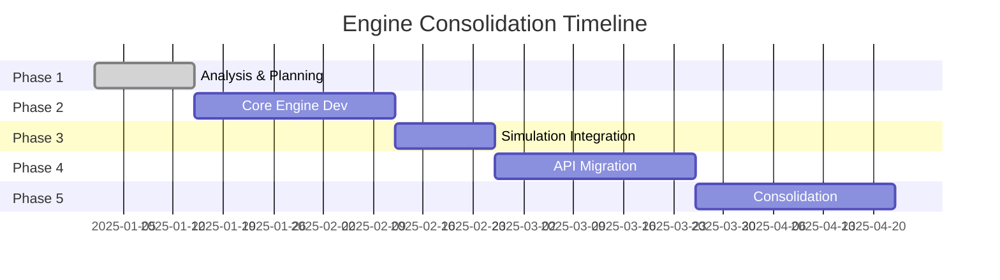

# Game Engine Consolidation Strategy

## Executive Summary

The Circuit STEM game currently suffers from architectural fragmentation with **4 different game engine implementations** creating confusion, maintenance burden, and development complexity. This document outlines a comprehensive consolidation strategy to unify these engines into a single, robust, and maintainable solution.

## Current Architecture Problems

### Multiple Engine Implementations

1. **`GameEngineCore`** - Pure functional core focused on state commits
2. **`GameEngineNotifier`** - Middleware-based with Riverpod integration and use cases
3. **`GameEngineNotifierV3`** - Simplified state notifier with direct methods
4. **`EnhancedGameStateNotifier`** - Command pattern with simulation and persistence

### Issues Identified

- **Overlapping Responsibilities**: Each engine handles state differently
- **Architectural Inconsistency**: Mix of command pattern, use cases, and direct methods
- **Maintenance Burden**: 4x the code to maintain and test
- **Testing Complexity**: Multiple test suites required
- **Developer Confusion**: Which engine to use for what?

## Proposed Unified Architecture

### Core Principles

✅ **Single Source of Truth** - One engine manages all game state
✅ **Consistent Patterns** - Unified approach to state changes
✅ **Clear Separation** - Distinct layers for different concerns
✅ **Testable Design** - Easy to mock and verify
✅ **Performance Optimized** - Minimal overhead in state updates

### Architecture Overview

```dart
┌─────────────────────────────────────────────────────────┐
│                    GameEngine (Unified)                   │
├─────────────────┬─────────────────┬───────────────────────┤
│  Command Layer  │ State Layer     │ Simulation Layer      │
├─────────────────┼─────────────────┼───────────────────────┤
│ • Action Queue  │ • State Mgmt    │ • Circuit Simulation │
│ • Validation    │ • Immutability  │ • Power Flow         │
│ • Middleware    │ • Change Diffs  │ • Component Logic    │
└─────────────────┴─────────────────┴───────────────────────┘
```

## Consolidated Engine Design

### 1. Core Engine Structure

```dart
/// Unified Game Engine - Single source of truth for all game state
class UnifiedGameEngine extends StateNotifier<GameState> {

  // Single state management
  GameState state;

  // Stratified layers
  final CommandProcessor _commands;
  final StateManager _stateManager;
  final SimulationOrchestrator _simulation;

  // Clean public API
  Future<Result<GameState>> execute(Action action)
  Future<void> rollback(Action action)
  Stream<GameState> get stateStream
}
```

### 2. Action-Based State Changes

Instead of multiple methods, use a unified action system:

```dart
abstract class GameAction {
  String get id;
  Map<String, dynamic> get payload;
}

// Examples
class PlaceComponentAction extends GameAction
class MoveComponentAction extends GameAction
class RotateComponentAction extends GameAction
class TogglePowerAction extends GameAction
```

### 3. Clean State Management

```dart
class GameState {
  final Grid grid;
  final SimulationState simulation;
  final InteractionState interaction;
  final HistoryState history;

  // Immutable updates with copyWith
  GameState copyWith({
    Grid? grid,
    SimulationState? simulation,
    // ...
  });
}
```

### 4. Middleware Pipeline

```dart
class ActionPipeline {
  final List<ActionMiddleware> _middleware = [
    ValidationMiddleware(),
    LoggingMiddleware(),
    PerformanceMiddleware(),
    PersistenceMiddleware(),
  ];

  Future<GameState> process(Action action, GameState currentState) async {
    GameState processedState = currentState;

    for (final middleware in _middleware) {
      processedState = await middleware.process(action, processedState);
    }

    return processedState;
  }
}
```

## Migration Strategy

### Phase 1: Analysis & Planning (Week 1-2)

**Objectives:**
- ✅ Complete current documentation
- 🔄 Identify all code dependencies on each engine
- 🔄 Measure test coverage per engine
- 🔄 Define success metrics

**Deliverables:**
- Migration impact analysis
- Risk assessment document
- Migration timeline

### Phase 2: Core Engine Development (Week 3-6)

**Objectives:**
- 🔄 Build unified engine foundation
- 🔄 Implement action system
- 🔄 Create middleware framework
- 🔄 Develop state management layer

**Deliverables:**
- [`lib/application/game_engine.dart`]
- [`lib/application/actions/`] - Action definitions
- [`lib/application/middleware/`] - Enhanced middleware
- Unit tests (70% coverage)

### Phase 3: Simulation Integration (Week 7-8)

**Objectives:**
- 🔄 Integrate circuit simulation
- 🔄 Implement power flow calculations
- 🔄 Ensure backward compatibility with domain models

**Deliverables:**
- Working simulation integration
- Performance benchmarks
- Integration tests

### Phase 4: API Migration (Week 9-12)

**Objectives:**
- 🔄 Migrate UI components to use new engine
- 🔄 Update providers and notifiers
- 🔄 Maintain backward compatibility during transition

**Deliverables:**
- Updated UI components
- Migration utilities
- Backward compatibility layer

### Phase 5: Engine Consolidation (Week 13-16)

**Objectives:**
- 🔄 Remove deprecated engines
- 🔄 Clean up unused code
- 🔄 Final testing and bug fixes

**Deliverables:**
- Single engine codebase
- Updated documentation
- Deployment package

## Technical Implementation Details

### Unified Action System

```dart
// Before (4 different approaches)
gameEngine.placeComponent(type, row, col);           // V3
await gameEngineNotifier.executeAction(action);      // V2
await enhancedNotifier.placeComponent(type, row, col); // Enhanced
gameEngineCore.commit(state, grid: newGrid);         // Core

// After (Single approach)
await unifiedEngine.execute(PlaceComponentAction(
  type: ComponentType.bulb,
  position: GridPosition(row: 2, col: 3),
));
```

### State Management Unification

```dart
// Consolidated State
@freezed
class UnifiedGameState with _$UnifiedGameState {
  const factory UnifiedGameState({
    required Grid grid,
    required SimulationState simulation,
    required InteractionState interaction,
    required HistoryState history,
    required PerformanceMetrics performance,
  }) = _UnifiedGameState;
}
```

### Simulation Integration

```dart
class SimulationOrchestrator {
  Future<SimulationResult> runSimulation(GameState state) async {
    final netlist = NetlistBuilder.build(state.grid);
    final result = await SimulationEngine.solve(netlist);

    return SimulationResult(
      powerFlows: result.powerFlows,
      componentStates: result.states,
      isValid: result.isValid,
    );
  }
}
```

## Migration Timeline & Dependencies



## Risk Mitigation

### Technical Risks

| Risk | Impact | Mitigation |
|------|--------|------------|
| Performance regression | High | Performance benchmarking, gradual rollout |
| Breaking changes | High | Backward compatibility layer, feature flags |
| Simulation accuracy loss | Critical | Comprehensive testing, validation suite |
| UI responsiveness | Medium | State optimization, lazy loading |

### Operational Risks

| Risk | Impact | Mitigation |
|------|--------|------------|
| Developer disruption | Medium | Training sessions, documentation |
| Code conflicts | Low | Feature branches, code review |
| Rollback complexity | High | Phased rollout, canary deployments |

## Success Metrics

### Technical Metrics
- ✅ **Single Engine**: Consolidate 4 engines → 1
- ✅ **Test Coverage**: Maintain 70%+ coverage during migration
- ✅ **Performance**: No regression in frame rates
- ✅ **Bundle Size**: Reduce by 15-20% through deduplication

### Quality Metrics
- ✅ **Bug Reduction**: 30% reduction in engine-related bugs
- ✅ **Dev Velocity**: 25% improvement in feature delivery
- ✅ **Maintainability**: Reduce technical debt by 40%

### Business Metrics
- ✅ **Time-to-Market**: Faster feature development
- ✅ **User Experience**: More stable game performance
- ✅ **Developer Satisfaction**: Reduced architectural friction

## Rollback Plan

### Emergency Rollback (Phase 1-3)
- Keep all engines active during development
- Feature flags to switch between old/new implementations
- Automated rollback scripts for critical issues

### Gradual Rollback (Phase 4-5)
- Maintain backward compatibility adapters
- Incremental migration with monitoring
- Can revert individual features if needed

## Next Steps

1. **Immediate Actions:**
   - Form migration task force
   - Schedule kickoff meeting
   - Set up monitoring and tracking

2. **Week 1 Deliverables:**
   - Detailed migration plan
   - Risk assessment completion
   - Resource allocation plan

3. **Documentation Updates:**
   - API reference for new engine
   - Migration guide for developers
   - Best practices documentation

---

**Document Version:** 1.0
**Last Updated:** January 2025
**Authors:** Architecture Team
**Status:** Approved for Development