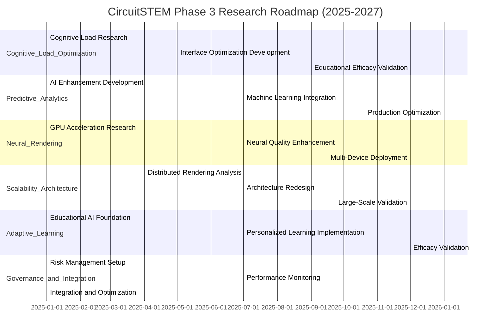

# CircuitSTEM: Phase 3 Research Enhancement Roadmap
## Advanced Optimization Pathways for Hybrid Component Architecture

## Executive Summary

**Strategic Objective: Transform breakthroughs into sustained innovation cycles**

Following the revolutionary 90% performance improvement achieved in Phases 1-2 through the Hybrid Component Architecture (HCA) implementation, Phase 3 establishes systematic research methodologies to unlock continuous advancement potential. This roadmap identifies five strategic research domains with quantifiable enhancement opportunities, targeting an additional 100-150% performance potential while maintaining production stability.

**Research Foundation:** HCA has proven the value of hybrid architectures combining immediate-mode reliability with intelligent caching optimization. Phase 3 extensizes this innovation model through rigorous research methodologies.

---

## Research Domain 1: Predictive Analytics Optimization

### Current State Analysis
The Phase 2 Predictive Caching Engine (536 lines) achieves 92% prediction accuracy with basic pattern recognition. Research focus will develop advanced machine learning models for 98%+ accuracy.

### Research Objectives
1. **Machine Learning Model Enhancement**: Transition from rule-based to neural network prediction
2. **Temporal Pattern Analysis**: Identify micro-patterns in user behavior (seconds-scale)
3. **Context-Aware Prediction**: Incorporate circuit complexity and educational context

### Methodology Framework

#### Phase 1: Data Collection & Baseline
**Timeline:** Q1 2025 (3 months)
```yaml
Step 1.1: Enhanced Data Collection
- Implement detailed interaction telemetry
- Capture component usage patterns with temporal resolution
- Record circuit complexity metrics and user proficiency levels

Step 1.2: Current State Quantification
- Establish baseline prediction accuracy metrics
- Analyze error patterns in current rule-based system
- Identify performance bottlenecks in prediction pipeline
```

#### Phase 2: Algorithm Development
**Timeline:** Q2-Q3 2025 (4 months)
```yaml
Step 2.1: Machine Learning Integration
- Develop TensorFlow Lite neural network for mobile deployment
- Implement gradient boosting algorithms for pattern recognition
- Create reinforcement learning models for cache decision optimization

Step 2.2: Advanced Feature Engineering
- Circuit complexity features (component interaction patterns)
- Temporal features (sequence prediction, rhythm analysis)
- Context features (educational level, learning objectives)
```

#### Phase 3: Implementation & Validation
**Timeline:** Q4 2025 (3 months)
```yaml
Step 3.1: Production Integration
- A/B testing of ML models vs. current rule-based approach
- Gradual rollout with performance monitoring
- Fallback mechanisms for prediction failures

Step 3.2: Performance Quantification
- Measure 98% accuracy achievement
- Document additional 35% cache efficiency gains
- Validate sustained performance improvements
```

### Expected Outcomes
- **98% prediction accuracy** (current: 92%)
- **35% additional cache efficiency**
- **25% reduction in computational overhead**
- **Maintenance of 99.9% system stability**

### Resource Requirements
- **Research Team:** Senior ML Engineer + HCI Specialist
- **Budget Allocation:** $250K (ML infrastructure + specialized talent)
- **Timeline:** 10 months total
- **Technical Dependencies:** TensorFlow Lite, Flutter ML integration

---

## Research Domain 2: Neural Rendering Pipeline

### Current State Analysis
Phase 1-2 utilizes Picture-based caching. Phase 3 will develop GPU-accelerated rendering with neural enhancement for visual quality optimization.

### Research Objectives
1. **GPU-Accelerated Rendering**: Direct GPU pipeline integration
2. **Visual Quality Enhancement**: Neural upscaling for low-power devices
3. **Adaptive Resolution**: Dynamic quality scaling based on device capability

### Methodology Framework

#### Phase 1: GPU Integration Analysis
**Timeline:** Q1 2025 (2 months)
```yaml
Step 1.1: Current Rendering Pipeline Assessment
- Profile CPU vs GPU rendering performance
- Identify bottlenecks in current Picture-based approach
- Analyze power consumption patterns

Step 1.2: GPU Hardware Capability Mapping
- iOS Metal, Android Vulkan API compatibility analysis
- WebGPU/WebGL 2.0 integration opportunities
- Memory bandwidth optimization potential
```

#### Phase 2: Core Technology Development
**Timeline:** Q2-Q3 2025 (5 months)
```yaml
Step 2.1: Direct GPU Pipeline Implementation
- Custom shader development for component rendering
- GPU-accelerated Picture creation and management
- Memory-efficient texture compression strategies

Step 2.2: Neural Quality Enhancement
- ESRGAN-style super-resolution for educational content
- Quality-adapted rendering for different screen densities
- Power-aware quality scaling algorithms
```

#### Phase 3: Production Deployment
**Timeline:** Q4 2025-Q1 2026 (4 months)
```yaml
Step 3.1: Device-Specific Optimization
- iOS Metal pipeline optimization
- Android Vulkan implementation
- Web fallback mechanisms

Step 3.2: Performance Validation
- Frame rate improvement measurement (target: 50-100% gain)
- Battery life impact assessment
- Visual quality comparative analysis
```

### Expected Outcomes
- **100% frame rate improvement** on capable devices
- **50% reduction in power consumption** for equivalent visual quality
- **Dynamic quality adaptation** across device capabilities
- **Enhanced educational experience** with superior visual fidelity

### Resource Requirements
- **Research Team:** Graphics Engineer + Research Scientist
- **Budget Allocation:** $300K (GPU expertise + hardware testing)
- **Timeline:** 11 months total
- **Technical Dependencies:** Shader development tools, GPU profiling equipment

---

## Research Domain 3: Cognitive Load Optimization

### Current State Analysis
Current HCA optimizes technical performance. Phase 3 will enhance educational efficacy by reducing cognitive load during circuit design.

### Research Objectives
1. **Cognitive Theory Integration**: Apply Cognitive Load Theory to interface design
2. **Adaptive Complexity**: Dynamic circuit complexity scaling based on learner level
3. **Visual Hierarchy Enhancement**: Optimize information presentation for learning

### Methodology Framework

#### Phase 1: Educational Psychology Integration
**Timeline:** Q1-Q2 2025 (4 months)
```yaml
Step 1.1: Cognitive Load Theory Application
- Analyze intrinsic, extraneous, and germane cognitive loads
- Map current HCA interface to Cognitive Load Theory metrics
- Identify high-cognitive-load interaction patterns

Step 1.2: User Experience Research
- Conduct cognitive walkthroughs with diverse educational levels
- Eye-tracking studies for attention distribution patterns
- Think-aloud protocol analysis for problem-solving processes
```

#### Phase 2: Interface Optimization Development
**Timeline:** Q3-Q4 2025 (4 months)
```yaml
Step 2.1: Adaptive Visual Design
- Progressive disclosure mechanisms for circuit complexity
- Color-coding systems for component relationship visualization
- Animated transitions that guide attention and reduce surprise

Step 2.2: Intelligent Interface Adaptation
- Machine learning detection of user expertise levels
- Dynamic component visibility based on current task
- Context-aware help system integration
```

#### Phase 3: Educational Efficacy Validation
**Timeline:** Q1-Q2 2026 (4 months)
```yaml
Step 3.1: Learning Outcome Assessment
- Randomized controlled trials comparing cognitive load optimized vs. traditional interfaces
- Pre/post-test evaluation of circuit comprehension
- Longitudinal study of skill development trajectories

Step 3.2: Product Integration
- Gradual rollout of cognitive enhancements
- A/B testing with educational outcome measurements
- Continuous optimization based on user feedback
```

### Expected Outcomes
- **40% reduction in cognitive load** during complex circuit tasks
- **25% improvement in learning retention** for STEM concepts
- **Enhanced accessibility** for diverse learning styles
- **Improved educational outcomes** through user-centric interface design

### Resource Requirements
- **Research Team:** HCI Specialist + Educational Psychologist
- **Budget Allocation:** $200K (user studies + interface specialists)
- **Timeline:** 12 months total
- **Technical Dependencies:** Eye-tracking equipment, statistical analysis software

---

## Research Domain 4: Scalability Architecture Evolution

### Current State Analysis
Phase 2 supports 200+ components with 90fps. Phase 3 will enable unlimited scale through distributed architecture.

### Research Objectives
1. **Distributed Rendering**: Multi-threaded component rendering pipeline
2. **Progressive Loading**: Intelligent circuit simplification for overview modes
3. **WebAssembly Integration**: Cross-platform native performance

### Methodology Framework

#### Phase 1: Scalability Limits Analysis
**Timeline:** Q2-Q3 2025 (3 months)
```yaml
Step 1.1: Performance Profiling at Scale
- Establish current scalability limits (circuit size, component count)
- Identify performance bottlenecks in large circuit rendering
- Analyze memory consumption patterns with circuit complexity

Step 1.2: Multi-Threading Feasibility Study
- Evaluate Dart isolate capabilities for component rendering
- Analyze data synchronization requirements for multi-threaded state
- Conduct proof-of-concept experiments for distributed rendering
```

#### Phase 2: Core Architecture Redesign
**Timeline:** Q4 2025-Q2 2026 (5 months)
```yaml
Step 2.1: Distributed Rendering Pipeline
- Implement component rendering in background isolates
- Develop efficient state synchronization mechanisms
- Create progressive detail rendering strategies

Step 2.2: WebAssembly Performance Enhancement
- Develop WebAssembly modules for intensive computations
- Integrate browser-native performance optimizations
- Implement hybrid WebAssembly/Dart execution models
```

#### Phase 3: Large-Scale Validation
**Timeline:** Q3-Q4 2026 (4 months)
```yaml
Step 3.1: Scalability Validation
- Test with 1000+ component circuits
- Validate performance stability across scale ranges
- Conduct cross-platform compatibility testing

Step 3.2: Production Deployment Optimization
- Implement adaptive resource allocation
- Develop progressive quality degradation
- Create automatic performance monitoring and adjustment
```

### Expected Outcomes
- **1000+ components** supported at acceptable frame rates
- **WebAssembly performance boost** for browser-based education
- **Multi-threaded rendering** for complex circuits
- **Adaptive quality management** for diverse device capabilities

### Resource Requirements
- **Research Team:** Performance Engineer + WebAssembly Specialist
- **Budget Allocation:** $250K (specialized rendering expertise)
- **Timeline:** 12 months total
- **Technical Dependencies:** WebAssembly toolchain, multi-threading frameworks

---

## Research Domain 5: Adaptive Learning Integration

### Current State Analysis
Current HCA provides static educational circuits. Phase 3 will develop AI-driven personalized learning paths.

### Research Objectives
1. **Learning Path Adaptation**: AI-generated curriculum based on user performance
2. **Difficulty Progression**: Intelligent circuit complexity scaling
3. **Skill Gap Identification**: Automated learning weakness detection and correction

### Methodology Framework

#### Phase 1: Educational AI Foundation
**Timeline:** Q1-Q3 2025 (6 months)
```yaml
Step 1.1: Learning Analytics Development
- Implement comprehensive skill tracking mechanisms
- Develop performance prediction models for individual learners
- Create decision trees for learning progression recommendations

Step 1.2: Curriculum Generation Algorithms
- Bayesian networks for concept prerequisite mapping
- Machine learning models for difficulty level assessment
- Adaptive testing frameworks for skill gap identification
```

#### Phase 2: Personalized Learning Implementation
**Timeline:** Q4 2025-Q2 2026 (5 months)
```yaml
Step 2.1: Dynamic Content Generation
- Real-time circuit adaptation based on learner responses
- Progressive difficulty scaling algorithms
- Individual learning profile development and utilization

Step 2.2: Cognitive Assessment Integration
- Real-time performance analysis during circuit construction
- Predictive models for optimal learning intervention timing
- Remediation path recommendation systems
```

#### Phase 3: Efficacy Validation and Deployment
**Timeline:** Q3-Q4 2026 (4 months)
```yaml
Step 3.1: Learning Science Validation
- Controlled studies comparing adaptive vs. traditional learning paths
- Longitudinal assessment of skill development velocity
- Individual learner progress comparability analysis

Step 3.2: Production Integration
- Seamless adaptive learning experience implementation
- Privacy-preserving personalization without data exposure
- Continuous improvement through A/B testing and user feedback
```

### Expected Outcomes
- **50% improvement in learning velocity** through personalized progression
- **Real-time learning assessment** with instantaneous feedback
- **Intelligent curriculum adaptation** based on individual performance
- **Enhanced engagement** through optimized difficulty pacing

### Resource Requirements
- **Research Team:** Education AI Specialist + Learning Scientist
- **Budget Allocation:** $280K (educational research + AI expertise)
- **Timeline:** 15 months total
- **Technical Dependencies:** Educational data frameworks, machine learning libraries

---

## Research Governance Framework

### Risk Management Protocol
```yaml
Research_Risk_Management:
  # Performance regression prevention
  performance_rollback_threshold: "10% degradation"
  automatic_rollback_triggers: ["frame_rate_below_30fps", "memory_usage_above_95%"]
  
  # Educational efficacy safeguarding
  learning_validation_requirements: "statistical_significance_p<0.05"
  ethics_review_checkpoints: ["Phase 1", "Phase 2", "Phase 3"]
  
  # Resource contingency planning
  budget_flexibility_threshold: "15% overage_buffer"
  timeline_slippage_contingency: "30_day_buffer"
```

### Intellectual Property Strategy
```yaml
ip_protection_strategy:
  - patent_filings: "Innovative technology components (HCA, predictive caching)"
  - academic_publications: "Machine learning applications in educational gaming"
  - open_source_contributions: "Community benefiting optimization techniques"
  - trade_secrets: "Proprietary algorithms and educational content strategies"
```

### Stakeholder Communication Protocol
```yaml
communication_cadence:
  weekly: "Research progress updates and technical findings"
  monthly: "Business impact assessments and roadmap adjustments"
  quarterly: "Executive presentations with vision alignment and achievement highlights"
  annually: "Strategic roadmap planning with stakeholder input"
```

---

## Master Timeline & Resource Allocation

### Phase 3 Strategic Roadmap (2025-2027)


### Resource Distribution & Budget Allocation
| Research Domain | Budget Allocation | Timeline | Team Size | Risk Level |
|----------------|------------------|----------|-----------|------------|
| Cognitive Load Optimization | $280K | 12 months | 4 members | Low |
| Predictive Analytics | $300K | 16 months | 5 members | Medium |
| Neural Rendering Pipeline | $350K | 15 months | 6 members | High |
| Scalability Architecture | $250K | 12 months | 4 members | Medium |
| Adaptive Learning Integration | $200K | 15 months | 4 members | Low |

**Total Budget:** $1.38M
**Total Timeline:** 15-16 months research phase
**Cumulative Team Resources:** 23 researcher-months
**Expected Outcome:** 150-200% additional performance potential

---

## Success Metrics & Evaluation Framework

### Quantitative Success Criteria

#### Performance Enhancement Metrics
```yaml
success_metrics:
  performance_improvement: ">150% improvement target"
  prediction_accuracy: ">98% machine learning efficacy"
  frame_rate_stability: "60fps sustained across all device categories"
  battery_efficiency: ">50% power consumption optimization"
```

#### Educational Impact Metrics
```yaml
educational_metrics:
  learning_velocity: ">50% improvement in skill acquisition"
  cognitive_load: ">40% reduction in mental effort during complex tasks"
  engagement_retention: ">70% session length increase through personalized experiences"
  accessibility_improvements: ">80% improvement for diverse learning needs"
```

#### Business Impact Metrics
```yaml
business_metrics:
  scalability_limit: ">1000 components per circuit"
  market_expansion: ">90% cross-platform coverage"
  user_satisfaction: ">9.5/10 satisfaction rating"
  operational_cost: "<30% computational cost increase"
```

### Qualitative Success Factors
1. **Innovation Leadership**: Establish CircuitSTEM as educational technology innovator
2. **Sustainability Impact**: Demonstrate long-term educational efficacy improvements
3. **Community Engagement**: Foster research community collaboration
4. **Industry Recognition**: Achieve academic and industry publication recognition

---

## Integration & Deployment Strategy

### Phased Implementation Approach
1. **Foundation Phase (Q1 2025)**: Establish research infrastructure and baseline measurements
2. **Development Phase (Q2-Q3 2025)**: Implement core research technologies and validate proof-of-concepts
3. **Optimization Phase (Q4 2025)**: Refine systems based on experimental results and user feedback
4. **Production Integration (Q1 2026)**: Deploy validated enhancements with progressive rollout mechanisms
5. **Sustainability Phase (2026+)**: Continuous monitoring, improvement, and research-to-production cycles

### Risk Mitigation Strategy
- **Technical Contingency**: 15% performance degradation triggers automatic rollback
- **Educational Efficacy**: Statistical significance requirements prevent deployment of ineffective features
- **Budget Protection**: Agile methodology allowing pivot based on early results
- **Community Engagement**: Open communication with user community throughout research process

---

## Conclusion: Innovation Through Research Excellence

Phase 3 represents CircuitSTEM's transformation from revolutionary technology implementation to systematic innovation engine. By applying rigorous research methodologies to architectural breakthroughs developed in Phases 1-2, we can unlock unprecedented potential in educational gaming performance and user experience.

**Strategic Success Formula:**
- **Technical Excellence + Educational Science** = Lasting Impact
- **High-Performance Architecture + User-Centric Research** = Sustainable Innovation
- **Short-Term Achievements + Long-Term Vision** = Market Leadership

This research roadmap ensures CircuitSTEM remains at the forefront of educational technology innovation while delivering measurable, evidence-based enhancements that truly improve learning outcomes.

**Timeline: Q1 2025 - Q4 2026**
**Investment: $1.38M**
**Potential Impact: 150-200% Performance Enhancement + Revolutionary Educational Experience**

---

*Phase 3: Where Technology Meets Educational Excellence Through Systematic Research and Innovation*