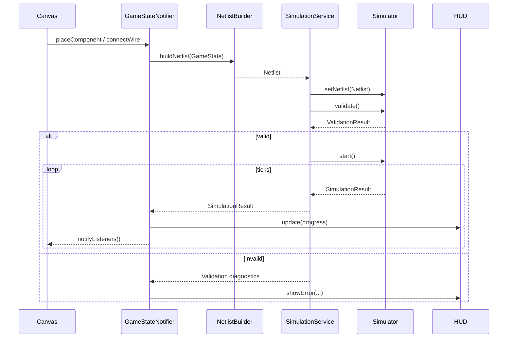
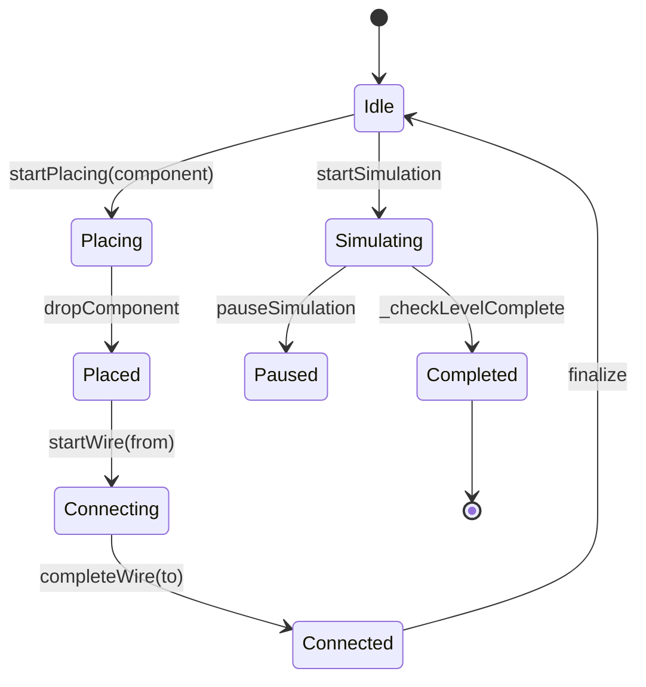
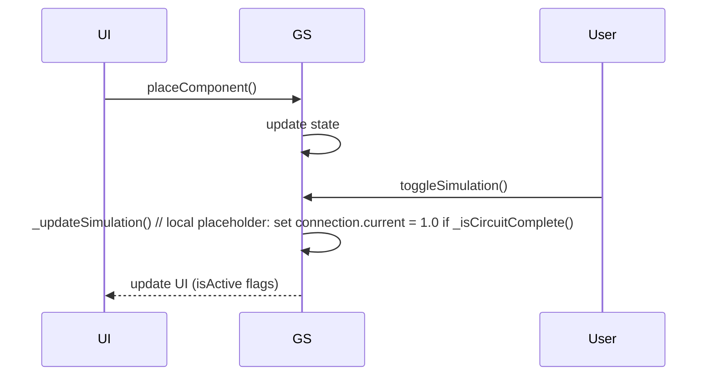
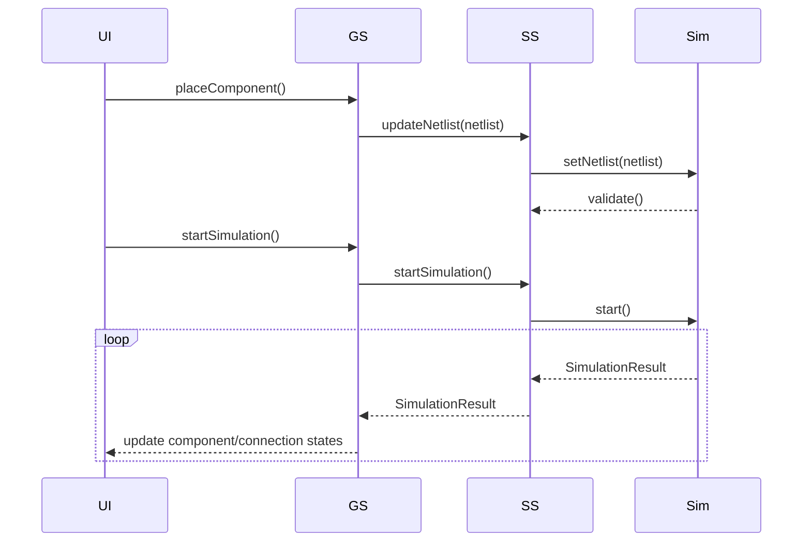
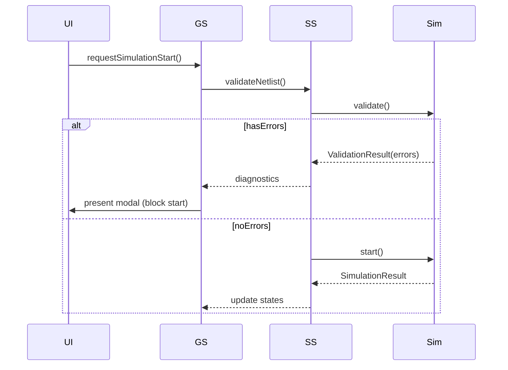
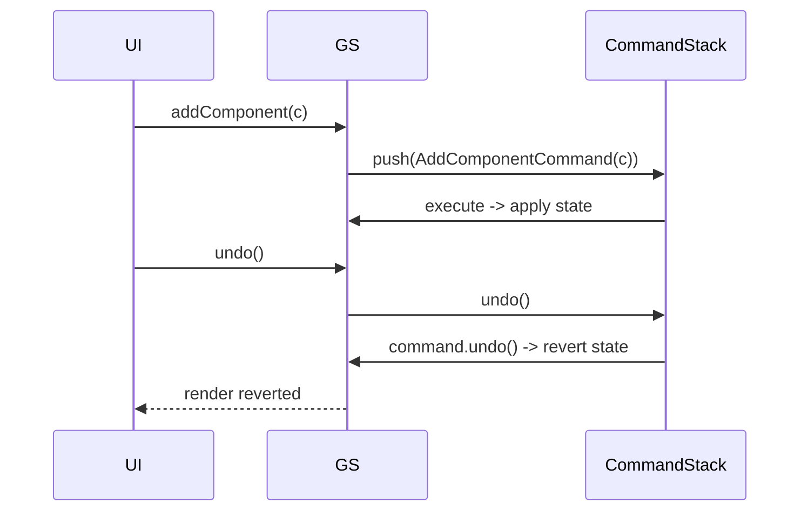

# SparkCircuit Diagrams — Core Integration

This file contains the Mermaid diagrams for the Core Integration design. Render with a Mermaid-capable viewer.

## System Architecture (high-level)
```mermaid
graph LR
  subgraph UI
    A[GameScreen / Canvas]
    B[Palette UI]
    C[HUD]
  end

  subgraph Presentation
    GS[GameStateNotifier]
    PS[PaletteStateNotifier]
    HS[HudStateNotifier]
  end

  subgraph Services
    SS[SimulationService]
    Storage[StorageService]
    Scoring[ScoringService]
    Cmd[CommandStackService]
  end

  subgraph Core
    Sim[Simulator (MNA Solver)]
    Models[Sim Models / Netlist]
  end

  A -->|user actions| GS
  B -->|select/place| PS
  GS -->|netlist updates| SS
  SS -->|runs| Sim
  Sim -->|results| SS
  SS -->|stream| GS
  GS -->|persist| Storage
  GS --> Cmd
  GS --> Scoring
  C <-- HS
```

## Data Flow (Netlist → Simulation → UI)


## State Flow (GameState transitions)


## Before / After Integration Sequence

Before (current placeholder logic)


After (proposed integrated flow)


## Error handling flow


## Undo/Redo workflow


## Deployment / Isolation notes
```mermaid
flowchart LR
  App[Flutter UI] -->|calls| SimulationService[SimulationService Provider]
  SimulationService -->|runs in isolate| SimulatorIsolate[Isolate: Simulator]
  SimulationService --> StorageService[Storage (Hive/SharedPrefs)]
  SimulationService -->|stream| GameStateNotifier